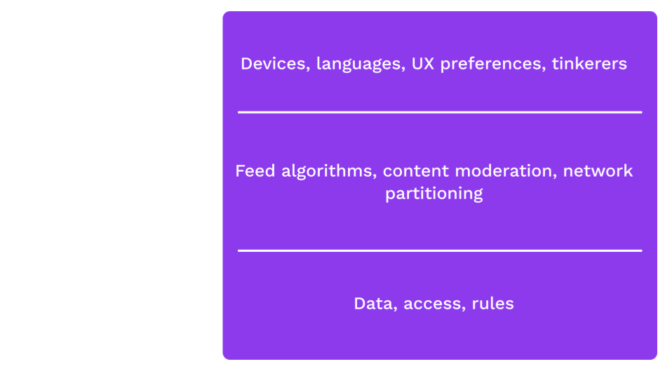

# Blockchains and Smart Contracts Overview

---

## Upholding Expectations

What is the core problem we want to solve?

Trustless provisioning of infrastructure.

<!-- .element: class="fragment" -->

Notes:

Something kind of like a server, that doesn't rely on a server operator, and has strong guarantees like Cryptography has to offer.

One framing: Coming to a shared understanding of a common history, and therefore a common state, of a system.

---

## Comparison with Cryptography

Cryptography provides strong guarantees about _messages_ without a trusted party, regardless of the conduit over which a message was transported.

Notes:

Crypto guarantees:

- No tampering
- No eavesdropping
- Authorship

---

## Application Disentanglement

Removing trust allows us to unpackage applications.

Notes:

The idea here is to discuss how applications are often seen as an entire bundle: e.g.
Instagram is the database, the algorithms, the UX.
But when we have credible expectations that we're interacting with the same system, rules, data, it's possible to build lots of ways to access and interact with the system.
It also removes the need for a central authority to deal with all appeals/complaints from various users.

---

# Desired Properties

---v

## Permissionless access

Anyone should be able to access and interact with the system.

---v

## Privacy

Users should have credible expectations about what information they give up about themselves.

---v

## Authenticity

Users should have credible expectations about the messages they see, regardless of the platform the messages are on.

---v

## Finality

Users should be able to form credible expectations about when a state transition is final.

---v

## Behavior

The system should behave as expected, even if system operators do not.

---v

## _Unstoppability_

No individual actor, company, state, or coalition should be able to degrade any of these properties.

---

## A Shared History

Notes:

So now we understand the goals of web3.
How do we achieve them? The key is allowing users to agree on a shared history.
The simplest blockchains do nothing more than timestamp and attest to a stream of historical records.
In Web 2 users have no visibility into the history of the app.
They must trust the provider to accurately represent the current state.
By giving the service provider the power to change the story, we give them the power to shape our understanding of reality and consequently our behavior.

---v

## A Shared History

> Any large-scale operation - whether a modern state, a medieval church, or an archaic tribe - is rooted in common stories that exist only in people's collective imaginations.

> Telling effective stories is not easy.
> The difficulty lies ... in convincing everyone else to believe it.
> Much of history revolves around this question: How does one convince millions of people to believe particular stories about gods, nations, or LLCs?

<!-- .element: class="fragment" -->

_-- Yuval Noah Harari, Sapiens --_

---v

## Shared Story of a State Machine

<pba-cols>
<pba-col>
<pba-flex center>

If we agree on:

- The starting state (aka genesis state)
- The history of transitions

</pba-col>
<pba-col>
</pba-flex>

Then we _MUST_ agree on:

<pba-flex center>

- The current state

</pba-flex>

</pba-col>
</pba-cols>

Notes:

Now that we have a formal math-y model of systems that we care about, we can see that the notion of shared stories being powerful is more than slick language of philosophical mumbo jumbo.
Even the term genesis state (or genesis block) is taken straight from mythology.
We aren't newly discovering or inventing the idea that having a shared understanding of our past is important.
It dates back to pre-history.
We are just formalizing it and applying it to digital services.

---

## Blockchains (Finally)

A blockchain can be thought of in three parts

<pba-cols>
<pba-col>
<pba-flex center>

**State Machine**

What does the state hold?

What are the _rules_ to change it?

</pba-flex>
</pba-col>
<pba-col>
<pba-flex center>

**Shared History** (data structure)

Which potential histories exist?

</pba-flex>
</pba-col>
<pba-col>

<pba-flex center>

**Consensus**

Which history is the real one?

What part of history is final?

</pba-flex>
</pba-col>
</pba-cols>

Notes:

First, each blockchain tracks some state machine.
We've discussed several examples of what that might be already, we'll code some simple examples shortly, and we'll spend all of module 5 digging into how to create a blockchain-friendly production-ready state machine.

Next is the Blockchain Data structure.
This data structure is basically a linked list of state transitions.
But unlike the linked lists you studied in your data structures course, it isn't just linked by memory addresses or any other malleable thing.
Instead it is cryptographically linked so that if anyone presents a different history, you can tell right away that you don't agree on a shared history.
We'll dive into this data structure in the next lesson.

Finally, is a consensus mechanism.
Defining a state machine alone does not uniquely define a history.
There are many possible valid histories.
Just like the many worlds interpretation of quantum mechanics.
To really agree on the current state, we need to agree on which of the possible histories is the real one.

---v

## Short History of Blockchains

---v

## Bitcoin

Uses an unspent transaction output (UTXO) model & Proof of Work (PoW) consensus.

<!-- .element: class="fragment" -->

Notes:

Who knows where the figure is from?

CLICK

Bitcoin was first.
It was a money app.
The first app chain.
It hosts a smart contract in the broad definition.

It was the first time most people considered a digital service that was not run by a particular person.

Figure source: [Bitcoin white paper](https://bitcoin.org/en/bitcoin-paper)

---v

## Litecoin, Monero, Dogecoin

Notes:

Only a few year later people realized they could fork the code and make small changed and improvements.
Some changes were trivial.
Some were interesting: monero and privacy.

For me personally, this was a small crisis.
I thought bitcoin was the one global one.
Aren't these other coins undermining the narrative?
NO! The point is that anytime you don't like the system or have an idea for a better one, you can do it!
If you don't like bitcoin, build your own coin and make it better.
Let the market decide.

---v

## Ethereum

- Generalization of Bitcoin: provides a quasi-Turing-complete VM
- Uses an account-based system
- Accounts can store balances, but can also store executable code (smart contracts)
- Each contract can have its own internal state and API

---v

## Smart contracts - Two Definitions

 
 

#### Broad Definition <small style="margin-top:20px;"> _"Szabo definition"_</small>

<blockquote>A machine program with rules that we could have defined in a contract, but instead a machine performs or verifies performance.</blockquote>

#### Narrow Definition <small style="margin-top:20px;"> _"web3 definition"_</small>

<blockquote>A program that specifies how users can interact with a state machine and is deployed permissionlessly to a blockchain network</blockquote>
