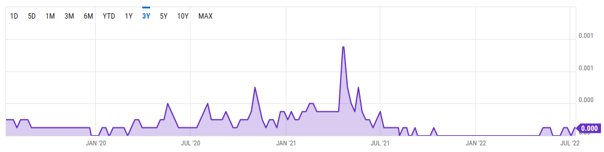
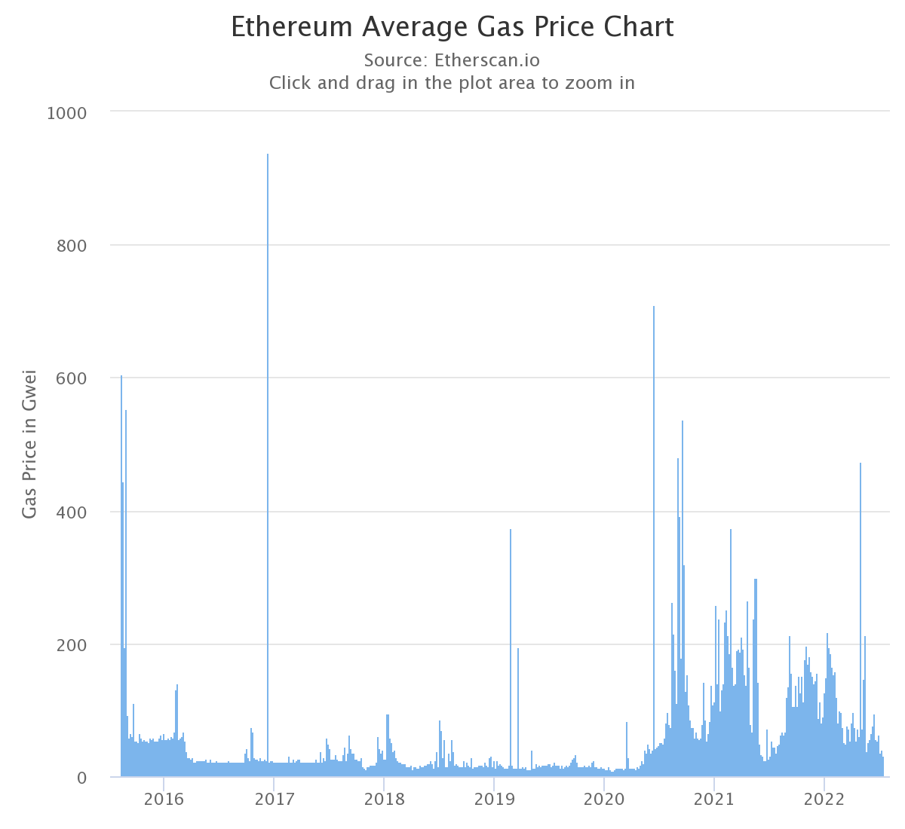

# Resources, Fees, Ordering

---

## Overview

<pba-flex center>

1. [Fees and ordering](#fees--ordering)
1. [Execution models](#execution-models)

</pba-flex>

Notes:

- This lecture is a bit all over the place.
- A bunch of stuff worth covering, but not all directly related.

---

# Fees & Ordering

---

## Fees & Ordering

Blockchains are open, shared systems.
They are unrestricted in access.

But restricted in resources.

---

## Permissionless Access

Free _ability_ to access does not mean free _cost_ to access.

---

## Threads

A blockchain runtime is single-threaded.

(For now)

---

## Time

A block must terminate in some amount of time.

---

## Network

Besides execution time, blocks need to propagate throughout the network.

---

## Demand

Many people may want to use the system concurrently.

But the system needs to decide:

- Which state transition calls to include in a block, and
- How to order them.

---

## Brief Interruption #1

> The block body contains an ordered set of _extrinsics_: Packets from the outside world with _zero_ or more signatures attached.

Notes:

Recall from Lecture 1.

---

## Brief Interruption #1 (cont.)

These packets include:

- A call to the system's state transition function
- Some contextual information (e.g. a spec version)
- Perhaps some additional information that would help block authors prioritise

---

## No-Longer Brief Interruption #1 (cont.)

Consider packets with:

- zero signatures attached as "inherents" or "unsigned extrinsics"
- one or more signatures attached as "transactions"

This will be pretty straightforward until it's not.

---

## Fee Models

Different blockchains have different fee models.

For this lecture, we will look at three:

- Size (Bitcoin)
- Step Metering (Ethereum)
- Time (Polkadot)\*

\* (and coming soon, space)

---

## Size

Bitcoin has a very simple STF: Namely verifying signatures and reassigning UTXOs.

Its block size is limited, and each transaction has some byte-length (instruction, signature, etc.)

Block authors will normally choose the set of transactions that would yield the highest gross fee.

---

## Bitcoin Fee Market



Notes:

- Fee market evolves based on demand

[Source: Y Charts](https://ycharts.com/indicators/bitcoin_average_transaction_fee_btc)
(Couldn't find the chart I really wanted (per-byte rate), but can discuss)

---

## Metering

Ethereum has a more complex STF than Bitcoin, namely one that is quasi-Turing-complete.

Users could submit transactions with an unknown number of steps to terminate.

The system uses "gas metering" to halt execution of a transaction and continue to the next.

---

## Metering

Ethereum's STF defines a VM with instruction set, where each instruction costs some "gas".

Users specify:

- Max amount of gas to use
- Cost, in ETH, per unit of gas they are willing to pay

---

## Metering

Each time an instruction is executed, the system deducts its cost from the max gas.

If the program terminates, it only charges for the gas used.

If it runs out of gas, it terminates the program.

---

## Gas Rates



Notes:

[Source: Etherscan](https://etherscan.io/chart/gasprice)

---

## Weight

Instead of metering during runtime, meter ahead of time.

Charge a fixed\* fee for dispatching some call.

---

## \*Fixed

```rust
#[pallet::weight(100_000_000)]
fn my_variable_weight_call(input: u8) -> Refund {
	let mut refund: Refund = 0;
	if input > 127 {
		let _ = do_some_heavy_computation();
	} else {
		let _ = do_some_light_computation();
		refund = 80_000_000;
	}
	refund
}
```

---

## Time

Weight is picoseconds of execution time (`10E-12`).

Calls are benchmarked on some "standard hardware".

(There are some changes in the works about making two-dimensional weight.)

---

## Weight

Using weight reduced the overhead of runtime metering, but requires some more care from developers.

- It must be possible to meter before runtime
- So, users should not be able to deploy untrusted code
- There is no safety net on execution
- Some computation is OK, but should be possible from call inspection

Notes:

Examples:

- User-supplied length of a list that will be iterated over
- Number of calls within a batch

---

## Brief Interruption #2

Some of the gas and weight systems are evolving.

- Ethereum recently added EIP1559, which uses a fee + tip mechanism
- Parity and Web3 Foundation are discussing some changes to the weights model

---

## Fee Strategies

Block authors can include transactions using several strategies:

- Just take those with the highest fee
- Take those with the highest fee to {length, gas, weight} ratio

---

## Fee Burning

Not all the fees must go to the block author (depends on system design).

In fact, this is often a bad design. Block authors will want fees to go up, so may indulge in no-op transactions to boost fees.

---

## Fee Burning Examples

- Polkadot only gives 20% of fees to block authors (80% goes to an on-chain Treasury)
- Since EIP1559, Ethereum burns some of its fees (its "base") from each transaction

In both systems, users can add "tips" to increase the priority of their transaction with authors.

---

## Filling a Block

Depending on the limiting factor, systems can have different limits to call a block full.

- Bitcoin: Size (in bytes)
- Ethereum: Gas limit (sum of all gas limits of transactions)
- Polkadot: Weight (sum of all max expected weights)

---

## Ordering

We've selected some transactions, but the runtime is single-threaded.

Block authors must order them.

---

## Priority Basis

The naive solution is to maintain an order of pending transactions by some "priority".

And just include the top `N` transactions that fit in a block.

---

## More Advanced

But, many small transactions might result in a higher fee for greedy block authors.

So there could exist a set of transactions that is more profitable than just the top `N`.

Even some that could be considered attacks.

---

# Execution Models

---

## Transactional Execution

Most blockchains have a "transactional" execution model.

That is, they need to be woken up.

A smart contract, for example, won't execute any code unless someone submits a signed, fee-paying transaction to the system.

---

## Brief Interruption #3

All of the "packets from the outside world" in these systems are signed.

Some key holder signs an instruction that authorises a call and is willing to pay for its execution.

Now is the time to enter the world of unsigned packets.

---

## Free Execution

State machines can have autonomous functions in their state transition function.

System designers can make these functions execute as part of the STF.

In this model, block authors _must_ execute some logic.

---

## Free Execution

These added function calls are powerful, but some care must be taken:

- They still consume execution resources (e.g., weight)
- They need some method of verification (other nodes should be able to accept/reject them)

---

## Hooks

The Substrate lectures will get into these, but for now just a look at some APIs:

```rust
pub trait Hooks<BlockNumber> {
	fn on_initialize(_n: BlockNumber) -> Weight {}
	fn on_finalize(_n: BlockNumber) {}
	fn on_idle(_n: BlockNumber, _remaining_weight: Weight) -> Weight {}
	fn on_runtime_upgrade() -> Weight {}
	fn offchain_worker(_n: BlockNumber) {}
}
```

Source: [`/frame/support/src/traits/hooks.rs`](https://github.com/paritytech/polkadot-sdk/blob/a13382f/substrate/frame/support/src/traits/hooks.rs)
