# Unstoppable Applications

Notes:

Much like tokenomic design, that is a large component in unstoppable apps that incorporate cryptocurrency or other motivating factors, this lesson is far far too short to give you all the tools and techniques to make a robust DApp design.

Instead we strive to highlight the problem space we face and some classes of solutions to them.

---

## Motivation

So far, we have discussed state machines and consensus... in _isolation_.

Does the _contexts in which they operate within_ matter?

Notes:

- So far _mostly_ on simplified, idealized systems.
  - "Black boxes" of cryptography
  - Rational actors and assumed complete models of behavior in economics
  - Blockchains as an "[isolated system](https://en.wikipedia.org/wiki/Isolated_system)" of sorts - external systems _cannot_ be reasoned about in the same way...
    We will talk about the Oracle Problem.
- In _practice_ there are far more ["unknown unknowns"](#🙈-unknown-unknowns) and "black swan" behavior.
  More to come on that in this lesson.

---

<!-- .slide: data-background-color="#4A2439" -->

## Discussion

> What properties of a system make it "stoppable"?

Notes:

- Web2 context: central providers & authorities, ...
- Web3 context: decentralized, ...
- What properties of a system make it "stoppable"?

---

### Unstoppable Apps Properties

<pba-flex center>

- Anitfragile
- Trustless\*
- Censorship-less\*
- Accessible\*
- ...perhaps more?

</pba-flex>

Notes:

The "\*" indicates the web3 context for defining properties, not generally.
Not all of these can apply, nor is is possible all simultaneously apply.
We need to craft the system properties based on what we must achieve.
In reality we strive for Absolute Unstoppability, but likely cannot grantee it in _every possible scenario_.

---

## Anitfragile

<pba-cols>
<pba-col>

> Some things benefit from shocks; they thrive and grow when exposed to volatility, randomness, disorder, and stressors and love adventure, risk, and uncertainty.
> Yet, in spite of the ubiquity of the phenomenon, there is no word for the exact opposite of fragile.
> Let us call it antifragile.
> Antifragility is beyond resilience or robustness.
> The resilient resists shocks and stays the same; the antifragile gets better.
>
> -- [Antifragile](https://en.wikipedia.org/wiki/Antifragile_%28book%29) --

</pba-col>
<pba-col>

</pba-col>
</pba-cols>

Notes:

- Read Antifragile quote, recommend book recommended, see the links throughout slides for more after class.
- Hydra fable & lore: <https://en.wikipedia.org/wiki/Lernaean_Hydra> - even though can be almost completely destroyed, it is _resilient_ and recovers.
  Absolutely Unstoppable doesn't mean it cannot be damaged or even paused temporarily, it means it cannot cease to exist and will eventually recover, and ideally come back stronger in doing so.

---

## An N-lemma

Hypothesis: a _absolutely_ Unstoppable App cannot exist.

We must make trade-offs out of all N properties that a _absolutely_ Unstoppable App would possess.

<pba-cols>
<pba-col>
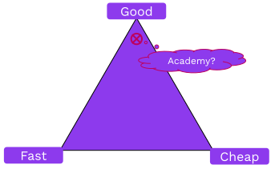
</pba-col>
<pba-col>
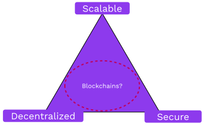
</pba-col>
</pba-cols>

Notes:

As with crypto, we can have astronomically good odds...
But they are not perfect.
We want the most robust system possible, given the _environment and context_ the consensus system lives in.

More relevant trilemma:

- [Scalability](https://vitalik.ca/general/2021/04/07/sharding.html#the-scalability-trilemma)
- [Zooko's Triangle](https://en.wikipedia.org/wiki/Zooko's_triangle) (Network IDs)
- More likely!

---

## Web3 Tech Stack

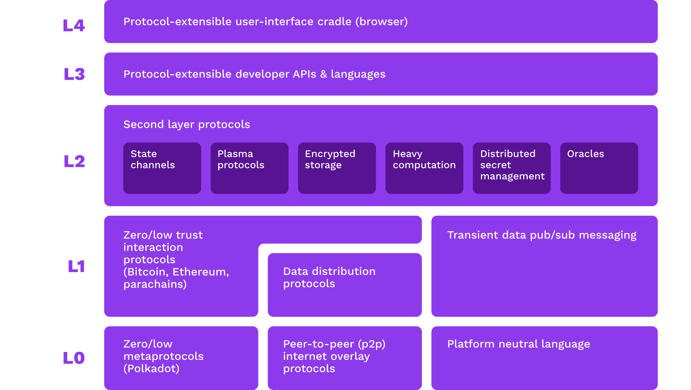

Notes:

This diagram is a bit dated with advancements in the field, but a good approx.
representation.

Observation and clarification: DApps canonically refer to smart contract applications.
These exist _within the context_ of consensus systems that themselves inherit properties of unstoppability from.
The academy is more focused on _consensus system engineering_ - we reason about blockchains themselves - rather than "DApp"s that _use_ those as platforms to operate in or on.
The Smart contracts lessons _may_ include detains on unstoppable dapps design considerations.

<!-- FIXME TODO: update this graphic, rather stale (Joe mentioned in Cambridge) -->
<!-- FIXME TODO: clarify based on smart contract content - does it inform on system design considerations for unstoppable dapps? -->

---

## Much More Than Blockchain Architecture...

<pba-cols>
<pba-col>

Blockchains only form one part of the stack.

Web3 applications must prevent attacks at all layers.

</pba-col>
<pba-col>

<pba-flex center>

- Networking
- Consensus
- Node access
- Validator power
- Inter-consensus trust
- _Human factors_
- _Extrinsic factors_

</pba-flex>
</pba-col>
</pba-cols>

Notes:

These are for discussion today, but there are _many more_ thank those listed here!

---

<!-- .slide: data-background-color="#4A2439" -->

# Human Level

---

## Attacking Web3

Notes:

Key point: your "perfect" system in is likely weak to things outside of the "rules"!
especially

Image Source: <https://xkcd.com/538/>

---v

## Web3 Criticisms

<pba-cols>
<pba-col>

There are [valid criticisms](https://moxie.org/2022/01/07/web3-first-impressions.html) of how many Web3 apps operate today.

</pba-col>
<pba-col>

<pba-flex center>

- Humans are cheap & lazy... 
  No individuals run servers.
- RPC node providers
- A _protocol_ improves slowly vs. a platform.
- False marketing, frauds, & scams!

</pba-flex>
</pba-col>
</pba-cols>

Notes:

<https://moxie.org/2022/01/07/web3-first-impressions.html> great critique on the state of the space, but founder of [Signal messenger](https://signal.org).

Not all hope is lost!
This is valid mostly in the present, we will discuss these and what we're building to realize a better stack.

<!-- TODO FIXME: more slides on this section! -->

---

<!-- .slide: data-background-color="#4A2439" -->

# Systems Level

---v

## Prove it!

We use the word "proof" a lot... it means many things in [different contexts](https://en.wikipedia.org/wiki/Provable):

<pba-flex center>

- Math → **Provable Correct** (algo)
- Consensus → Proof of X (security)
- Crypto → \[ZK | VRF | Validity | ... \] Proofs

</pba-flex>

Notes:

The one so far not covered is Provable Correctness - where we can use maths to _prove_ that our logic cannot do unexpected behavior.
An interesting example is [Cardano's design value proposition](https://docs.cardano.org/explore-cardano/cardano-design-rationale/) using haskell and provably correct most parts of their platform.

> We have a lesson and exercise on formal verification methods latter on - this is how we can approach Provable Correctness in the context of Rust and thus Substrate.

BUT this property assumes a complete system model!
Nuke proposes that when considering factors outside the consensus system, there cannot be a rigorous proof of correctness as we cannot model the universe.

---v

## 🔮 Oracle Problem

An [oracle](https://en.wikipedia.org/wiki/Category:Computation_oracles) provides eternal data to a consensus system. (i.e. a partial state of an external chain)

The [oracle problem](https://chain.link/education-hub/oracle-problem) relates to the _trust_ in the oracle.

Notes:

- Example: Random Oracle, NOT like VRF we saw in the crypto module that can be in the consensus system.
- Oracle needed for _input_ from anything that lives outside of the boundary of the consensus system.
  - Everything in a chain is self-referential.
    Applications in a consensus system may want to _try_ and reason about something outside itself.
- Inclusive of bridges

---v

## 🦢 Black Swans

<pba-flex center>

- known bounds of operation  _assumed_ impossible
- death spirals

</pba-flex>

Notes:

Explain example of luna or other system collapse.

- 📔[The Black Swan: The Impact of the Highly Improbable](https://en.wikipedia.org/wiki/The_Black_Swan:_The_Impact_of_the_Highly_Improbable)
- [Wiki Black Swan Theory](https://en.wikipedia.org/wiki/Black_swan_theory)

---v

## 🤯 Complexity

<pba-cols>
<pba-col>

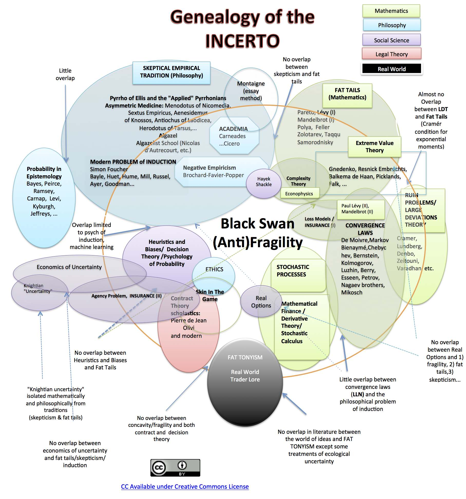

</pba-col>
<pba-col>

- Illustrating how to map the intricacies of _coupled, complicated, interactions of systems_.
- \* You are not expected to understand this plot 😅

</pba-col>
</pba-cols>

Notes:

- Great talk by the author: <https://www.youtube.com/watch?v=S3REdLZ8Xis> reference talk by book author.

Example: irrational actors can be represented in a very simple model as a completely random act, or opposite act of what a rational actor would do.
If you "fuzz" you system you may discover fragility to irrational actions that could undermine your system.
Perhaps it's far easier and more likely than it at first appears to experience a black swan event.

- Image [source](https://en.wikipedia.org/wiki/Nassim_Nicholas_Taleb#/media/File:Genealogy_map_of_topics_treated_by_Nassim_Taleb.jpg) - Describes the various categories of uncertainty, epistemology limits and statistical subjects touching on Taleb's Black swan / antifragility etc. ideas

---v

## 👪 Dependency

<pba-cols>
<pba-col>

</pba-col>
<pba-col>

- [Confusion](https://secureteam.co.uk/2021/02/24/what-is-a-dependency-confusion-attack/)
- [Hijacking](https://blog.sonatype.com/bladabindi-njrat-rat-in-jdb.js-npm-malware)
- [Hardware side-channel attacks](https://hackaday.com/2019/09/13/side-channel-attack-shows-vulnerabilities-of-cryptocurrency-wallets/)

</pba-col>
</pba-cols>

Notes:

- yes in software and hardware, you are at risk of attack from poisoned deps through non-maintenance, up to targeted exploitation.
  One mitigation is vendoring these, need systems inn place to monitor.
  Dependabot is not sufficient.
- Also in dependance on specific operational contexts.
  For example that it is legal to operate the software for nodes.

Image source: <https://xkcd.com/2347/>

---v

## 🦸 Dependency in Polkadot

<pba-cols>
<pba-col>

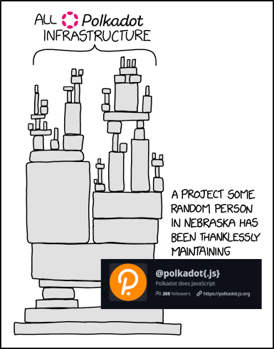

</pba-col>
<pba-col>

> _Foundational_ to Polkadot ecosystem!

</pba-col>
</pba-cols>

Notes:

- [Jaco](https://github.com/jacogr) is effectively the only maintainer of how _just about everything_ communicates with Substrate nodes!
- [Capi](https://github.com/paritytech/capi) is on the way, but just getting started.

---v

## 🙈 Unknown unknowns

Notes:

Outside of the system itself, we cannot guarantee/prove that every possible condition is accounted for in our models & system design.
We must expect forces outside our system & it's model may interact in unexpected ways.
Assumptions about context must be rigorously evaluated (i.e. - what does finality mean in the chain this pallet or contract lives in?)
(Formal mathematical proofs reason only about the things we can and do account for.)

---

<!-- .slide: data-background-color="#4A2439" -->

# Network Level

---v

## 🕸️ Peer-to-Peer Networks

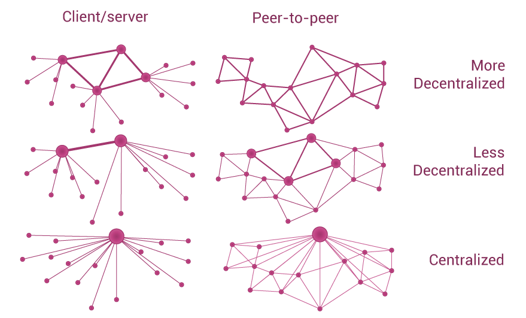

---v

## Network Attacks

<pba-flex center>

- Entry/Boot nodes and peer discovery
- Data center faults
- Traffic analysis and targeted takedowns
- Eclipse attacks

</pba-flex>

Notes:

The network lesson covers these, just a reminder that the network is not in the direct command of the consensus system, so it's a threat!

- security & stability
- privacy!
  On chain might be ZK, but how about the gossip and RPCs?

Boot nodes typically _hard coded_ to "bootstrap" and start peer discovery.
Boot nodes can decide what peers to advertize, or can be inaccessible.
Common data centers (AWS, GCP, ...) could fail or censor, potentially large number of peers go dark.
Hard to hide! Most p2p traffic is easy to identify vs. web2 traffic.

---v

## Node Queries

Running a node is hard, most people outsource.

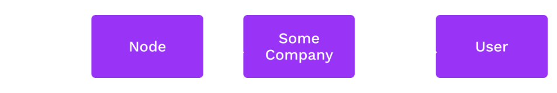

These service have power to deceive, censor, and surveil.

---v

## Multi-Chain Applications

If running _one_ node is burdensome, try multiple.

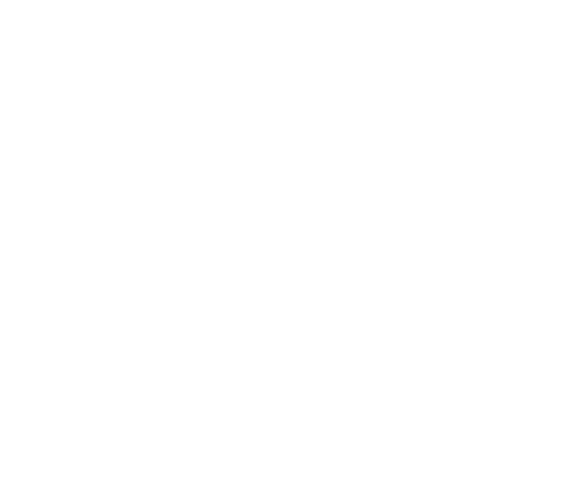

---v

## Trustless Messaging

In order to handle messages _without trust_, systems must share common finality guarantees.

`A` should never process a message from `B`, where `B` is reverted and `A` is not.

---v

## A Note on Synchronicity

Smart contracts on a single chain (e.g. Ethereum) can interact trustlessly because of their shared view of finality.

Asynchronous systems can also share finality. 
i.e., be members of the same consensus system.

---v

<!-- .slide: data-background-color="#4A2439" -->

# Discussion

**Minimum viable decentralization.**

> What key aspects should be considered?

Notes:

- Quantitative: nodes needed (for what), incentives, ... FIXME TODO
- Qualitative: social norms, ... FIXME TODO

---

<!-- .slide: data-background-color="#4A2439" -->

# Consensus

---v

## Mining Pools

Proof of Work authority sets have no finite bound. 
But people like to organize.

\[Collaborating | Colluding\] authority sets creates risk.

Notes:

Call out that Nomination pools exist and are discussed in the NPoS lesson latter.
Similar issues, but in a more bounded set.

---v

## Mining Pools

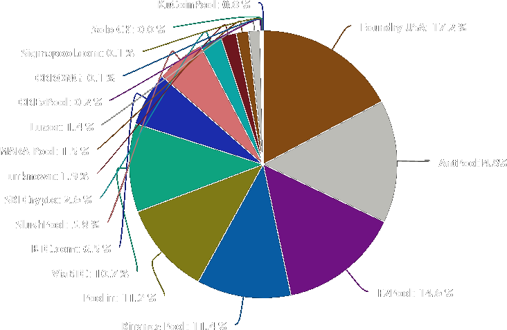

Notes:

Source: [Buy Bitcoin Worldwide](https://buybitcoinworldwide.com/pages/mining/pools/img/pool-graph.png)

---v

## Security Dilution

Security is always a finite resource:

<pba-flex center>

- Centralized: Cost of corruption/influence
- Proof of Work: Number of CPUs in the world
- Proof of Stake: Value (by definition, finite)

</pba-flex>

---v

## Security Dilution

Consensus systems compete for security, and they have reason to attack each other.

Emergence of obscure/niche "Proof of X" algorithms to shelter from attack only goes so far.

---v

## ⚔ Blockchain Wars

Systems with high security have the incentive to attack systems with low security whom they perceive as competitors.

> For fun and profit.

Notes:

"In ~~a galaxy~~ the universal consensus ~~far far away~~ not so far away..."

---v

## ⚔ Proof of Work Battles

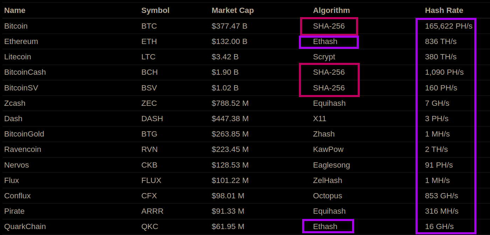

> What might it cost to successfully attack?

Notes:

- For PoW, hashing power for the same algo can be attacked!
  Buying hash power is possible:
- Most GPU miners switch tasks to the mine the highest paying (relative to some base currency) chain using software like <https://www.nicehash.com/>.
- ASICs are less flexible, but also can to the highest paying coin.
- Example: [ETH classic deep re-ogs](https://coingeek.com/ethereum-classic-experiences-51-attack-and-3000-block-reorg/)

---v

## Proof of... Nothing at Stake

Forks are "free" to vote in favor of... 
vote on them all!

(If you are not eventually slashed!)

> What might it cost to successfully attack?

Notes:

- Unlike PoW where voting on a chain costs something _extrinsic_ to the system, PoS has only _intrinsic_ measures to do accounting of consensus rules.
- **Critical:** This was a problem with early naive implementations of PoS.
  Modern PoS schemes avoid this specific problem by having the security deposit and slashing for equivocation (in a few slides)
- Good explainer, source of image: <https://golden.com/wiki/Nothing-at-stake_problem-639PVZA>

---v

## Proof of...  _Relatively_ Nothing at Stake

Risk-to-reward ratio of attacks is  _relative to the valuation of the staked assets_.

Rational actors take into account  _extrinsic motivators_ in calculating the highest reward.

> What might it cost to successfully attack?

Notes:

- Again PoS ha only _intrinsic_ measures to do accounting of consensus rules, but the system doesn't exist in a vacuum: the relative valuation of what is at stake needs to be accounted for.

---v

## Validator Consolidation

How many validators does a system need?

Higher numbers should lead to a decrease in the ability for entities to collude.

But validators are expensive, both economically and computationally.

Notes:

Yet another N-lemma to consider.

---v

## PoS Economic Security

Proposition: The upper bound of economic security in PoS is relative valuation can secure, that is correlated with the market capitalization of the network.

> Market capitalization refers to the total market value of all assets inherent to a single company/chain/token.

Notes:

- This market capitalization could be company shares, or total ETH in existence, or total X token associated with a specific smart contract or parachain.

---v

## ⚔ PoS Economic Security Battles

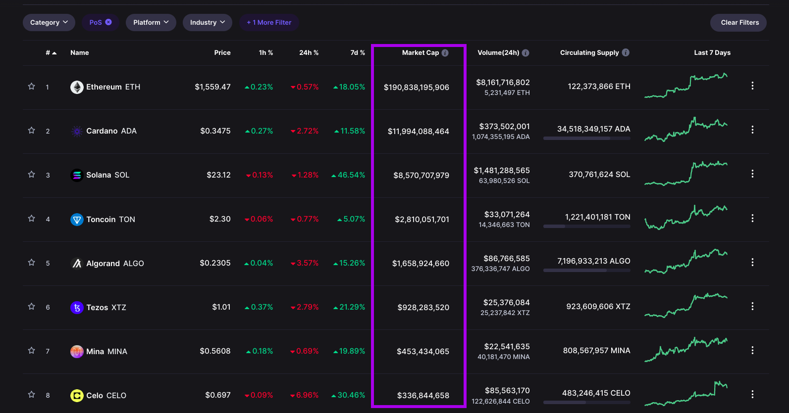

Notes:

Here like in PoW we have relative safety in networks, but there is no way to "hop" from one chain to another, so the war is still in the relative security, but one stake cannot _directly_ attach another stake in a separate consensus system...

What about an system of value _within_ consensus?

---v

## DApp PoS Economic Security

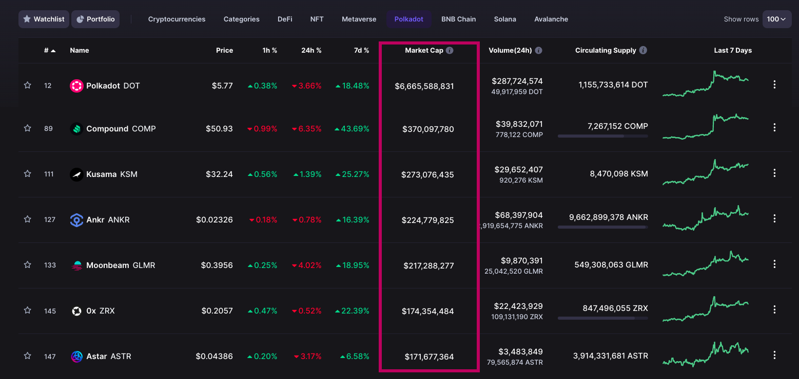

Notes:

Consideration: these notes are an oversimplification! We may talk more about this kind of problem in NPoS lesson (Nuke thinks at least).
The details of a formal analysis are out of scope for this Academy.

Proposition: Total applications valuation of their assets (tokens on smart contracts, or parachains) is limited and that limit is correlated with the total economic security of the consensus system they reside in.

In Polkadot's relay chain model, Nuke would argue it's feasible that an attack to extract value from a very highly valued asset could outweighs the cost of obtaining a _byzantine level of stake_ to execute.
Therefore the sum of all parachains market cap is also limited as that same level of stake control would enable take over of all chains on it.

Nuke argue this is the same for the sum of all contracts valuations on something like Ethereum.

---v

## Authority Misbehavior

<pba-flex center>

- Equivocation
  - Authorship: Proposing mutually exclusive chains
  - Finality: Voting for mutually exclusive chains to be final
- Invalidity
- Lack of availability
- **Intentional protocol abuse** ([selfish mining](https://golden.com/wiki/Selfish_mining_attack-39PMNNA))

</pba-flex>

Notes:

We already talked consensus faults, but abuse is newer.
Nuke argues "abuse" as a term here isn't the intended mechanism design, and is adverse to the health of the system.
Selfish mining where it's impossible to _prove_ an author is withholding valid blocks to "cheat" by mining ahead of the rest of th network is a good example in the class of attacks that consensus authorities and others may have.

...Could other actors abuse the protocols?

---v

## Accountability of Authority

Authority should imply accountability.

No matter how you design an authority selection mechanism, some people will have a privileged position within it.

Those who _choose_ to become authorities should be liable for their actions.

---v

## Provability and Equivocation

Some types of misbehavior are harder to prove than others.

**Equivocation** is simple: Someone can just produce two signed messages as cryptographic proof.

Others rely on challenge-response games and dispute resolution.

Notes:

Nothing at stake solution, with the possible caveat of long range attacks
[Weak subjectivity](https://blog.ethereum.org/2014/11/25/proof-stake-learned-love-weak-subjectivity) can still potentially cause the same behavior in a much harder to orchestra way, with bad actors having already have their stake released to produce a valid, finalized fork.

---v

## Design Considerations in Polkadot

- More validators increases the state transition throughput of the network: parachains.
- Individual shards have full economic freedom by being members of a larger consensus system.
- _Superlinear_ slashing puts colluding validators at existential risk, while well-meaning ones should have little to worry about).

Notes:

A few interesting design decisions in Polkadot's architecture.

We will cover polkadot much more in depth latter!

---v

## Transaction Censorship and Ordering

Block authors choose the transactions they include and in what order.

<pba-flex center>

- Censorship attacks
- "Maximal extractable value" (MEV)

</pba-flex>

---v

## Web3 Goal: Non-Censorship

There are a lot more system users than system authorities.

However, every transaction must be included by an authority.

If no authority will include a user's transaction, they do not have _permissionless_ access.

_If any authority (author) decides not to censor, it **may** be included._

Notes:

Most present systems have no mechanism to penalize censorship, and a much harder problem can be the ability to discover this is happening on the network at all, depending on the actors involved.

---v

## Maximal Extractable Value (MEV)

A measure of the value that block authors can extract based on their knowledge of pending transactions and ability to order them.

<pba-flex center style="margin-left: -90px">

- Frontrunning
- Backrunning
- Sandwiching

</pba-flex>

> <https://www.mev.wiki/>

Notes:

Emergent behavior.
Not realized as possible by many until it quietly became the norm.

---v

## Maximal Extractable Value

> An environment in which detection means certain death... 
> ...identifying someone’s location is as good as directly destroying them.  
> -- [Ethereum is a Dark Forest](https://www.paradigm.xyz/2020/08/ethereum-is-a-dark-forest) --

Notes:

Tell the story of this article, basically a white hat engineered obfuscation to try and remove funds in a bugged contract -> someone decoded, realized extractable valued, and front-ran them.

This is now the norm on Ethereum at least, and further _it's becoming institutionalized_.

<!-- FIXME TODO Dark Forest game on Ethereum testnet... or other zk game? -->

---v

## 👼 Flashbots

> Flashbots is a research and development organization formed to mitigate the negative externalities posed by Maximal Extractable Value (MEV) to stateful blockchains, starting with Ethereum.  
> -- [Flashbots](https://www.flashbots.net/) --

Notes:

This might be misleading, in that they are profiting in making MeV more effective and institutionalized!

---v

## Flashbots 😈

- **Flashbots Auction**: a marketplace for transaction ordering including the Flashbots Relay and MEV-Geth.
- **MEV-Boost**: an out-of-protocol implementation of proposer-builder separation (PBS) for proof-of-stake Ethereum.
- **Flashbots Protect**: an rpc endpoint that anyone can use for protection from frontrunning and failed transactions.
- **Flashbots Data**: tools and dashboards to improve the transparency of MEV activity on Ethereum and the Flashbots Auction.

Notes:

Centralizing force, as information asymmetry generally drives towards a monopoly on MeV.
Competitive landscape for this exists, and to Flashbots' credit, they seem genuine in trying to help the health of Ethereum by decentralizing...

(BUT FIRST a discussion!)
Especially in light of recent OFAC pressures revealing fragility in the system...

---v

<!-- .slide: data-background-color="#4A2439" -->

# Discussion

Front-running as a Service (FaaS) & MEV Auctions (MEVA)

_A solution or crutch?_

Notes:

- Flashbots & Friends

---v

## Compliance

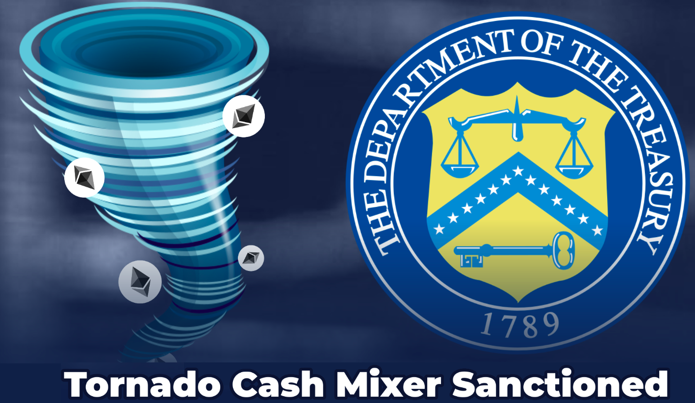

Notes:

<https://cryptoslate.com/op-ed-is-ethereum-now-under-u-s-control-99-of-latest-relay-blocks-are-censoring-the-network/>

- code is unstoppable, but platform _can_ sensor.
  Ability -> responsibility (we may talk more on that latter)

---v

## Social Context

Social systems and norms can help _cover up_ weaknesses in protocols.

> Public monitor to shame OFAC censors:
>
> <https://www.mevwatch.info/>

Notes:

- Pressure from peers through breaking norms, perhaps even losing of authority in consensus due to this.
  Peer reputation in computer networks, and here also in human ones.
- Sometimes social pressures are healthy for the system, sometimes toxic depending on point of view and who benefits!
- In monero "run your own node" culture helps keep it decentralized. 
  Bitcoin big block wars show social pressures help decide the canonical forks.
- Normalizing MEV for the profit of middlemen, providing extraction services in the worst case.

---v

## Unbundling

Notes:

From before, but here point out how this is getting more fine grained as well, and where a single actor would do it all (early bitcoin for example) we are moving more and more to appear.

- Especially if more things like MeV can be enhanced by doing so.
- This introduces more complexity and interfaces that can provide weakness (especially when a network is required!)

---v

## Unbundling

### _The vision of "blockspace" leads more and more to this end_

---v

## Diversity

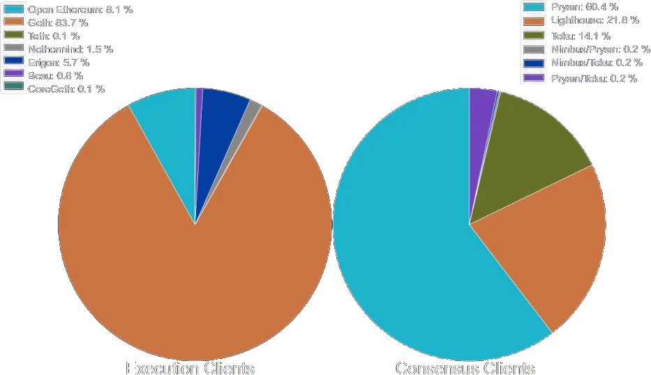

Notes:

- Parity saved ETH (alt clients, and diversity)
  - same runtime on chain, it's impossible to have an alt runtime.
- all on GCP
- All run same hardware (CPU, etc.)
- ...

- Image source, and good reference on this: <https://mirror.xyz/jmcook.eth/S7ONEka_0RgtKTZ3-dakPmAHQNPvuj15nh0YGKPFriA>

---

## Final Thoughts

- Complexity generally increases the risks of failures, but we should not fear it. 
  $~~~$_Hypothesis: this \_usually_ makes systems more brittle.\_
- Observable behavior trumps models and theory. 
  $~~~$_Complex systems are not intuitive and may show your assumptions and models are wrong!_
- This lesson was a _start_ down holes...
  $~~~$_We encourage you to keep diving deeper!_

Notes:

- Risks and unknown unknowns increase exponentially so in many cases.
- Examples of observables in things like MEV OFAC dominance and Babe fallback dominance etc.
- Looking forward to explore the great unknown horizons in web3 together!

---

## 🤝 Together, into the Deep

---

<!-- .slide: data-background-color="#4A2439" -->

# Questions

---

<!-- .slide: data-background-color="#000000" -->

# Additional Slides

Notes:

For reference mostly, outside of formal class time 😀

---

## Governance... Unstoppable?

<iframe width="1120" height="630" src="https://www.youtube-nocookie.com/embed/Q6euy5W1js4" title="YouTube video player" frameborder="0" allow="accelerometer; autoplay; clipboard-write; encrypted-media; gyroscope; picture-in-picture" allowfullscreen></iframe>

[Unstoppable Code: The Difference Between Can't and Won't](https://www.youtube-nocookie.com/embed/Q6euy5W1js4)

Notes:

Watch _after class_!
Perhaps assigned informally to everyone to watch in the next few days.

---v

## Unstoppable Code

> It seizes power from dominate forms of power: governments, corporations, states, associations, cultures, religions.
> It seizes power, from these big things and gives it to little people.
> And sooner or later, the people who are losing their undeserved, abusively applied power will start to fight back.
> And at that point, we will start to find out how unstoppable our code is.  
> -- Andreas Antonopoulos --

---v

## Can't vs. Won't

> The moment you go over the the line from "can't to won't, what started as an ability becomes a responsibility.
> And then if you claim that you don't have the ability anymore, that responsibility just became negligence, criminal negligence.  
> -- Andreas Antonopoulos --

Notes:

- The difference?
- Silk road founder getting 2 life sentences + 40 years.
- moral relativism -> "who's law?"
- Don't make your "oops clause" -> not too narrow.

---

## DAOs

Decentralized Autonomous Organizations ([DAOs](https://www.investopedia.com/tech/what-dao/)).

> A **coordination** mechanism.

---v

## Democratic Systems

Democratic Mediums is a directory of patterns  for decision, deliberation, and noise.

<pba-flex center>

- <https://medlabboulder.gitlab.io/democraticmediums/>
- <https://metagov.org/> -- weekly seminar
- <https://www.smartcontractresearch.org/>

</pba-flex>

Notes:

Very much encouraged to explore after class!
Many novel and niece definitions in this wiki.

---

## Modeling Behavior

> [Token Engineering](https://tokenengineeringcommunity.github.io/website/) 
> {especially the Academy & cadCAD Edu}

Notes:

Mostly free education and tools to dive deeper on tokenomics.
Remember, these are _models_ of idealized systems in general, real world conditions will differ!
