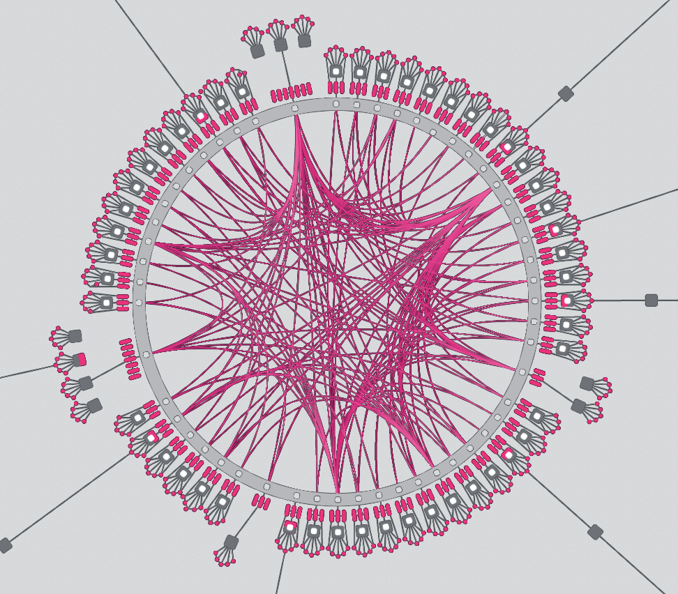

# Copy and Paste Slide Templates

---

### _At the end of this lecture, you will be able to:_

- Describe ... <!-- TODO: fill this in  -->
- Navigate ... <!-- TODO: fill this in  -->
- Justify ... <!-- TODO: fill this in  -->

---

## Here is a topic

- Use some bullets
- To make a few points

Notes:

Speaker view ONLY notes

---

## Here is an important point

#### _Make it clear_

Notes:

Stuff you should remember to say

---

## Code Highlight & Transitions

Syntax for many langs is possible, and very easy to style.
You can _and should_ use highlighting of lines in a large snippets of code.

You an also add comments to make "fragments" for specific components

<!-- .element: class="fragment" data-fragment-index="1" -->

_They can ordered how you see fit!_

<!-- .element: class="fragment" data-fragment-index="3" -->

See the source for syntax

<!-- .element: class="fragment" data-fragment-index="2" -->

---

## Rust Example

```rust [0|1,6|15-25|30-31]
#![cfg_attr(not(feature = "std"), no_std)]
// `construct_runtime!` does a lot of recursion and requires us to increase the limit to 256.
#![recursion_limit = "256"]

// Make the Wasm binary available.
#[cfg(feature = "std")]
include!(concat!(env!("OUT_DIR"), "/wasm_binary.rs"));

mod weights;
pub mod xcm_config;

/// BlockId type as expected by this runtime.
pub type BlockId = generic::BlockId<Block>;

/// The SignedExtension to the basic transaction logic.
pub type SignedExtra = (
	frame_system::CheckNonZeroSender<Runtime>,
	frame_system::CheckSpecVersion<Runtime>,
	frame_system::CheckTxVersion<Runtime>,
	frame_system::CheckGenesis<Runtime>,
	frame_system::CheckEra<Runtime>,
	frame_system::CheckNonce<Runtime>,
	frame_system::CheckWeight<Runtime>,
	pallet_transaction_payment::ChargeTransactionPayment<Runtime>,
);

/// Unchecked extrinsic type as expected by this runtime.
pub type UncheckedExtrinsic = generic::UncheckedExtrinsic<Address, Call, Signature, SignedExtra>;

/// Extrinsic type that has already been checked.
pub type CheckedExtrinsic = generic::CheckedExtrinsic<AccountId, Call, SignedExtra>;

/// Executive: handles dispatch to the various modules.
pub type Executive = frame_executive::Executive<
	Runtime,
	Block,
	frame_system::ChainContext<Runtime>,
	Runtime,
	AllPalletsWithSystem,
>;
```

---

## Design system examples

Use `o` to open the overview mode and explore slides here.

You can see the source of these slides to copy&paste<br />
as slide templates in your slides!

<pba-flex center>

1. Columns
1. Images
1. MarkDown examples

</pba-flex>

---

## Two Column

<pba-cols>
<pba-col center>

### Center 1

Using<br /> `<pba-col center>`

</pba-col>
<pba-col center>

### Center 2

Using<br /> `<pba-col center>`

</pba-col>
</pba-cols>

---v

## Two Column

<!-- prettier-ignore -->
```html
<pba-cols>
<pba-col center>

### Center 1

Using<br />`<pba-col center>`

</pba-col>
<pba-col center>

### Center 2

Using<br />`<pba-col center>`

</pba-col>
</pba-cols>
```

---

## Three Columns

<pba-cols>
<pba-col left>

### Left

Using<br /> `<pba-col left>`

</pba-col>
<pba-col center>

### Center

Using<br /> `<pba-col center>`

</pba-col>
<pba-col right>

### Right

Using<br /> `<pba-col right>`

</pba-col>
</pba-cols>

---v

## Three Columns

<!-- prettier-ignore -->
```html
<pba-cols>
<pba-col left>

### Left

Using<br />`<pba-col left>`

</pba-col>
<pba-col center>

### Center

Using<br />`<pba-col center>`

</pba-col>
<pba-col right>

### Right

Using<br />`<pba-col right>`

</pba-col>
</pba-cols>
```

---

<pba-cols>
<pba-col>

### This column has a bit of a statement to make.

</pba-col>
<pba-col>

- Lorem ipsum dolor sit amet, consectetur adipiscing elit
- Ut enim ad minim veniam, quis nostrud exercitation
- Duis aute irure dolor in reprehenderit in
- Excepteur sint occaecat cupidatat non proident, sunt in

</pba-col>
</pba-cols>

---v

<!-- prettier-ignore -->
```html
<pba-cols>
<pba-col>

### This column has a bit of a statement to make.

</pba-col>
<pba-col>

- Lorem ipsum dolor sit amet, consectetur adipiscing elit
- Ut enim ad minim veniam, quis nostrud exercitation
- Duis aute irure dolor in reprehenderit in
- Excepteur sint occaecat cupidatat non proident, sunt in

</pba-col>
</pba-cols>
```

---

## Images

<!-- So slides AND the raw markdown work as expected: Set WIDTH ONLY in PERCENT, relative to the `div` this img lands within. -->


#### _Leave a note on why this one matters_

Notes:

<!-- Don't forget to link to the image source here, AND the license, if not included with the first use of the image elsewhere in this book. -->

---v

<!-- prettier-ignore -->
```html

```

---

## Graphics

<!-- So slides AND the raw markdown work as expected: Set WIDTH ONLY in PERCENT, relative to the `div` this img lands within. -->


svg, png, gif, ... anything that works on the web should work here!
(Please do be mindful of file size, and minimize where practical)

> Where possible use `svg` or vector graphics...
> Consider using a [mermaid diagram](#mermaid-diagrams) instead 🤩

Notes:

Image source: <https://giphy.com/stickers/transparent-hU2uvl6LdxILQOIad3>
License: <https://support.giphy.com/hc/en-us/articles/360020027752-GIPHY-Terms-of-Service>

---v

<!-- prettier-ignore -->
```html

```

---

## Video

<!-- So slides AND the raw markdown work as expected: Set WIDTH ONLY in PERCENT, relative to the `div` this img lands within. -->
<video rounded controls width="70%">
    <source src="../../polkadot/light-clients/img/LightClients.mp4" type="video/mp4">
    Sorry, your browser doesn't support embedded videos.
</video>

mp4, webm, ... anything that works on the web should work here!

> Please do be mindful of file size, and minimize and compress before committing!

Notes:

Video source: <https://www.youtube.com/watch?v=oaidhA5eL_8>
License: <https://www.youtube.com/static?template=terms>

---v

<!-- prettier-ignore -->
```html
<video controls width="100%">
    <source src="../../polkadot/light_clients/img/LightClients.mp4" type="video/mp4">
    Sorry, your browser doesn't support embedded videos.
</video>
```

---

<!-- .slide: data-background-color="#4A2439" -->

# Section title

---v

<!-- .slide: data-background-color="#4A2439" -->

<!-- prettier-ignore -->
```html
<!-- .slide: data-background-color="#4A2439" -->

# Section title
```

---

> A quote of myself, saying great stuff, as always.

Source: me™ at the last event

---

Testing **bold** and _italic_ markdown texts!

<!-- prettier-ignore -->
```html
Testing **bold** and *italic* markdown texts!
```

---

## Rust Example

```rust [0|1,6|15-25|30-31]
#![cfg_attr(not(feature = "std"), no_std)]
// `construct_runtime!` does a lot of recursion and requires us to increase the limit to 256.
#![recursion_limit = "256"]

// Make the Wasm binary available.
#[cfg(feature = "std")]
include!(concat!(env!("OUT_DIR"), "/wasm_binary.rs"));

mod weights;
pub mod xcm_config;

/// BlockId type as expected by this runtime.
pub type BlockId = generic::BlockId<Block>;

/// The SignedExtension to the basic transaction logic.
pub type SignedExtra = (
	frame_system::CheckNonZeroSender<Runtime>,
	frame_system::CheckSpecVersion<Runtime>,
	frame_system::CheckTxVersion<Runtime>,
	frame_system::CheckGenesis<Runtime>,
	frame_system::CheckEra<Runtime>,
	frame_system::CheckNonce<Runtime>,
	frame_system::CheckWeight<Runtime>,
	pallet_transaction_payment::ChargeTransactionPayment<Runtime>,
);

/// Unchecked extrinsic type as expected by this runtime.
pub type UncheckedExtrinsic = generic::UncheckedExtrinsic<Address, Call, Signature, SignedExtra>;

/// Extrinsic type that has already been checked.
pub type CheckedExtrinsic = generic::CheckedExtrinsic<AccountId, Call, SignedExtra>;

/// Executive: handles dispatch to the various modules.
pub type Executive = frame_executive::Executive<
	Runtime,
	Block,
	frame_system::ChainContext<Runtime>,
	Runtime,
	AllPalletsWithSystem,
>;
```

---v

<!-- prettier-ignore -->
~~~

## Rust Example

```rust [0|1,6|15-25|30-31]
#![cfg_attr(not(feature = "std"), no_std)]
// `construct_runtime!` does a lot of recursion and requires us to increase the limit to 256.
#![recursion_limit = "256"]

// Make the Wasm binary available.
#[cfg(feature = "std")]
include!(concat!(env!("OUT_DIR"), "/wasm_binary.rs"));

mod weights;
pub mod xcm_config;

/// BlockId type as expected by this runtime.
pub type BlockId = generic::BlockId<Block>;

/// The SignedExtension to the basic transaction logic.
pub type SignedExtra = (
	frame_system::CheckNonZeroSender<Runtime>,
	frame_system::CheckSpecVersion<Runtime>,
	frame_system::CheckTxVersion<Runtime>,
	frame_system::CheckGenesis<Runtime>,
	frame_system::CheckEra<Runtime>,
	frame_system::CheckNonce<Runtime>,
	frame_system::CheckWeight<Runtime>,
	pallet_transaction_payment::ChargeTransactionPayment<Runtime>,
);

/// Unchecked extrinsic type as expected by this runtime.
pub type UncheckedExtrinsic = generic::UncheckedExtrinsic<Address, Call, Signature, SignedExtra>;

/// Extrinsic type that has already been checked.
pub type CheckedExtrinsic = generic::CheckedExtrinsic<AccountId, Call, SignedExtra>;

/// Executive: handles dispatch to the various modules.
pub type Executive = frame_executive::Executive<
	Runtime,
	Block,
	frame_system::ChainContext<Runtime>,
	Runtime,
	AllPalletsWithSystem,
>;
```

~~~

---

<pba-cols>
<pba-col>

### Column + Code

- Some
- Observations
- Others

</pba-col>
<pba-col>

```rust [0|1,13|4-8]
fn largest_i32(list: &[i32]) -> i32 {
    let mut largest = list[0];

    for &item in list {
        if item > largest {
            largest = item;
        }
    }

    largest
}

fn largest_char(list: &[char]) -> char {
    let mut largest = list[0];

    for &item in list {
        if item > largest {
            largest = item;
        }
    }

    largest
}

fn main() {
    let number_list = vec![34, 50, 25, 100, 65];

    let result = largest_i32(&number_list);
    println!("The largest number is {}", result);
    assert_eq!(result, 100);

    let char_list = vec!['y', 'm', 'a', 'q'];

    let result = largest_char(&char_list);
    println!("The largest char is {}", result);
    assert_eq!(result, 'y');
}
```

</pba-col>
</pba-cols>

---v

<!-- prettier-ignore -->
```html
<pba-cols>
<pba-col>

### Column + Code

- Some
- Observations
- Others

</pba-col>
<pba-col>


```rust [0|1,13|4-8]
fn largest_i32(list: &[i32]) -> i32 {
    let mut largest = list[0];

    for &item in list {
        if item > largest {
            largest = item;
        }
    }

    largest
}

fn largest_char(list: &[char]) -> char {
    let mut largest = list[0];

    for &item in list {
        if item > largest {
            largest = item;
        }
    }

    largest
}

fn main() {
    let number_list = vec![34, 50, 25, 100, 65];

    let result = largest_i32(&number_list);
    println!("The largest number is {}", result);
    assert_eq!(result, 100);

    let char_list = vec!['y', 'm', 'a', 'q'];

    let result = largest_char(&char_list);
    println!("The largest char is {}", result);
    assert_eq!(result, 'y');
}
```

</pba-col>
</pba-cols>
````

---

## Tables

| Tables              |         Are         |                    Cool |
| ------------------- | :-----------------: | ----------------------: |
| col 1 is            |    left-aligned     |                   $1600 |
| col 2 is            |      centered       |                     $12 |
| col 3 is            |    right-aligned    |                      $1 |
| This row sure has a | _lot_ of text so it | spaces the columns outs |

---v

```
| Tables              |         Are         |                    Cool |
| ------------------- | :-----------------: | ----------------------: |
| col 1 is            |    left-aligned     |                   $1600 |
| col 2 is            |      centered       |                     $12 |
| col 3 is            |    right-aligned    |                      $1 |
| This row sure has a | _lot_ of text so it | spaces the columns outs |
```

---

## Math

KaTeX/LaTeX rendered within blocks with "`$$`" delimiters

$$J(\theta_0,\theta_1) = \sum_{i=0}$$

In line uses "`\\(`" and "`\\)`" to render: \\(\alpha\beta\gamma\\)
.

More info: https://revealjs.com/math/

---

## Charts

<p>
A plugin for Reveal.js allowing to easily add charts using Chart.js.
</p>

<p style="font-size: 1.2rem; margin-top: 1.2rem; color: #999;">There is a known bug:<br /> Chart (meaning the < canvas > tag) needs to be in a full HTML slide (no md allowed); this means that the whole slide that contains a chart MUST be written in plain HTML.

---v
<canvas data-chart="line" style="height: 300px">

<!--
{
 "data": {
  "labels": ["January"," February"," March"," April"," May"," June"," July"],
  "datasets":[
   {
    "data":[4,7,10,25,56,78,140],
    "label":"Polkadot","backgroundColor":"#E6007A"
   },
   {
    "data":[10,27,40,75,80,155,340],
    "label":"Kusama","backgroundColor":"#000"
   }
  ]
 }
}
-->
</canvas>

---v

### The code

```html
<canvas data-chart="line" style="height: 300px">
  <!--
{
 "data": {
  "labels": ["January"," February"," March"," April"," May"," June"," July"],
  "datasets":[
   {
    "data":[4,7,10,25,56,78,140],
    "label":"Polkadot","backgroundColor":"#E6007A"
   },
   {
    "data":[10,27,40,75,80,155,340],
    "label":"Kusama","backgroundColor":"#000"
   }
  ]
 }
}
-->
</canvas>
```

<pba-flex left>
  Note : < !-- and --> are intentional
</pba-flex>

---v

<section style="margin-top: 100px">
  <h5>Bar chart with CSV data</h5>
  <div style="height:480px">
  <canvas data-chart="bar">
    January, February, March, April, May, June, July
    My first dataset, 65, 59, 80, 81, 56, 55, 40
    My second dataset, 28, 48, 40, 19, 86, 27, 90
  </canvas>
  </div>
</section>

---v

### Previous slides' code:

```html
<section style="margin-top: 100px">
  <h5>Bar chart with CSV data</h5>
  <div style="height:480px">
    <canvas data-chart="bar">
      January, February, March, April, May, June, July My first dataset, 65, 59, 80, 81, 56, 55, 40 My second dataset,
      28, 48, 40, 19, 86, 27, 90
    </canvas>
  </div>
</section>
```

---v

<section style="margin-top: 100px">
  <h5>Stacked bar chart from CSV file with JSON configuration</h5>
  <div style="height:480px">
  <canvas data-chart="bar" data-chart-src="./data.csv">
    <!--
    {
    "data" : {
    "datasets" : [{ "backgroundColor": "#0f0" }, { "backgroundColor": "#0ff" } ]
    },
    "options": { "scales": { "x": { "stacked": true }, "y": { "stacked": true } } }
    }
    -->
  </canvas>
  </div>
  <div style="font-size:1.2rem">(There is a data.csv file located under same dir in order for this slide to work</div>
</section>

---v

### Previous slide's code:

```html
<section style="margin-top: 100px">
  <h5>Stacked bar chart from CSV file with JSON configuration</h5>
  <div style="height:480px">
    <canvas data-chart="bar" data-chart-src="./data.csv">
      <!--
    {
    "data" : {
    "datasets" : [{ "backgroundColor": "#0f0" }, { "backgroundColor": "#0ff" } ]
    },
    "options": { "scales": { "x": { "stacked": true }, "y": { "stacked": true } } }
    }
    -->
    </canvas>
  </div>
</section>
```

---

# Mermaid Diagrams

[Mermaid](https://mermaid.js.org) lets you create diagrams and visualizations using text and code.

It is a JavaScript based diagramming and charting tool that renders Markdown-inspired text definitions to create and modify diagrams dynamically.

First of all lets see some examples of diagrams that Mermaid can show with its integration with revealJS;

---v

### [A Flowchart](https://mermaid.js.org/syntax/flowchart.html)

<diagram class="mermaid">
    %%{init: {'theme': 'dark', 'themeVariables': { 'darkMode': true }}}%%
    flowchart TD
      A(Start) --> B{Is it?};
      B -- Yes --> C(OK);
      C --> D(Rethink);
      D --> B;
      B -- No ----> E(End);
</diagram>

---v

### And its code

<!-- prettier-ignore -->
```html
  <diagram class="mermaid">
    %%{init: {'theme': 'dark', 'themeVariables': { 'darkMode': true }}}%%
    flowchart TD
      A(Start) --> B{Is it?};
      B -- Yes --> C(OK);
      C --> D(Rethink);
      D --> B;
      B -- No ----> E(End);
  </diagram>
```

---v

### Entity relationship diagram

<diagram class="mermaid">
    erDiagram
    Node ||--o{ Wallet : places_order
    Wallet ||--|{ Account : owner
    Node }|..|{ Some-IP : uses
</diagram>

---v

### And its code

<!-- prettier-ignore -->
```html
<diagram class="mermaid">
    erDiagram
    Node ||--o{ Wallet : places_order
    Wallet ||--|{ Account : owner
    Node }|..|{ Some-IP : uses
</diagram>
```

---v

### Sequence diagram

<diagram class="mermaid">
  sequenceDiagram
      Alice->>John: Hello John, how are you?
      John-->>Alice: Great!
      Alice-)John: See you later!
</diagram>

---v

### And its code

<!-- prettier-ignore -->
```html
<diagram class="mermaid">
  sequenceDiagram
      Alice->>John: Hello John, how are you?
      John-->>Alice: Great!
      Alice-)John: See you later!
</diagram>
```

---v

### Class Diagram

<diagram class="mermaid">
    classDiagram
      note "From Duck till Zebra"
      Animal <|-- Duck
      note for Duck "can fly\ncan swim\ncan dive\ncan help in debugging"
      Animal <|-- Fish
      Animal <|-- Zebra
      Animal : +int age
      Animal : +String gender
      Animal: +isMammal()
      Animal: +mate()
      class Duck{
          +String beakColor
          +swim()
          +quack()
      }
      class Fish{
          -int sizeInFeet
          -canEat()
      }
      class Zebra{
          +bool is_wild
          +run()
      }
</diagram>

---v

### And its code

<!-- prettier-ignore -->
```html
<diagram class="mermaid">
    classDiagram
      note "From Duck till Zebra"
      Animal <|-- Duck
      note for Duck "can fly\ncan swim\ncan dive\ncan help in debugging"
      Animal <|-- Fish
      Animal <|-- Zebra
      Animal : +int age
      Animal : +String gender
      Animal: +isMammal()
      Animal: +mate()
      class Duck{
          +String beakColor
          +swim()
          +quack()
      }
      class Fish{
          -int sizeInFeet
          -canEat()
      }
      class Zebra{
          +bool is_wild
          +run()
      }
</diagram>
```

---v

### State diagram (v2)

<diagram class="mermaid">
  stateDiagram-v2
    [*] --> Still
    Still --> [*]

    Still --> Moving
    Moving --> Still
    Moving --> Crash
    Crash --> [*]

</diagram>

---v

### And its code

<!-- prettier-ignore -->
```html
<diagram class="mermaid">
  stateDiagram-v2
    [*] --> Still
    Still --> [*]

    Still --> Moving
    Moving --> Still
    Moving --> Crash
    Crash --> [*]
</diagram>
```

---v

### User Journey

<diagram class="mermaid">
  journey
    title My working day
    section Go to work
      Make tea: 5: Me
      Go upstairs: 3: Me
      Do work: 1: Me, Cat
    section Go home
      Go downstairs: 5: Me
      Sit down: 5: Me
</diagram>

---v

### And its code

<!-- prettier-ignore -->
```html
<diagram class="mermaid">
    journey
    title My working day
    section Go to work
      Make tea: 5: Me
      Go upstairs: 3: Me
      Do work: 1: Me, Cat
    section Go home
      Go downstairs: 5: Me
      Sit down: 5: Me
</diagram>
```

---v

### Gantt

<diagram class="mermaid">
    gantt
      apple :a, 2017-07-20, 1w
      banana :crit, b, 2017-07-23, 1d
      cherry :active, c, after b a, 1d
</diagram>

---v

### And its code

<!-- prettier-ignore -->
```html
<diagram class="mermaid">
    gantt
      apple :a, 2017-07-20, 1w
      banana :crit, b, 2017-07-23, 1d
      cherry :active, c, after b a, 1d
</diagram>
```

---v

### Pie Chart

<diagram class="mermaid">
    pie title Pets adopted by volunteers
      "Dogs" : 386
      "Cats" : 85
      "Rats" : 15
</diagram>

---v

### And its code

<!-- prettier-ignore -->
```html
<diagram class="mermaid">
    pie title Pets adopted by volunteers
      "Dogs" : 386
      "Cats" : 85
      "Rats" : 15
</diagram>
```

---v

### Git Graph

<diagram class="mermaid">
    gitGraph
      commit
      commit
      branch develop
      checkout develop
      commit
      commit
      checkout main
      merge develop
      commit
      commit
</diagram>

---v

### And its code

<!-- prettier-ignore -->
```html
<diagram class="mermaid">
    gitGraph
      commit
      commit
      branch develop
      checkout develop
      commit
      commit
      checkout main
      merge develop
      commit
      commit
</diagram>
```

---v

### Useful links

- [Mermaid Syntax](https://mermaid.js.org/syntax/flowchart.html)
- [Mermaid Live Editor with examples](https://mermaid.live/)

---

# More help needed?

_Please reach out to a contributor_
