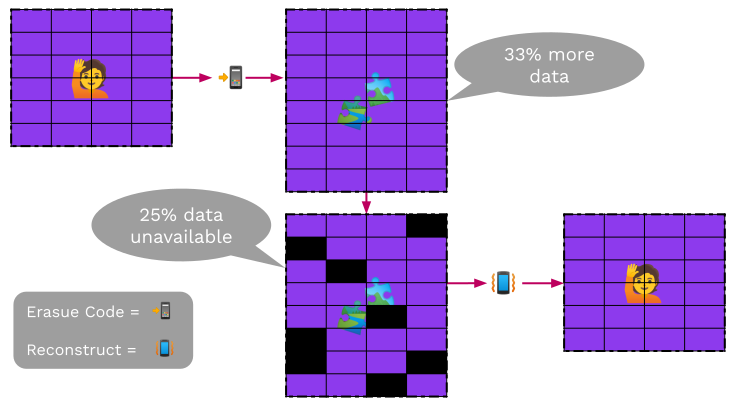
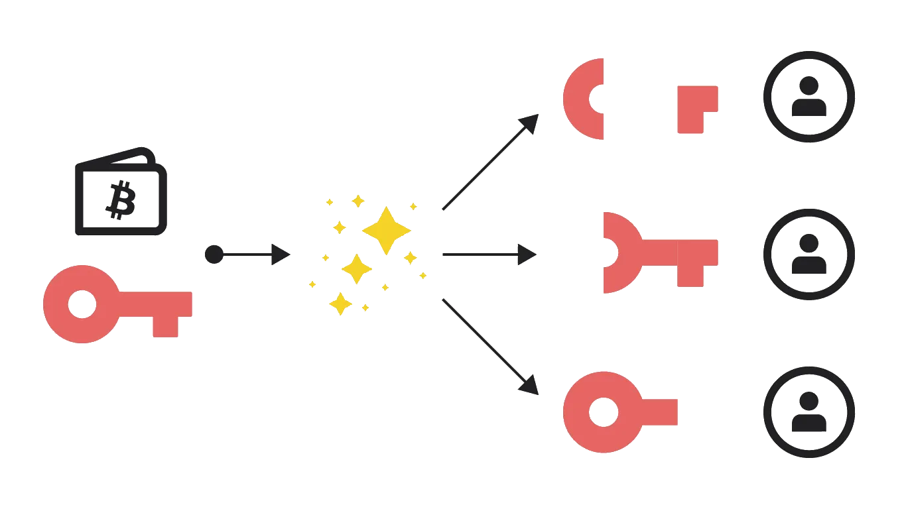
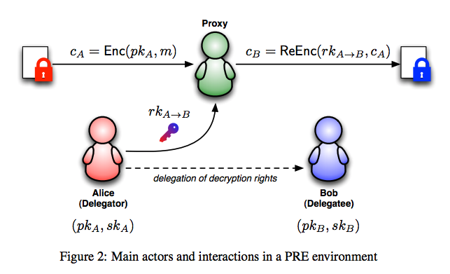

# Exotic Primitives

---

# Outline

<pba-flex center>

1. [Verifiable Random Functions (VRFs)](#verifiable-random-functionsvrfs)
1. [Erasure coding](#erasure-coding)
1. [Shamir Secret Sharing](#shamir-secret-sharing)
1. [Proxy Re-Encryption](#proxy-reencryption)
1. [ZK Proofs](#zk-proofs)

</pba-flex>

---

## Verifiable Random Functions (VRFs)

<widget-center>

- Used to obtain <ins>private randomness</ins>, that is <ins>publicly verifiable</ins>

- A variation on a signature scheme:
  - still have private/public key pairs, input as message
  - in addition to signature, we get an output

---

## VRF Interface

- `sign(sk, input) -> signature`

- `verify(pk, signature) -> option output`

- `eval(sk,input) -> output`

Notes:

The output of verification being an option represents the possibility of an invalid signature

---

## VRF Output properties

- Output is a deterministic function of _key_ and _input_
  - i.e. eval should be deterministic
- It should be pseudo-random
- But until the VRF is revealed, only the holder of the secret key knows the output
- Revealing output does not leak secret key

---

## VRF Usage

- Choose input after key, then the key holder cannot influence the output
- The output then is effectively a random number known only to the key holder
- But they can later reveal it, by publishing the VRF proof (signature)

Notes:

The signature proves that this is the output associated to their input and public key.

---

## VRF Example

- Playing a card game in a distributed and trustless way
- For player A to draw a card, the players agree on a new random number x
- A's card is determined by
  `eval(sk_A,x) mod 52`
- To play the card, A publishes the signature

---

## VRF Extensions

- Threshold VRFs / Common coin

  - Generate the same random number if $t$ out of $n$ people participate

- RingVRFs

  - The VRF output could be from any one of a group of public keys.

Notes:

Common coins were used in consensus before blockchains were a thing.
Dfinity based their consensus on this.
But this needs a DKG, and it's unclear if a decentralized protocol can do those easily.

A participant in a RingVRF could still only reveal _one_ random number.

---

## Erasure Coding

_Magical data expansion_

- Turn data into pieces (with some redundancy) so it can be reconstructed even if some pieces are missing.

- A message of $k$ symbols is turned into a coded message of $n$ symbols and can be recovered from any $k$ of these $n$ symbols

---

## Erasure Coding Intuition

Erasure coding relies on both parties sharing an understanding of what possible messages are valid. This lets mistakes be noticed and corrected.

Imagine you are receiving a message, and you know ahead of time that the only two possible messages you would receive are `file` and `ruin`.

Notes:

This concept of a subset of messages being valid is super common in real life, and occurs all over the place.
At a restaurant, when they ask you if you want soup or salad, even if you mumble they will probably understand you.

---v

## Erasure Coding Intuition

How would you classify each of the following words?

file pile pale tale tall rule tail rail rain ruin

---v

## Erasure Coding Intuition

How would you classify each of the following words?

file pile pale tale tall rule  tail rail rain ruin

You can classify them based on how close they are to a valid input. This also means we can find the errors in these messages.

Notes:

There is no perfect way to separate these, but one very reasonable one is to do it based on the edit distance of the received word with any valid messsage you could receive.

---v

## Erasure Coding Intuition

Now, you are receiving messages that could be `msg1` or `msg2`. Can you apply the same technique? Is it as easy to separate received messages?

What if you receive `msg3`?

Notes:

If the messages are not far apart, it is impossible to distinguish in many cases. There is not enough "distance" between the two possibilities.

---v

## Erasure Coding Intuition

With erasure coding, we extend each message magically so they are different enough. The sender and receiver know the same encoding procedure. These extensions will be very different, even if the messages are similar.

`msg1` `jdf` and `msg2` `ajk`

Notes:

It is actually always possible to make the extra magic only appended to the message. This is called a _systematic encoding_.

For those curious about how the "magic" works:

The magic here is polynomials, and the fact that a polynomial of degree $n$ is completely determined by $n+1$ points. There are many good explanations online.

---

## Erasure Coding

---

## Erasure Coding Classical use

- Used for noisy channels
- If a few bits of the coded data are randomly flipped,  we can still recover the original data
- Typically $n$ is not much bigger than $k$

---

## Use in Decentralized Systems

- We have data we want to keep publicly available

  - but not have everyone store
  - but we don't trust everyone who is storing pieces

- Typically we use $n$ much bigger than $k$

---

## Shamir Secret Sharing

_Redundancy for your secrets_

- Turn data (typically a secret) into pieces so it can be reconstructed from some subset of the pieces.

- A secret is turned into $n$ shares, and be recovered by any $k$ of the shares. $k-1$ shares together reveals nothing about the secret.

---

## Shamir Secret Sharing

Notes:

Image source: <https://medium.com/clavestone/bitcoin-multisig-vs-shamirs-secret-sharing-scheme-ea83a888f033>

---

## Pros and Cons

- Can reconstruct a secret if you lose it.
- So can other people who collect enough shares.

---

## Proxy Reencryption

Generate keys to allow a third party to transform encrypted data so someone else can read it, without revealing the data to the third party.

---

## Proxy Reencryption

Notes:

[img source](https://scrapbox.io/layerx/Proxy_Re-Encryption%28PRE%29%E3%81%A8NuCypher)

---

## Proxy Reencryption API

- `fn encrypt(pk, msg) -> ciphertext;`   Takes your public key and a message; returns ciphertext.
- `fn decrypt(sk, ciphertext) -> msg;`   Takes your private key and a ciphertext; returns the message.
- `fn get_reencryption_key(sk, pk) -> rk;`   Takes your private key, and the recipient's public key; returns a reencryption key.
- `fn reencrypt(rk, old_ciphertext) -> new_ciphertext;`   Take a reencryption key, and transform ciphertext to be decrypted by new party.

---

## ZK Proofs

How do we do private operations on a public blockchain and have everyone know that they were done correctly?

Notes:

(we are working on substrate support for these and will use them for protocols)

---

## What is a ZK Proof?

- A prover wants to convince a verifier that something is true without revealing why it is true.

- They can be interactive protocols, but mostly we'll be dealing with the non-interactive variety.

---

## What can we show?

- NP relation: `function(statement, witness) -> bool`

- Prover knows a witness for a statement:

  - They want to show that they know it (_a proof of knowledge_)

  - ... Without revealing anything about the witness (_ZK_)

---

## ZK Proof Interface

- NP relation: `function(statement, witness) -> bool`

- `prove(statement, witness) -> proof`

- `verify(statement, proof) -> bool`

---

## ZK Proof Example

_Example:_ Schnorr signatures are ZK Proofs

- They show that the prover knows the private key (the discrete log of the public key) without revealing anything about it.
- The statement is the public key and the witness the private key.

---

## zk-SNARK

**Z**ero-**K**nowledge **S**uccinct **N**on-interactive **Ar**gument of **K**nowledge

- **Zero knowledge** - the proof reveals nothing about the witness that was not revealed by the statement itself.
- **Succinct** - the proof is small
- **Proof of knowledge** - if you can compute correct proofs of a statement, you should be able to compute a witness for it.

---

## What can we show?

- NP relation: `function(statement, witness) -> bool`

  - They want to show that they know it (_a proof of knowledge_)

  - ... Without revealing anything about the witness (_ZK_)

- With a small proof even if the witness is large (_succinctness_)

---

## What can we show?

- There are many schemes to produce succinct ZK proofs of knowledge (_ZK-SNARKs_) for every NP relation.

---

## ZK Proof Scaling

A small amount of data, a ZK proof, and execution time can be used to show properties of a much larger dataset which the verifier doesn't need to know.

---

## Scaling via ZK Proofs in Blockchain

- Large amount of data - a blockchain
- Verifier is e.g. an app on a mobile phone

Notes:

e.g. Mina do a blockchain with a constant size proof (of correctness of execution and consensus) using recursive SNARKs.

---

## Scaling via ZK Proofs in Blockchain

- The verifier is a blockchain: very expensive data and computation costs.

- Layer 2s using ZK rollups

Notes:

Of which Ethereum has many, ZKsync, ZKEVM etc.
Polkadot already scales better!

---

## Privacy

<pba-flex center>

A user has private data, but we can show publicly that this private data is correctly used. 
An example would a private cryptocurrency:

- Keep who pays who secret
- Keep amounts secret,   _But show they are positive!_

</pba-flex>

Notes:

You can do some of keeping amounts secret without ZK-SNARKs, but the positive part is difficult.
To do everything well, ZK-SNARKs are needed in e.g. ZCash and its many derivatives e.g. Manta.

---

## Practical Considerations

- Very powerful primitive

- Useful for both scaling and privacy

- One can design many protocols with ZK Proofs that wouldn't otherwise be possible

---

## Downside

- Slow prover time for general computation
- To be fast, need to hand optimize
- Very weird computation model: 
  Non-deterministic arithmetic circuits

---

## Downsides Conclusion?

- So if you want to use this for a component, expect a team of skilled people to work for at least a year on it...
- But if you are watching this 5 years later, people have built tools to make it less painful.

---

## Succinct Proving with Cryptography?

<pba-flex center>

- ZK friendly hashes
- Non-hashed based data structures
  - RSA accumulators
  - Polynomial commitment based 
    (Verkle trees)

</pba-flex>

---

## Summary

- VRF: Private randomness that is later publicly verifiable
- Erasure Coding: Making data robust against losses with redundancy
- Shamir Secret Sharing: Redundancy for your secrets.
- Proxy Re-encryption: Allow access to your data _with cryptography_.
- ZK Proofs: Just magic, but expensive magic

---

<!-- .slide: data-background-color="#4A2439" -->

# Questions
