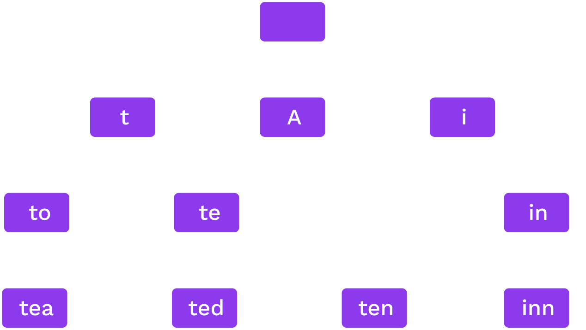
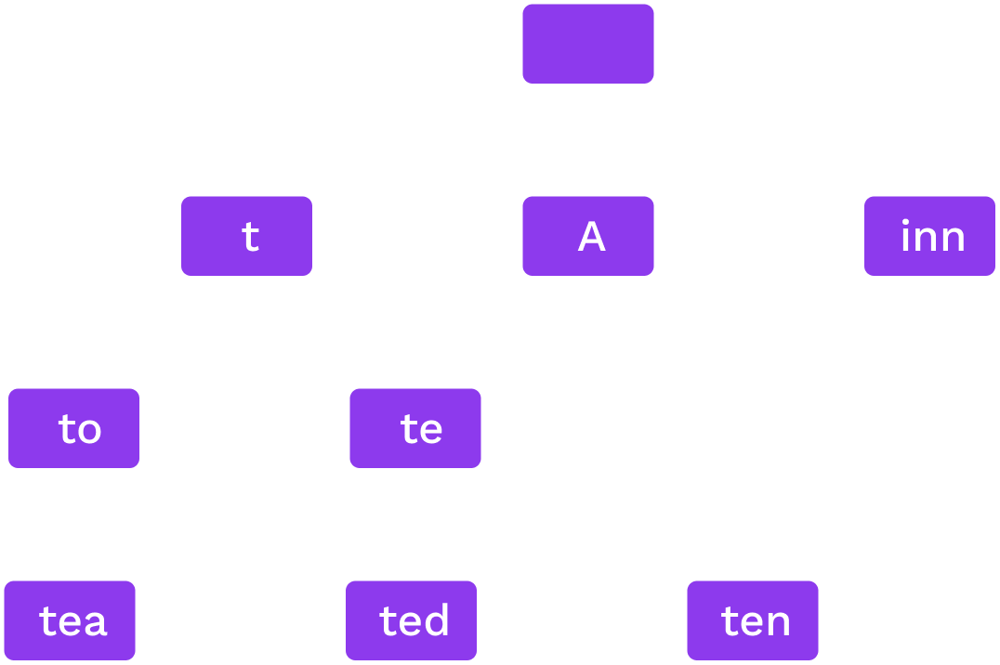
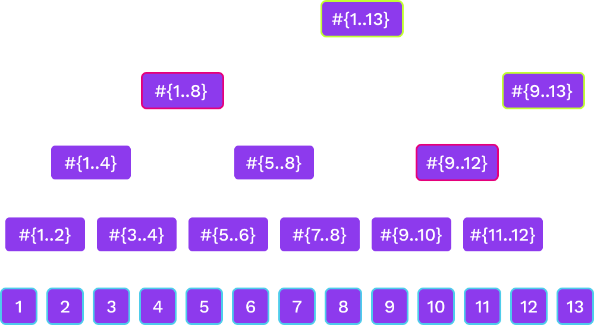

# Hash Based Data Structures

---

## Comparison to<br />Pointer Based Data Structures

- A hash references the _content_ of some data;
- A pointer tells you where to find it;
- We can not have cycles of hashes.

---

## Hash Chains


A hash chain is a linked list using hashes to connect nodes.

Notes:

Each block has the hash of the previous one.

---

## Merkle Trees


A binary Merkle tree is a binary tree using hashes to connect nodes.

Notes:

Ralph Merkle is a Berkeley alum!

---

## Proofs

- The root or head hash is a commitment to the entire data structure.
- Generate a proof by expanding some but not all hashes.

_Crucial for the trustless nature of decentralised cryptographic data systems!_

---

## Proofs: Merkle Copaths


Notes:

Given the children of a node, we can compute a node
Given the purple nodes and the white leaf, we can compute the white nodes bottom to top.
If we compute the correct root, this proves that the leaf was in the tree

---

## Security

Collision resistance: we reasonably assume only one preimage for each hash,<br />therefore making the data structure's linkage persistent and enduring (until the cryptography becomes compromised 😥).

Notes:

Explain what could happen when this fails.

---

## Proof Sizes

Proof of a leaf has size $O(\log n)$<br />and so do proofs of updates of a leaf

---

## Key-Value Databases and Tries

---

## Key-value database

The data structure stores a map `key -> value`.<br />
We should be able to:

<pba-flex center>

- `put(key, value)`
- `get(key)`
- `delete(key)`

</pba-flex>

---

## Provability in key-value databases

We should also be able to perform the following operations for a provable key-value database:

1. For any key, if `<key,value>` is in the database, we can prove it.
1. If no value is associated to a key, we need to be able to prove that as well.

---

## Types of Data Structures

- _**Trees**_ are rooted, directed acyclic graphs where each child has only one parent.
- _**Merkle Trees**_ are _trees_ which use hashes as links.
- _**Tries**_ are a particular class of _trees_ where:
  - Given a particular piece of data, it will always be on a particular path.
- _**Radix Tries**_ are a particular class of a trie where:
  - The location of a value is determined the path constructed one digit at a time.
- _**Patricia Tries**_ are _radix tries_ which are optimized to ensure lonely node-paths are consolidated into a single node.

Notes:

Just a selection we'll cover in this course.

---

## Radix Trie

_Words:_ to, tea, ted, ten, inn, A.



Each node splits on the next digit in base $r$

Notes:

In this image, $r$ is 52 (26 lowercase + 26 uppercase).

---

## Patricia Trie

_Words:_ to, tea, ted, ten, inn, A.



If only one option for a sequence we merge them.

<!-- TODO maybe some code stuff with extension nodes etc. -->

---

## Patricia Trie Structures

```rust
pub enum Node {
  Leaf {
    partial_path: Slice<RADIX>,
    value: Value
  },
  Branch {
    partial_path: Slice<RADIX>,
    children: [Option<Hash>; RADIX],
    value: Option<Value>,
  },
}
```

Notes:

The current implementation actually makes use of dedicated "extension" nodes instead of branch nodes that hold a partial path. There's a good explanation of them [here](https://ethereum.stackexchange.com/questions/39915/ethereum-merkle-patricia-trie-extension-node).

Additionally, if the size of a value is particularly large, it is replaced with the hash of its value.

<!-- TODO: Add a nice illustration similar to Shawn's dev-trie-backend-walk here. -->

---

## Hash Trie

- Inserting arbitrary (or worse, user-determined) keys into the Patricia tree can lead to highly unbalanced branches, enlarging proof-sizes and lookup times.
- Solution: pre-hash the data before inserting it to make keys random.
- _Resistance against partial collision is important._
- Could be a Merkle trie or regular.

---

## Computational and Storage <br />Trade-offs

What radix $r$ is best?

- Proof size of a leaf is $r \log_r n$
  - $r=2$ gives the smallest proof for one leaf

...but:

- Higher branching at high levels of the tree can give smaller batch proofs.
- For storage, it is best to read consecutive data so high $r$ is better.

---

## Merkle Mountain Ranges

- Efficient proofs and updates for a hash chain
- Append only data structure
- Lookup elements by number

---

## Merkle Mountain Ranges


Notes:

we have several Merkle trees of sizes that are powers of two.
The trees that are here correspond to the binary digits of 13 that are 1.

---

## Merkle Mountain Ranges


---

## Merkle Mountain Ranges



Notes:

- Not as balanced as a binary tree but close
- Can update the peak nodes alone on-chain

---

<!-- .slide: data-background-color="#4A2439" -->

# Questions
