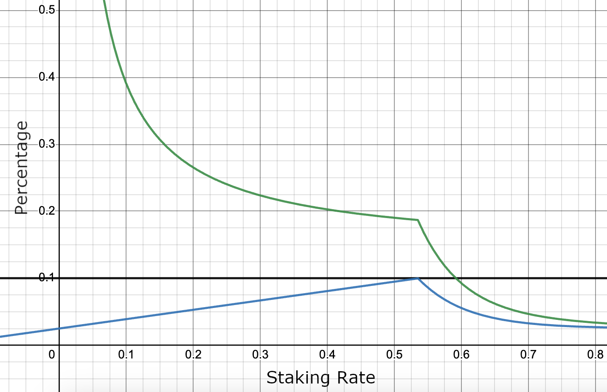
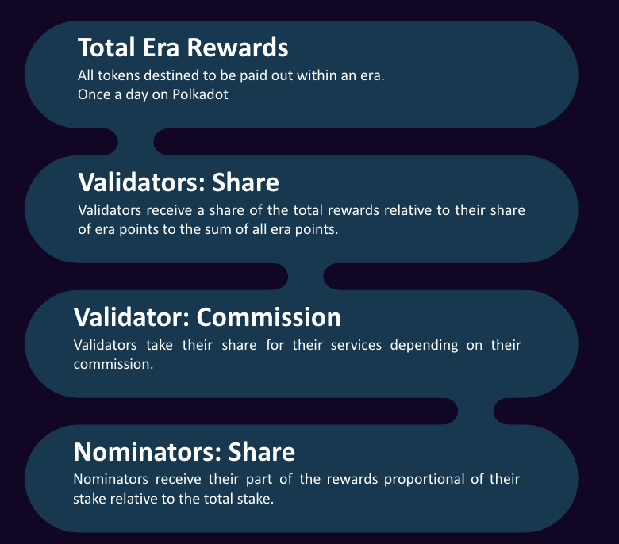
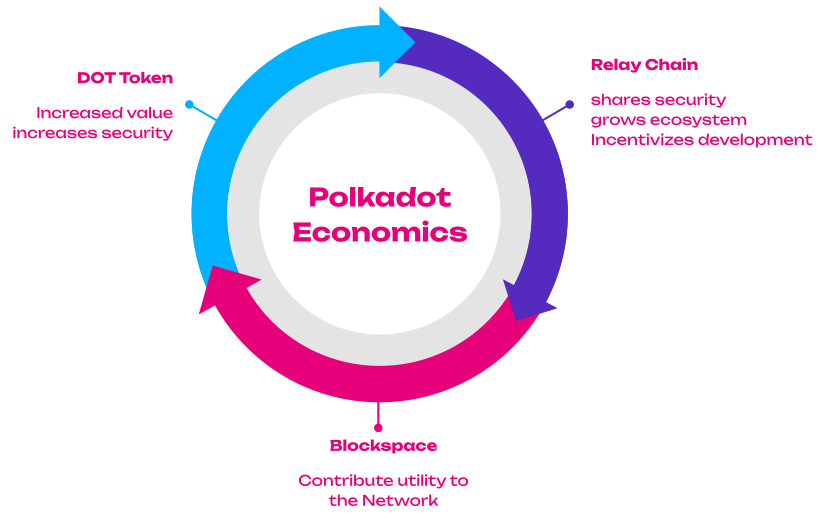

# The Economics of Polkadot

---

## Overview

<ul>
<li class="fragment">Which economic pieces build the the Polkadot Network?</li>
<li class="fragment">What are their mechanisms and incentives?</li>
<li class="fragment">How are those pieces interrelated?</li>
</ul>

Remark: There are currently many changes planned

---

---

# Token Economics

---

## DOT Token

<ul>
<li class="fragment">Native token of the Polkadot network.</li>
<li class="fragment">1 DOT = \(1\mathrm{e}{10}\) Plancks</li>
<li class="fragment">
    Planck = smallest unit of account.
    <ul>
        <li class="fragment">Reference to Planck Length = the smallest possible distance in Physics.</li>
    </ul>
</li>
<li class="fragment">
    <strong>Utility Token</strong> with several use-cases:
    <ul>
        <li class="fragment">Governance (decentralization)</li>
        <li class="fragment">Bonding in slot auctions (utility)</li>
        <li class="fragment">Staking (security)</li>
        <li class="fragment">Message passing (e.g., transfers)</li>
    </ul>
</li>
</ul>

---

## Inflation Model

<ul>
<li class="fragment">Expansion in token supply.</li>
<li class="fragment">Token minted from thin air.
  <ul>
  <li class="fragment">Used to pay staking rewards for validators and nominators.</li>
  <li class="fragment">(Indirectly) fund Treasury.</li>
  </ul>
</li>
<li class="fragment">Central economic variables of the model are:</li>
<li class="fragment"><strong>Exogenous</strong>:
  <ul>
  <li class="fragment">Staking rate (Total amount of staked DOT / Total amount of DOT).</li>
  </ul>
</li>
<li class="fragment"><strong>Endogenous</strong>:
  <ul>
  <li class="fragment">Optimal staking rate (a sufficient backing for validators to provide reasonable security).</li>
  </ul>
</li>
<li class="fragment">Total inflation rate (10%).</li>
</ul>

---

## Inflation Model

<ul>
<li class="fragment">Different <strong>states</strong> of DOT:
  <ul>
  <li class="fragment"><strong>Liquid</strong>: Used for messaging and liquidity on markets.</li>
  <li class="fragment"><strong>Bonded (Staking)</strong>: Economic mass that guarantees the security of the network.</li>
  <li class="fragment"><strong>Bonded (Parachains)</strong>: The demand for DOT tokens by parachains.</li>
  </ul>
</li>
<li class="fragment">The goal is to obtain (some) <strong>sensible ratio</strong> between those three token states.</li>
</ul>

---

## Inflation Model

    

        
    

    

        <ul>
            <li class="fragment"><strong>Central variable</strong>: Ideal staking rate (currently ~53.5%).</li>
            <li class="fragment">Highest staking rewards at the ideal staking rate.</li>
            <li class="fragment">Incentives to (increase) decrease the staking rate it is (below) above the optimal.</li>
            <li class="fragment">Staking inefficiencies -> Treasury.</li>
            <li class="fragment">Ideal staking rate scales with number of active parachains (0.5% less with each parachain).</li>
        </ul>
    

---

## Inflation

<ul>
    <li class="fragment">In the fiat-world, inflation has a negative connotation.</li>
    <li class="fragment">This is a general discussion in economics.</li>
    <li class="fragment">My take on this:</li>
    <ul>
        <li class="fragment">Predictable (maximum) inflation is good.</li>
        <li class="fragment">It incentivizes to work with the tokens (i.e., bond for good parachains, use for message passing).</li>
        <li class="fragment">Deflation can cause a halt of economic activity, because people start hoarding tokens.</li>
    </ul>
</ul>

Notes:

Question: What do you think about Inflation?

---

## Potential changes incoming

<ul>
    <li class="fragment">The current system incentivizes to move the staking rate to the ideal rate.</li>
    <li class="fragment">Then, Treasury inflow would be 0 DOT.</li>
    <li class="fragment">That is not sustainable.</li>
    <li class="fragment">Proposed change: Detach inflation to stakers from total inflation and divert the rest to Treasury directly.</li>
</ul>

---

## Staking: Concept

<ul>
    <li class="fragment"><strong>Nominated Proof-Of-Stake (NPoS)</strong>.</li>
    <li class="fragment">Economic incentives of <strong>validators</strong> and <strong>nominators</strong> are aligned with those of the network.</li>
    <ul>
        <li class="fragment">Good behavior is rewarded with staking rewards.</li>
        <li class="fragment">Malicious / Neglecting behavior is punished (slashed).</li>
    </ul>
    <li class="fragment">Currently, minimum total stake is ~1.6M DOTs.</li>
    <li class="fragment">The total stake in the system directly translates to the <strong>economic security</strong> that it provides.</li>
    <li class="fragment">Total stake is pooled from validators (self-stake) and their nominators (nominated stake)</li>
    <ul>
        <li class="fragment">High degree of inclusion</li>
        <li class="fragment">High security</li>
        <li class="fragment">The goal is to get as much <strong>skin-in-the-game</strong> as possible.</li>
    </ul>
</ul>

---

## Validators

<ul>
    <li class="fragment">What makes Validators resilient:</li>
    <ul>
        <li class="fragment">Self-stake</li>
        <li class="fragment">Reputation (identity)</li>
        <li class="fragment">High future rewards (self-stake + commission)</li>
    </ul>
</ul>

---

## Nominators

<ul>
    <li class="fragment">Bond tokens for up to 16 validators that they deem trustworthy.</li>
    <li class="fragment">They have an incentive to find the best ones that match their preferences.</li>
    <li class="fragment">They are tasked to collectively curate the set of active validators.</li>
</ul>

---

## Rewards

<pba-cols>
<pba-col>
<pba-flex center>

</pba-flex>
</pba-col>
<pba-col>

<ul>
    <li class="fragment"><em>What are staking rewards for?</em></li>
    <li class="fragment"><strong>Validators</strong>: Hardware, networking, and maintenance costs, <strong>resilience</strong>.</li>
    <li class="fragment"><strong>Nominators</strong>: Curation of the active set of validators, sort out the good from the bad ones (Invisible Hand).</li>
</ul>

</pba-col>
</pba-cols>

---

## Validator Selection

<ul>
    <li class="fragment">The job of nominators is to find and select suitable validators.</li>
    <li class="fragment">Nominators face several trade-offs when selecting validators:</li>
    <ul>
        <li class="fragment">Security, Performance, Decentralization</li>
        <li class="fragment">Ideally those variables in their historic time-series.</li>
    </ul>
    <li class="fragment">Economic Background:</li>
    <ul>
        <li class="fragment">Self-stake as main indicator of skin-in-the-game.</li>
        <li class="fragment">Higher commission, ceteris paribus, leaves a validator with more incentives to behave.</li>
    </ul>
    <li class="fragment">Various sources of trust</li>
    <li class="fragment">Efficient validator recommendation is one of my research topics.</li>
</ul>

---

# Parachains

---

## What are Parachains?

<ul>
    <li class="fragment">Parachains (or cores) are the layer-1 part of the protocol.</li>
    <li class="fragment">Blockchains of their own that run in parallel.</li>
    <ul>
        <li class="fragment">Highly domain specific and have high degree of flexibility in their architecture.</li>
        <li class="fragment">Share same messaging standard to be interoperable and exchange messages through the Relay Chain.</li>
    </ul>
    <li class="fragment">Polkadot: 43 Parachains, Kusama: 46 Parachains.</li>
    <li class="fragment">Their state transition function (STF) is registered on the Relay Chain.</li>
    <ul>
        <li class="fragment">Validators can validate state transitions without knowing all the data on the Parachain.</li>
        <li class="fragment">Collators keep the parachain alive (but are not needed for security).</li>
    </ul>
    <li class="fragment">Offer their utility to the network.</li>
</ul>

---

## Parachain Slots

<ul>
    <li class="fragment">The access to the network is abstracted into the notion of “slots”.</li>
    <ul>
        <li class="fragment">Leases for ~2 years on Polkadot (~1 year on Kusama).</li>
        <li class="fragment">Only limited amount of slots available (networking).</li>
        <li class="fragment">The slots are allocated through a candle auction.</li>
    </ul>
    <li class="fragment">Bonded tokens held (trustlessly) in custody on the Relay Chain.</li>
    <li class="fragment">The tokens will be refunded after the slot expires.</li>
</ul>

---

## Economic Intuition

<ul>
    <li class="fragment">Tokens cannot be used for anything (staking, transacting, liquidity, governance).</li>
    <ul>
        <li class="fragment">That means, tokens locked cause opportunity costs.</li>
        <li class="fragment">An approximation is the trust-free rate of return from staking.</li>
    </ul>
    <li class="fragment">Parachains need to compete with those costs and generate benefits that exceed those opportunity costs.</li>
    <ul>
        <li class="fragment">Sufficient crowdloan rewards.</li>
        <li class="fragment">Sufficient economic activity on-chain that justifies renewal.</li>
    </ul>
    <li class="fragment">Slot mechanism creates constant demand for DOT token.</li>
    <li class="fragment">It is costly to be and remain a parachain.</li>
    <ul>
        <li class="fragment">Natural selection mechanism to select useful parachains.</li>
        <li class="fragment">Continuous pressure to gather funds for extending slots.</li>
    </ul>
</ul>

---

## What do Parachains get?

<ul>
    <li class="fragment"><strong>Parachains pay for security</strong>.</li>
    <ul>
        <li class="fragment">Every parachain is as secure as the Relay Chain.</li>
        <li class="fragment">Polkadot is a security alliance with network effects.</li>
        <li class="fragment">Not only scaling number of transactions, but it also scaling of security.</li>
    </ul>
    <li class="fragment">Security is a pie of limited size, because financial resources are limited.</li>
    <li class="fragment">Every chain that secures itself need cut a piece of the cake, which leaves less to others (zero-sum).</li>
    <li class="fragment">Shared security protocols allow to keep the cake whole and entail it to all participants.</li>
    <li class="fragment">Shared security is a scaling device, because the amount of stake you need to pay stakers to secure 100 shards is less than you need to pay stakers to secure 100 individual chains.</li>
</ul>

---

## Outlook Polkadot 2.0

<ul>
    <li class="fragment">Based on Gav’s Keynote at Polkadot Decoded 2023.</li>
    <li class="fragment">A new narrative of the whole Polkadot system.</li>
    <li class="fragment">We move away from regarding Parachains as a distinct entity but rather regard Polkadot as global distributed computer.</li>
    <li class="fragment">It's spaces and apps rather than chains.</li>
    <li class="fragment">This computer has computation cores that can be allocated flexible to applications that need it.</li>
    <li class="fragment">Coretime can be bought, shared, resold.</li>
</ul>

---

## Core Attributes of Blockspace

<ul>
    <li class="fragment"><strong>Security</strong>: The scarcest resource in blockchain, crucial in preventing consensus faults or 51% attacks that could compromise transactions.</li>
    <li class="fragment"><strong>Availability</strong>: Ensuring blockspace is available without long waiting times or uncertain costs for a smooth, seamless interaction within the decentralized ecosystem.</li>
    <li class="fragment"><strong>Flexibility</strong>: The ability of blockspace to be fine-tuned by the consumer for specific use-cases.</li>
</ul>

---

## Blockspace Ecosystem

<ul>
    <li class="fragment">A networked collection of individual blockspace producers (blockchains) offering secured, fit-for-purpose, efficiently-allocated, and cost-effective blockspace.</li>
    <li class="fragment">A valuable aspect of a blockspace ecosystem is its connective tissue of shared security and composability.</li>
    <li class="fragment">Dapp developers or blockspace providers can focus on their unique features, reusing existing capabilities within the ecosystem.</li>
    <li class="fragment">For example, a supply chain traceability application could use different types of blockspace for identity verification, asset tokenization, and source traceability.</li>
</ul>

---

## Bulk markets

<ul>
    <li class="fragment">It's not yet finalized how they work but likely:</li>
    <ul>
        <li class="fragment">Around 75% of cores are allocated to the market.</li>
        <li class="fragment">Cores are sold for 4 weeks as NFT by a broker.</li>
        <li class="fragment">Unrented cores go to the instantaneous market.</li>
        <li class="fragment">Price de-/increases relative to demand.</li>
        <li class="fragment">Current tenants have a priority buy right for their core(s).</li>
    </ul>
</ul>

---

## Why the change?

<ul>
    <li class="fragment">This allows for low barriers of entry for people to simply deploy their code to a core and test stuff</li>
    <li class="fragment">It makes blockspace more efficient, because not all teams can/want to have a full block every 6/12 seconds.</li>
</ul>

---

# Treasury

<ul>
    <li class="fragment">The treasury is an on-chain fund that holds DOT token and is governed by all token holders of the network.</li>
    <li class="fragment">Those funds come from:</li>
    <ul>
        <li class="fragment">Transactions</li>
        <li class="fragment">Slashes</li>
        <li class="fragment">Staking inefficiencies (deviations from optimal staking rate)</li>
    </ul>
    <li class="fragment">Through governance, everybody can submit proposals to initiate treasury spending.</li>
    <li class="fragment">It currently holds around 46M DOT.</li>
    <li class="fragment">Spending is incentivized by a burn mechanism (1% every 26 days).</li>
</ul>

---

## Treasury as DAO

<ul>
    <li class="fragment">A DAO (decentralized autonomous organization) that has access to funds and can make funding decisions directed by the collective (that have vested interest in the network).</li>
    <li class="fragment">This has huge potential that might not yet have been fully recognized by the people.</li>
    <li class="fragment">This provides the chain the power to fund its own existence and improves the utility in the future. It will pay…</li>
    <ul>
        <li class="fragment">… <strong>core developers</strong> to improve the protocol.</li>
        <li class="fragment">… <strong>researchers</strong> to explore new directions, solve problems and conduct studies that are beneficial for the network.</li>
        <li class="fragment">… for campaigns <strong>educating people</strong> about the protocol.</li>
        <li class="fragment">… for <strong>systems-parachains</strong> (development & collators).</li>
    </ul>
    <li class="fragment">A truly decentralized and self-sustaining organization.</li>
</ul>

---

# How does it all fit together?

---

    

---

## Takeaways

<ul>
    <li class="fragment">Polkadot is a system that offers shared security and cross-chain messaging.</li>
    <li class="fragment">Security scales, i.e., it takes less stake to secure 100 parachains than 100 individual chains.</li>
    <li class="fragment">The DOT token captures the utility that the parachains provide and converts it to security.</li>
    <li class="fragment">The slot mechanics (renewal, auctions) creates a market where parachains need to outcompete opportunity costs to be sustainable (i.e., they need to be useful).</li>
    <li class="fragment">Polkadot is a DAO that will be able to fund its own preservation and evolution.</li>
    <li class="fragment">There are many changes to come with Polkadot 2.0 creating a much more agile system.</li>
</ul>

---

## Further Resources

- [Agile Coretime RFC](https://github.com/polkadot-fellows/RFCs/pull/1)
- [Discussion on Changing Inflation Model](https://forum.polkadot.network/t/adjusting-the-current-inflation-model-to-sustain-treasury-inflow/3301)
- [Talk about Polkadot 2.0](https://www.youtube.com/watch?v=GIB1WeVuJD0)
- [Nominating and Validator Selection On Polkadot](https://www.polkadot.network/blog/nominating-and-validator-selection-on-polkadot/)
