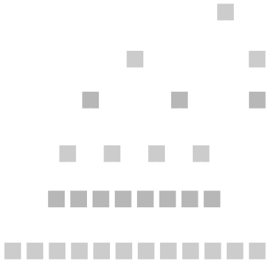

# FRAME Storage

---

## FRAME Storage

In this presentation, we will go even deeper into the concepts of Substrate storage, and see what kind of storage primitives FRAME provides you with to make Pallet development easy.

---

<div class="flex-container">

<div class="left-small">
	<table class="storage-layer-table">
	<tr><td class="ends">Developer</td></tr>
	<tr><td style="background-color: pink;">Runtime Storage API</td></tr>
	<tr><td style="background-color: pink;">Storage Overlays</td></tr>
	<tr><td>Patricia-Merkle Trie</td></tr>
	<tr><td>Key-Value Database</td></tr>
	<tr><td class="ends">Computer</td></tr>
	</table>
</div>
<div class="right">

### Storage layers

As we have learned, there are four core layers to Substrate's storage system.

Today we will focus on the top two layers: Runtime Storage APIs and Storage Overlays, which FRAME uses to improve developer experience.

</div>
</div>

---

### Overlay Deep Dive

<br />
<div class="flex-container">
<div class="left-small" style="font-size:0.9em">

The overlay stages changes to the underlying database.

</div>

<div class="right">

<table class="overlay-table">
<tr><td style="background-color: red;">Runtime Logic</td></tr>
<tr><td style="background-color: darkred;">Runtime Memory</td></tr>
</table>

<br />
<table class="overlay-table" style="background-color: green;">
<tr><td>Runtime Storage API</td></tr>
</table>

<br />
<table class="overlay-table">
<tr><td colspan=4>Overlay Change Set</td></tr>
<tr>
	<td>&nbsp;</td>
	<td>&nbsp;</td>
	<td>&nbsp;</td>
	<td>&nbsp;</td>
</tr>
</table>

<br />
<table class="overlay-table" style="background-color: blue;">
<tr><td>Memory / Database Interface</td></tr>
</table>

<br />
<table class="overlay-table">
<tr><td colspan=4>Database</td></tr>
<tr>
	<td>Alice: 10</td>
	<td>Bob: 20</td>
	<td>Cindy: 30</td>
	<td>Dave: 40</td>
</tr>
</table>

</div>

---

### Overlay: Balance Transfer

<div class="flex-container">
<div class="left-small" style="font-size:0.9em">

1. Runtime Logic Initiates.
1. Calls the Runtime Storage API.
1. First we query the Overlay Change Set.
   - Unfortunately it's not there.
1. Then we query the underlying Database.
   - Very slow as you have learned so far.

</div>

<div class="right">

<table class="overlay-table">
<tr><td style="background-color: red;">Runtime Logic</td></tr>
<tr><td style="background-color: darkred;">Runtime Memory</td></tr>
</table>

<br />
<table class="overlay-table" style="background-color: green;">
<tr><td>Runtime Storage API</td></tr>
</table>

<br />
<table class="overlay-table">
<tr><td colspan=4>Overlay Change Set</td></tr>
<tr>
	<td>&nbsp;</td>
	<td>&nbsp;</td>
	<td>&nbsp;</td>
	<td>&nbsp;</td>
</tr>
</table>

<br />
<table class="overlay-table" style="background-color: blue;">
<tr><td>Memory / Database Interface</td></tr>
</table>

<br />
<table class="overlay-table">
<tr><td colspan=4>Database</td></tr>
<tr>
	<td>Alice: 10</td>
	<td>Bob: 20</td>
	<td>Cindy: 30</td>
	<td>Dave: 40</td>
</tr>
</table>

</div>

---

### Overlay: Balance Transfer

<br />
<div class="flex-container">
<div class="left-small">

- As we return the data back to the runtime, we cache the values in the overlay.
- Subsequent reads and writes happen in the overlay, since the data is there.

</div>
<div class="right">

<table class="overlay-table">
<tr><td style="background-color: red;">Runtime Logic</td></tr>
<tr><td style="background-color: darkred;">Runtime Memory</td></tr>
</table>

<br />
<table class="overlay-table" style="background-color: green;">
<tr><td>Runtime Storage API</td></tr>
</table>

<br />
<table class="overlay-table">
<tr><td colspan=4>Overlay Change Set</td></tr>
<tr>
	<td>Alice: 10</td>
	<td>Bob: 20</td>
	<td>&nbsp;</td>
	<td>&nbsp;</td>
</tr>
</table>

<br />
<table class="overlay-table" style="background-color: blue;">
<tr><td>Memory / Database Interface</td></tr>
</table>

<br />
<table class="overlay-table">
<tr><td colspan=4>Database</td></tr>
<tr>
	<td>Alice: 10</td>
	<td>Bob: 20</td>
	<td>Cindy: 30</td>
	<td>Dave: 40</td>
</tr>
</table>

</div>

---

### Overlay: Balance Transfer

<br />
<div class="flex-container">
<div class="left-small">

- The actual transfer logic happens in the runtime memory.
- At some point, the runtime logic writes the new balances to storage, this updates the overlay cache.
- The underlying database is not updated yet.

</div>
<div class="right">

<table class="overlay-table">
<tr><td style="background-color: red;">Runtime Logic</td></tr>
<tr><td style="background-color: darkred;">Runtime Memory</td></tr>
</table>

<br />
<table class="overlay-table" style="background-color: green;">
<tr><td>Runtime Storage API</td></tr>
</table>

<br />
<table class="overlay-table">
<tr><td colspan=4>Overlay Change Set</td></tr>
<tr>
	<td style="color: yellow;">Alice: 15</td>
	<td style="color: yellow;">Bob: 15</td>
	<td>&nbsp;</td>
	<td>&nbsp;</td>
</tr>
</table>

<br />
<table class="overlay-table" style="background-color: blue;">
<tr><td>Memory / Database Interface</td></tr>
</table>

<br />
<table class="overlay-table">
<tr><td colspan=4>Database</td></tr>
<tr>
	<td>Alice: 10</td>
	<td>Bob: 20</td>
	<td>Cindy: 30</td>
	<td>Dave: 40</td>
</tr>
</table>

</div>

---

### Overlay: Balance Transfer

<br />
<div class="flex-container">
<div class="left-small">

- At the end of the block, staged changes are committed to the database all at once.
- Then storage root is recomputed a single time for the final block state.

</div>
<div class="right">

<table class="overlay-table">
<tr><td style="background-color: red;">Runtime Logic</td></tr>
<tr><td style="background-color: darkred;">Runtime Memory</td></tr>
</table>

<br />
<table class="overlay-table" style="background-color: green;">
<tr><td>Runtime Storage API</td></tr>
</table>

<br />
<table class="overlay-table">
<tr><td colspan=4>Overlay Change Set</td></tr>
<tr>
	<td>&nbsp;</td>
	<td>&nbsp;</td>
	<td>&nbsp;</td>
	<td>&nbsp;</td>
</tr>
</table>

<br />
<table class="overlay-table" style="background-color: blue;">
<tr><td>Memory / Database Interface</td></tr>
</table>

<br />
<table class="overlay-table">
<tr><td colspan=4>Database</td></tr>
<tr>
	<td style="color: lightgreen;">Alice: 15</td>
	<td style="color: lightgreen;">Bob: 15</td>
	<td>Cindy: 30</td>
	<td>Dave: 40</td>
</tr>
</table>

</div>

---

### Overlay: Implications

<br />
<div class="flex-container">
<div class="left-small">

- Reading the same storage a second or more time is faster (not free) than the initial read.
- Writing the same value multiple times is fast (not free), and only results in a single final Database write.

</div>
<div class="right">

<table class="overlay-table">
<tr><td style="background-color: red;">Runtime Logic</td></tr>
<tr><td style="background-color: darkred;">Runtime Memory</td></tr>
</table>

<br />
<table class="overlay-table" style="background-color: green;">
<tr><td>Runtime Storage API</td></tr>
</table>

<br />
<table class="overlay-table">
<tr><td colspan=4>Overlay Change Set</td></tr>
<tr>
	<td>&nbsp;</td>
	<td>&nbsp;</td>
	<td>&nbsp;</td>
	<td>&nbsp;</td>
</tr>
</table>

<br />
<table class="overlay-table" style="background-color: blue;">
<tr><td>Memory / Database Interface</td></tr>
</table>

<br />
<table class="overlay-table">
<tr><td colspan=4>Database</td></tr>
<tr>
	<td>Alice: 15</td>
	<td>Bob: 15</td>
	<td>Cindy: 30</td>
	<td>Dave: 40</td>
</tr>
</table>

</div>

Notes:

also this means that cross implementation of substrate/polkadot can be tricky to ensure determinism (also true for next slide).

---

### Additional Storage Overlays (Transactional)

<br />
<div class="flex-container">
<div class="left-small text-small">

- The runtime has the ability to spawn additional storage layers, called "transactional layers".
- This can allow you to commit changes through the Runtime Storage API, but then drop the changes if you want before they get to the overlay change set.
- The runtime can spawn multiple transactional layers, each at different times, allowing the runtime developer to logically separate when they want to commit or rollback changes.

</div>
<div class="right text-small">

<table class="overlay-table">
<tr><td style="background-color: red;">Runtime Logic</td></tr>
<tr><td style="background-color: darkred;">Runtime Memory</td></tr>
</table>

<br />
<table class="overlay-table" style="background-color: green;">
<tr><td>Runtime Storage API</td></tr>
</table>

<br />
<table class="overlay-table">
<tr><td colspan=4>Transactional Layer</td></tr>
<tr>
	<td style="color: yellow;">Alice: 25</td>
	<td>&nbsp;</td>
	<td style="color: yellow;">Cindy: 20</td>
	<td>&nbsp;</td>
</tr>
</table>

<br />
<table class="overlay-table">
<tr><td colspan=4>Overlay Change Set</td></tr>
<tr>
	<td>Alice: 15</td>
	<td>&nbsp;</td>
	<td>Cindy: 30</td>
	<td>&nbsp;</td>
</tr>
</table>

<br />
<table class="overlay-table" style="background-color: blue;">
<tr><td>Memory / Database Interface</td></tr>
</table>

<br />
<table class="overlay-table">
<tr><td colspan=4>Database</td></tr>
<tr>
	<td>Alice: 15</td>
	<td>Bob: 15</td>
	<td>Cindy: 30</td>
	<td>Dave: 40</td>
</tr>
</table>

</div>

---

### Transactional Implementation Details

- Non-Zero Overhead (but quite small)
  - 0.15% overhead per key written, per storage layer.
- Values are not copied between layers.
  - Values are stored in heap, and we just move pointers around.
  - So overhead has nothing to do with storage size, just the number of storage items in a layer.
- Storage layers use client memory, so practically no upper limit.

Notes:

For more details see:

- <https://github.com/paritytech/substrate/pull/10413>
- <https://github.com/paritytech/substrate/pull/10809>

In module 6, we can take a closer look at how this functionality is exposed in FRAME.

See: <https://github.com/paritytech/substrate/pull/11431>

---

## Storage Layer by Default

All extrinsics execute within a transactional storage layer.

This means that if you return an `Error` from your extrinsic, all changes to storage caused by that extrinsic are reverted.

This is the same behavior as you would expect from smart contract environments like Ethereum.

---

### Transactional Layer Attack

Transactional layers can be used to attack your chain:

<br />

- Allow a user to spawn a lot of transactional layers.
- On the top layer, make a bunch of changes.
- All of those changes will need to propagate down each time.

**Solution:**

- Do not allow the user to create an unbounded number of layers within your runtime logic.

---

# Runtime Storage APIs

---

## Patricia Trie


---

## Storage Keys


---

## FRAME Storage Keys

We follow a simple pattern:

```
hash(name) ++ hash(name2) ++ hash(name3) ++ hash(name4) ...
```

For example:

```
twox128(pallet_name) ++ twox128(storage_name) ++ ...
```

We will get into more details as we look at the specific storage primitives.

---

## Pallet Name

The pallet name comes from the `construct_runtime!`.

```rust
// Configure a mock runtime to test the pallet.
frame_support::construct_runtime!(
	pub enum Test {
		System: frame_system::{Pallet, Call, Config, Storage, Event<T>},
		Example: pallet_template,
	}
);
```

This means that changing the name of your pallet here is a **BREAKING** change, since it will change your storage keys.

---

## FRAME Storage Primitives

- `StorageValue`
- `StorageMap`
- `CountedStorageMap`
- `StorageDoubleMap`
- `StorageNMap`

We will go over all of them, and many important and subtle details along the way.

---

## Storage Value

Place a single item into the runtime storage.

```rust
pub struct StorageValue<Prefix, Value, QueryKind = OptionQuery, OnEmpty = GetDefault>(_);
```

Storage Key:

```rust
Twox128(Prefix::pallet_prefix()) ++ Twox128(Prefix::STORAGE_PREFIX)
```

---

## Storage Value: Example

```rust
#[pallet::storage]
pub type Item1<T> = StorageValue<_, u32>;
```

```rust
#[test]
fn storage_value() {
	sp_io::TestExternalities::new_empty().execute_with(|| {
		assert_eq!(Item1::<T>::get(), None);
		Item1::<T>::put(10u32);
		assert_eq!(Item1::<T>::get(), Some(10u32));
	});
}
```

---

## Storage "Prefix"

The first generic parameter in any FRAME storage is the `Prefix`, which is used to generate the storage key.

`Prefix` implements `StorageInstance` which has:

```rust
pub trait StorageInstance {
	const STORAGE_PREFIX: &'static str;

	fn pallet_prefix() -> &'static str;
}
```

`STORAGE_PREFIX` is the name of the storage, and `pallet_prefix()` is the name of the pallet that this storage is in.

This is populated thanks to FRAME's macro magic.

Notes:

<https://substrate.stackexchange.com/questions/476/storage-definition-syntax/478#478>

---

## Storage Value Key

```rust
use sp_core::hexdisplay::HexDisplay;
println!("{}", HexDisplay::from(&Item1::<T>::hashed_key()));
```

This will depend on your pallet's name of course...

```sh
e375d60f814d02157aaaa18f3639a254c64445c290236a18189385ed9853fb1e
```

```sh
e375d60f814d02157aaaa18f3639a254 ++ c64445c290236a18189385ed9853fb1e
```

```sh
twox128("Example") = e375d60f814d02157aaaa18f3639a254
twox128("Item1") = c64445c290236a18189385ed9853fb1e
```

---

## Demystifying FRAME Storage

This shows _basically_ what is going on when you use pallet storage. NOT accurate, but should be informative. As you can see, it is really not that complex.

```rust
struct Prefix;
impl StorageInstance for Prefix {
	const STORAGE_PREFIX: &'static str = "MyStorage";

	fn pallet_prefix() -> &'static str {
		"MyPallet"
	};

	fn prefix() -> Vec<u8> {
		twox_128(Self::pallet_prefix()) ++ twox_128(STORAGE_PREFIX)
	}
}

type MyStorage = StorageValue<Prefix, Type>;
trait StorageValue<Prefix, Type> {
    fn get() -> Option<Type> {
        sp_io::storage::get(Prefix::prefix())
    }

    fn set(value: Type) {
        sp_io::storage::set(Prefix::prefix(), value)
    }

    fn kill() {
        sp_io::storage::clear(Prefix::prefix())
    }

    // etc...
}
```

---

## All Storage is an Option

- At the Runtime Storage API level, a storage key will either have a value or not have a value.
- If there is no value, any query from the backend will be `None`.
- If there is a value, the query will be `Some(value)`.
- However, we can also hide this with a `Default` value.

---

## Query If Storage Actually Exists

There are APIs which expose to you whether the value actually exists in the database.

```rust
#[pallet::storage]
pub type Item1<T> = StorageValue<_, u32>;
```

```rust
#[test]
fn storage_value() {
	sp_io::TestExternalities::new_empty().execute_with(|| {
		// Nothing is actually there yet.
		assert_eq!(Item1::<T>::exists(), false);
		assert_eq!(Item1::<T>::try_get().ok(), None);
	});
}
```

---

## Query Kind

- `OptionQuery`: Default choice, represents the actual DB state.
- `ValueQuery`: Return a value when `None`. (`Default` or configurable)

```rust
#[pallet::storage]
pub type Item2<T> = StorageValue<_, u32, ValueQuery>;
```

```rust
#[test]
fn value_query() {
	sp_io::TestExternalities::new_empty().execute_with(|| {
		// `0u32` is the default value of `u32`
		assert_eq!(Item2::<T>::get(), 0u32);
		Item2::<T>::put(10u32);
		assert_eq!(Item2::<T>::get(), 10u32);
	});
}
```

Remember that 0 is not actually in storage when doing the first query.

---

## On Empty

You can control the `OnEmpty` value with:

```rust
#[pallet::type_value]
pub fn MyDefault<T: Config>() -> u32 { 42u32 }

#[pallet::storage]
pub type Item3<T> = StorageValue<_, u32, ValueQuery, MyDefault<T>>;
```

```rust
#[test]
fn my_default() {
	sp_io::TestExternalities::new_empty().execute_with(|| {
		// `42u32` is the configured `OnEmpty` value.
		assert_eq!(Item3::<T>::get(), 42u32);
		Item3::<T>::put(10u32);
		assert_eq!(Item3::<T>::get(), 10u32);
	});
}
```

Remember that 42 is not actually in storage when doing the first query.

---

## Not Magic

These "extra features" are just ways to simplify your code.

You can get the same effect without any magic:

```rust
let value = Item1::<T>::try_get().unwrap_or(42u32);
```

But you wouldn't want to do this every time.

---

## Set vs Put

- `pub fn set(val: QueryKind::Query)`
- `pub fn put<Arg: EncodeLike<Value>>(val: Arg)`

For Example:

```rust
#[pallet::storage]
pub type Item1<T> = StorageValue<_, u32>;
```

```rust
Item1::<T>::set(Some(42u32));
Item1::<T>::put(42u32);
```

---

## Don't Put The Option AS the Storage Value

This is basically an anti-pattern, and it doesn't really make sense to do.

```rust
#[pallet::storage]
pub type Item4<T> = StorageValue<_, Option<u32>>;

#[pallet::storage]
pub type Item5<T> = StorageValue<_, Option<u32>, ValueQuery>;
```

```rust
#[test]
fn nonsense() {
	sp_io::TestExternalities::new_empty().execute_with(|| {
		assert_eq!(Item4::<T>::exists(), false);
		assert_eq!(Item5::<T>::exists(), false);
		Item4::<T>::put(None::<u32>);
		Item5::<T>::put(None::<u32>);
		assert_eq!(Item4::<T>::exists(), true);
		assert_eq!(Item5::<T>::exists(), true);
	});
}
```

---

## Unit Type Instead of Bool

You might want to simply signify some true or false value in storage...

Save some bytes! Use the unit type.

```rust
#[pallet::storage]
pub type Item6<T> = StorageValue<_, ()>;
```

```rust
#[test]
fn better_bool() {
	sp_io::TestExternalities::new_empty().execute_with(|| {
		// false case
		assert_eq!(Item6::<T>::exists(), false);
		Item6::<T>::put(());
		// true case
		assert_eq!(Item6::<T>::exists(), true);
	});
}
```

---

## Kill Storage

Remove the item from the database using `kill()` or `take()`.

```rust
#[pallet::type_value]
pub fn MyDefault<T: Config>() -> u32 { 42u32 }

#[pallet::storage]
pub type Item3<T> = StorageValue<_, u32, ValueQuery, MyDefault<T>>;
```

```rust
#[test]
fn kill() {
	sp_io::TestExternalities::new_empty().execute_with(|| {
		assert_eq!(Item3::<T>::get(), 42u32);
		Item3::<T>::put(10u32);
		assert_eq!(Item3::<T>::get(), 10u32);
		//Item3::<T>::kill();
		let old_value = Item3::<T>::take();
		assert_eq!(Item3::<T>::get(), 42u32);
		assert_eq!(old_value, 10u32);
	});
}
```

---

## Mutate

Execute a closure on a storage item.

```rust
#[test]
fn mutate() {
	sp_io::TestExternalities::new_empty().execute_with(|| {
		Item2::<T>::put(42u32);
		Item2::<T>::mutate(|x| {
			if *x % 2 == 0 {
				*x = *x / 2;
			}
		});
		assert_eq!(Item2::<T>::get(), 21);
	});
}
```

---

## Try Mutate

Execute a closure on a storage item, but only write if the closure returns `Ok`.

```rust
#[test]
fn try_mutate() {
	sp_io::TestExternalities::new_empty().execute_with(|| {
		Item2::<T>::put(42u32);
		assert_noop!(Item2::<T>::try_mutate(|x| -> Result<(), ()> {
			*x = *x / 2;
			if *x % 2 == 0 {
				Ok(())
			} else {
				Err(())
			}
		}), ());
		// Nothing written
		assert_eq!(Item2::<T>::get(), 42);
	});
}
```

---

## Assert Noop

You may have noticed we just used `assert_noop!` instead of `assert_err!`.

```rust
/// Evaluate an expression, assert it returns an expected `Err` value and that
/// runtime storage has not been mutated (i.e. expression is a no-operation).
///
/// Used as `assert_noop(expression_to_assert, expected_error_expression)`.
#[macro_export]
macro_rules! assert_noop {
	(
		$x:expr,
		$y:expr $(,)?
	) => {
		let h = $crate::storage_root($crate::StateVersion::V1);
		$crate::assert_err!($x, $y);
		assert_eq!(h, $crate::storage_root($crate::StateVersion::V1), "storage has been mutated");
	};
}
```

There is also `assert_storage_noop!` which does not care what is returned, just that storage is not changed.

---

## Vec Tricks

You can use `decode_len()` and `append()` to work with a `Vec` without decoding all the items.

```rust
#[pallet::storage]
#[pallet::unbounded]
pub type Item7<T> = StorageValue<_, Vec<u8>, ValueQuery>;
```

```rust
#[test]
fn vec_tricks() {
	sp_io::TestExternalities::new_empty().execute_with(|| {
		assert_eq!(Item7::<T>::decode_len(), None);
		Item7::<T>::put(vec![0u8]);
		assert_eq!(Item7::<T>::decode_len(), Some(1));
		Item7::<T>::append(1u8);
		Item7::<T>::append(2u8);
		assert_eq!(Item7::<T>::get(), vec![0u8, 1u8, 2u8]);
		assert_eq!(Item7::<T>::decode_len(), Some(3));
	});
}
```

---

## Bounded Storage

You may have noticed `#[pallet::unbounded]` on the storage item in the previous slide.

Remember that blockchains are limited by:

- Computation Time
- Memory Limits
- Storage Size / Proof Size

In general, every storage item in FRAME should be **bounded** in size.

We will talk about this more when we discuss benchmarking.

---

## Bounded Vector

We have bounded versions of unbounded items like `Vec`, `BTreeSet`, etc...

```rust
#[pallet::storage]
pub type Item8<T> = StorageValue<_, BoundedVec<u8, ConstU32<100>>, ValueQuery>;
```

A second `Get<u32>` type is used to give a maximum number of values.

```rust
#[test]
fn bounded_vec() {
	sp_io::TestExternalities::new_empty().execute_with(|| {
		for i in 0u8..100u8 {
			assert_ok!(Item8::<T>::try_append(i));
		}
		// Only supports at most 100 items.
		assert_noop!(Item8::<T>::try_append(100), ());
	});
}
```

---

## Storage Map

Store items in storage as a key and value map.

```rust
pub struct StorageMap<Prefix, Hasher, Key, Value, QueryKind = OptionQuery, OnEmpty = GetDefault, MaxValues = GetDefault>(_);
```

Storage Key:

```rust
Twox128(Prefix::pallet_prefix()) ++ Twox128(Prefix::STORAGE_PREFIX) ++ Hasher1(encode(key))
```

---

## Storage Map: Example

```rust
#[pallet::storage]
pub type Item9<T: Config> = StorageMap<_, Blake2_128, u32, u32>;
```

```rust
#[test]
fn storage_map() {
	sp_io::TestExternalities::new_empty().execute_with(|| {
		Item9::<T>::insert(0, 100);
		assert_eq!(Item9::<T>::get(0), Some(100));
		assert_eq!(Item9::<T>::get(1), None);
	});
}
```

---

## Storage Map Key

With a storage map, you can introduce a "key" and "value" of arbitrary type.

```rust
pub struct StorageMap<Prefix, Hasher, Key, Value, ...>(_);
```

The storage key for a map uses the hash of the key. You can choose the storage hasher, these are the ones currently implemented:

- Identity (no hash at all)
- Blake2_128
- Blake2_256
- Twox128
- Twox256
- Twox64Concat (special)
- Blake2_128Concat (special)

---

## Value Query: Balances

```rust
#[pallet::storage]
pub type Item10<T: Config> = StorageMap<_, Blake2_128, T::AccountId, Balance, ValueQuery>;
```

```rust
#[test]
fn balance_map() {
	sp_io::TestExternalities::new_empty().execute_with(|| {
		// these would normally would be 32 byte addresses
		let alice = 0u64;
		let bob = 1u64;
		Item10::<T>::insert(alice, 100);

		let transfer = |from: u64, to: u64, amount: u128| -> Result<(), &'static str> {
			Item10::<T>::try_mutate(from, |from_balance| -> Result<(), &'static str> {
				Item10::<T>::try_mutate(to, |to_balance| -> Result<(), &'static str> {
					*to_balance = to_balance.checked_add(amount).ok_or("overflow")?;
					*from_balance = from_balance.checked_sub(amount).ok_or("not enough balance")?;
					Ok(())
				})
			})
		};

		assert_noop!(transfer(bob, alice, 10), "not enough balance");
		assert_ok!(transfer(alice, bob, 10));
		assert_noop!(transfer(alice, bob, 100), "not enough balance");

		assert_eq!(Item10::<T>::get(alice), 90);
		assert_eq!(Item10::<T>::get(bob), 10);
	});
}
```

---

## Prefix Tries

All pallets and storage items naturally form "prefix tries".


In this diagram, a pallet "Balances" has a storage value "Total Issuance" and a map of "Accounts" with balances as the value.

---

## Prefix Trie Keys

Let's now look at the keys of these storage items:

```rust
use sp_core::hexdisplay::HexDisplay;
println!("{}", HexDisplay::from(&Item2::<T>::hashed_key()));
println!("{}", HexDisplay::from(&Item10::<T>::hashed_key_for(0)));
println!("{}", HexDisplay::from(&Item10::<T>::hashed_key_for(1)));
```

```sh
e375d60f814d02157aaaa18f3639a2546fe5a43b77d7334acfb711a021a514b8
e375d60f814d02157aaaa18f3639a254ca79d14bc48854f664528f3a696b6c27c804ce198ec337e3dc762bdd1a09aece
e375d60f814d02157aaaa18f3639a254ca79d14bc48854f664528f3a696b6c279ea2d098b5f70192f96c06f38d3fbc97
```

<table style="font-size: 24px">
<tr>
	<td><span style="color: red;">e375d60f814d02157aaaa18f3639a254</span></td>
	<td><span style="color: lightblue;">6fe5a43b77d7334acfb711a021a514b8</span></td>
	<td>&nbsp;</td>
</tr>
<tr>
	<td><span style="color: red;">e375d60f814d02157aaaa18f3639a254</span></td>
	<td><span style="color: lightgreen;">ca79d14bc48854f664528f3a696b6c27</span></td>
	<td><span style="color: pink;">c804ce198ec337e3dc762bdd1a09aece</span></td>
</tr>
<tr>
	<td><span style="color: red;">e375d60f814d02157aaaa18f3639a254</span></td>
	<td><span style="color: lightgreen;">ca79d14bc48854f664528f3a696b6c27</span></td>
	<td><span style="color: orange;">9ea2d098b5f70192f96c06f38d3fbc97</span></td>
</tr>
</table>

---

## Storage Iteration

Because all storage items form a prefix trie, you can iterate the content starting with any prefix:

```rust [0|6-7]
impl<T: Decode + Sized> Iterator for StorageIterator<T> {
	type Item = (Vec<u8>, T);

	fn next(&mut self) -> Option<(Vec<u8>, T)> {
		loop {
			let maybe_next = sp_io::storage::next_key(&self.previous_key)
				.filter(|n| n.starts_with(&self.prefix));
			break match maybe_next {
				Some(next) => {
					self.previous_key = next.clone();
					let maybe_value = frame_support::storage::unhashed::get::<T>(&next);
					match maybe_value {
						Some(value) => {
							if self.drain {
								frame_support::storage::unhashed::kill(&next);
							}
							Some((self.previous_key[self.prefix.len()..].to_vec(), value))
						},
						None => continue,
					}
				},
				None => None,
			}
		}
	}
}
```

---

## You can...

- Iterate all storage on the blockchain using prefix `&[]`
- Iterate all storage for a pallet using prefix `hash(pallet_name)`
- Iterate all balances of users using prefix `hash("Balances") ++ hash("Accounts")`

This is not an inherit property!

This is only because we "cleverly" chose this pattern for generating keys.

Note that iteration has no "proper" order. All keys are hashed, and we just go in the order of the resulting hash.

---

## Opaque Storage Keys

But there is a problem...

Let's say I iterate over all users' balances...

- I will get all the balance values.
- I will get all the storage keys.
  - Which are all hashed.
- I will NOT get the actual accounts which hold these balances!

For this, we need **transparent storage keys**.

---

## Transparent Hashes

- Twox64Concat
- Blake2_128Concat

Basically:

```sh
final_hash = hash(preimage) ++ preimage
```

From this kind of hash, we can always extract the preimage:

```sh
"hello" = 0x68656c6c6f
blake2_128("hello") = 0x46fb7408d4f285228f4af516ea25851b
blake2_128concat("hello") = 0x46fb7408d4f285228f4af516ea25851b68656c6c6f
```

```sh
"world" = 0x776f726c64
twox64("world") = 0xef51ee66fefb78e7
twox64concat("world") = 0xef51ee66fefb78e7776f726c64
```

---

## Better Balance Map

<div class="text-small">

We should use `Blake2_128Concat`!

```rust
#[pallet::storage]
pub type Item11<T: Config> = StorageMap<_, Blake2_128Concat, T::AccountId, Balance, ValueQuery>;
```

```rust
#[test]
fn better_balance_map() {
	sp_io::TestExternalities::new_empty().execute_with(|| {
		for i in 0u64..10u64 {
			Item10::<T>::insert(i, u128::from(i * 100u64));
			Item11::<T>::insert(i, u128::from(i * 100u64));
		}
		// cannot call iter for 10 because it cannot returns the keys
		let all_10: Vec<_> = Item10::<T>::iter_values().collect();
		let all_11: Vec<_> = Item11::<T>::iter().collect();
		println!("{:?}\n{:?}", all_10, all_11);

		assert!(false)
	});
}
```

```sh
[600, 500, 300, 100, 800, 400, 700, 900, 0, 200]
[(6, 600), (5, 500), (3, 300), (1, 100), (8, 800), (4, 400), (7, 700), (9, 900), (0, 0), (2, 200)]
```

</div>

---

## Which Hasher to Use?

Now that we know that transparent hashers are extremely useful, there are really just 3 choices:

- `Identity` - No Hash at all
- `Twox64Concat` - Non-Cryptographic and Transparent Hash
- `Blake2_128Concat` - Cryptographic and Transparent Hash

---

## Unbalanced Trie

<div class="flex-container">
<div class="left">



</div>
<div class="right">

- We mentioned that unbalanced tries can be good at times...
- But in this case, we must select a hasher which prevents a user from manipulating the balance of our prefix trie.

</div>
</div>

---

## Which Hasher to Use?

Basically, you should just always use `Blake2_128Concat` since it is hardest for a user to influence.The difference in time to execute is probably nominal (but not properly benchmarked afaik).

Some reasonable exceptions:

- If the key is already an uncontrollable cryptographic hash, you can use `Identity`.
- If the key is simple and controlled by runtime (like an incremented count), `Twox64Concat` is good enough.

More info in the docs...

---

### Read the StorageMap Docs for API

<https://crates.parity.io/frame_support/pallet_prelude/struct.StorageMap.html>

---

### StorageDoubleMap and StorageNMap

Basically the same idea as `StorageMap`, but with more keys:

```rust
pub struct StorageDoubleMap<Prefix, Hasher1, Key1, Hasher2, Key2, Value, QueryKind = OptionQuery, OnEmpty = GetDefault, MaxValues = GetDefault>(_);
```

```sh
Twox128(Prefix::pallet_prefix()) ++ Twox128(Prefix::STORAGE_PREFIX) ++ Hasher1(encode(key1)) ++ Hasher2(encode(key2))
```

```rust
pub struct StorageNMap<Prefix, Key, Value, QueryKind = OptionQuery, OnEmpty = GetDefault, MaxValues = GetDefault>(_);
```

```sh
Twox128(Prefix::pallet_prefix())
		++ Twox128(Prefix::STORAGE_PREFIX)
		++ Hasher1(encode(key1))
		++ Hasher2(encode(key2))
	++ ...
	++ HasherN(encode(keyN))
```

---

## StorageNMap: Example

```rust
#[pallet::storage]
pub type Item12<T: Config> = StorageNMap<
	_,
	(
		NMapKey<Blake2_128Concat, u8>,
		NMapKey<Blake2_128Concat, u16>,
		NMapKey<Blake2_128Concat, u32>,
	),
	u128,
>;
```

Treat the key as a tuple of the composite keys.

```rust
#[test]
fn storage_n_map() {
	sp_io::TestExternalities::new_empty().execute_with(|| {
		Item12::<T>::insert((1u8, 1u16, 1u32), 1u128);
		assert_eq!(Item12::<T>::get((1u8, 1u16, 1u32)), Some(1u128));
	});
}
```

---

## Map Iteration Complexity

- Iterating over a map is extremely expensive for computational and storage proof resources.
- Requires `N` trie reads which is really `N * log(N)` database reads.
- Takes up `32 bytes per hash * 16 hashes per node * N * log(N)` proof size.

Generally you should not iterate on a map. If you do, make sure it is bounded!

---

## Remove All

Implemented on Storage Maps:

```rust
// Remove all value of the storage.
pub fn remove_all(limit: Option<u32>) -> KillStorageResult
```

Where:

```rust
pub enum KillStorageResult {
    AllRemoved(u32),
    SomeRemaining(u32),
}
```

Rather than trying to delete all items at once, you can "freeze" the state machine, and have a user call `remove_all` multiple times using a limit.

---

## Counted Storage Map

A wrapper around a `StorageMap` and a `StorageValue<Value=u32>` to keep track of how many items are in a map, without needing to iterate all the values.

```rust
pub struct CountedStorageMap<Prefix, Hasher, Key, Value, QueryKind = OptionQuery, OnEmpty = GetDefault, MaxValues = GetDefault>(_);
```

This storage item has additional storage read and write overhead when manipulating values compared to a regular storage map.

---

## Counted Storage Map Demystified

```rust
#[pallet::storage]
pub type Item13<T: Config> = CountedStorageMap<_, Blake2_128Concat, T::AccountId, Balance>;
```

This `CountedStorageMap` is exactly the same as:

```rust
#[pallet::storage]
pub type Item13<T: Config> = StorageMap<_, Blake2_128Concat, T::AccountId, Balance>;

/// Counter is always prefixed with "CounterFor"
#[pallet::storage]
pub type CounterForItem13<T: Config> = StorageValue<_, u32>;
```

With some additional logic to keep these two in check.

---

## Architecture Considerations

- You know that accessing very large items from the database is not efficient:
  - Databases like ParityDB are optimized for items under 32 KB.
  - Decoding is non-zero overhead.
- You know that accessing lots of storage items in a map is also very bad!
  - Lots of overhead constantly calling host functions.
  - Lots of overhead from the merkle trie lookup, and database reads.
  - Lots of **additional** overhead in the storage proof

So what do you pick?

---

## It depends! Sometimes both!

The choice of storage depends on how your logic will access it.

<div class="text-small">

- Scenario A: We need to manage millions of users, and support balance transfers.

  - We should obviously use a map! Balance transfers touch only 2 accounts at a time. 2 map reads is way more efficient than reading all million users to move the balance.

- Scenario B: We need to get the 1,000 validators for the next era.

  - We should obviously use a bounded vector! We know there is an upper limit of validators, and we will need to read them all for our logic!

- Scenario C: We need to store some metadata about the configuration of each validator.

  - We should probably use a map! We will be duplicating some data from from the vector above, but the way we access configuration stuff usually is on a per-validator basis.

</div>

---

## Summary

- FRAME Storage is just simple macros which wrap the underlying Substrate Storage APIs.
- The principles of Substrate Storage directly inform what kinds of behaviors you can do in FRAME.
- Just because something does not exist in FRAME does not mean you cannot do it!
- Just because something does exist in FRAME does not mean you can use it without thinking!
