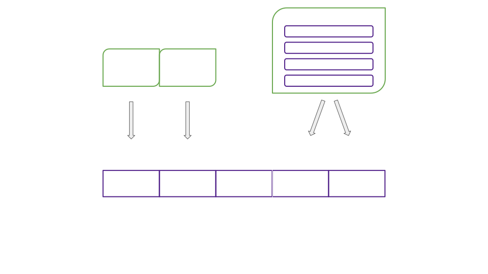
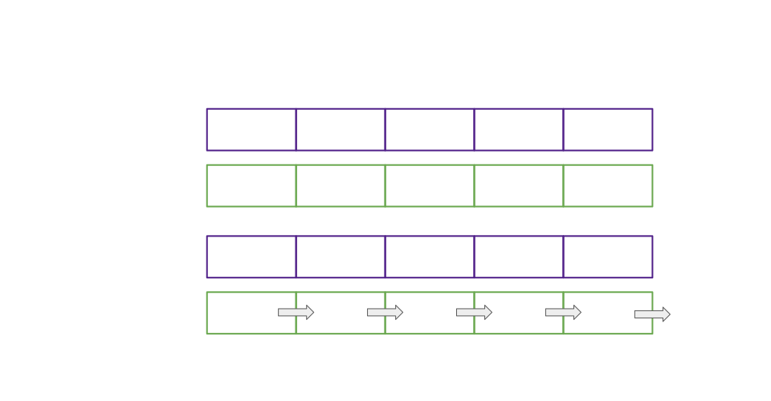
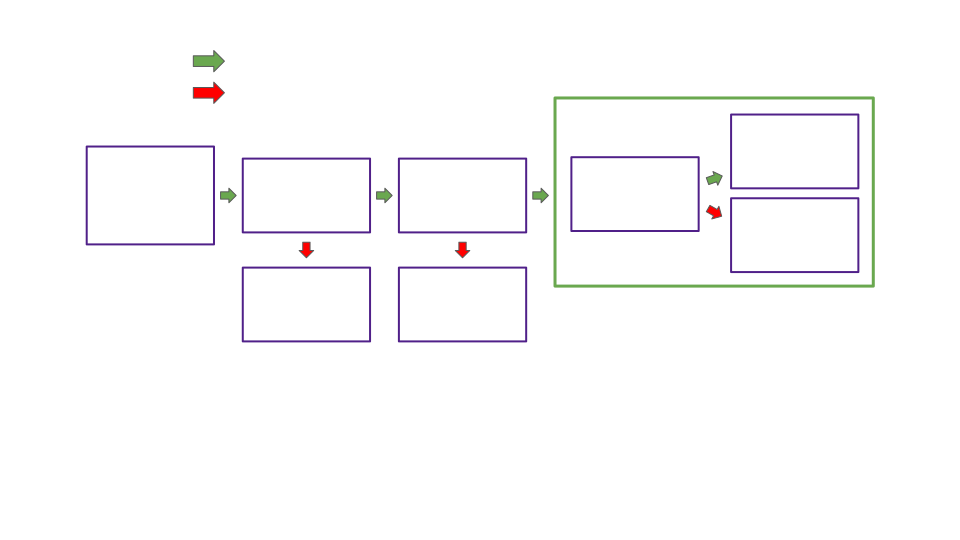

# Deep Dive, Availability Cores

Notes:

Hello!

I'm Bradley Olson

Was student at first Academy

Currently on Parachains Core Team

Will present 3 lectures providing a window into Polkadot core, a slice of where we're at and where we're headed.

First a look at availability cores, the abstraction enabling flexible purchases of blockspace under the umbrella of Polkadot shared security.

Lets get to it

---

## Addressing the Dual Naming

<pba-flex center>

- In the code: Availability core
- Outside the code: Execution core

</pba-flex>

---

## Overview

<pba-flex center>

- What do availability cores represent?

<!-- .element: class="fragment" data-fragment-index="0" -->

- How do cores map parachain leases and claims to validator subsets?

<!-- .element: class="fragment" data-fragment-index="1" -->

- How do cores gate each step of the parachains protocol?

<!-- .element: class="fragment" data-fragment-index="2" -->

- What advantages do cores give us now?

<!-- .element: class="fragment" data-fragment-index="3" -->

- What roadmap items do cores accommodate?

<!-- .element: class="fragment" data-fragment-index="4" -->

</pba-flex>

---

## Review, Blockspace

> Blockspace is the capacity of a blockchain<br />to finalize and commit operations

Polkadot's primary product is _blockspace_.

---

## Blockspace, Use It or Lose It

Polkadot blockspace is consumed in two ways:

<pba-flex center>

1. When the relay chain validates, includes, <br /> and finalizes a parachain block

<!-- .element: class="fragment" data-fragment-index="0" -->

1. When the capacity to validate a parachain block<br /> is left unused and expires

<!-- .element: class="fragment" data-fragment-index="1" -->

</pba-flex>


<!-- .element: class="fragment" data-fragment-index="1" -->

---

## Availability Core Defined

<pba-cols>
<pba-col center>

- Availability cores are the abstraction we use to allocate Polkadot's blockspace.

<!-- .element: class="fragment" data-fragment-index="0" -->

- Allocated via leases and on-demand claims

<!-- .element: class="fragment" data-fragment-index="1" -->

- Cores divide blockspace supply into discrete units, 1 parachain block per relay chain block per core

<!-- .element: class="fragment" data-fragment-index="2" -->

- Why "availability"?

<!-- .element: class="fragment" data-fragment-index="3" -->

- Why "core"?

<!-- .element: class="fragment" data-fragment-index="4" -->

</pba-col>
<pba-col center>


</pba-col>
</pba-cols>

Notes:

- "Availability", because a core is considered occupied by a parachain block candidate while that candidate is being made available. But cores mediate access to the entire parablock validation pipeline, not just availability.
- "Core", because many candidates can be made available in parallel, mimicking the parallel computation per core in a computer processor.

---

## Availability

Though cores gate the entire parachain block pipeline,<br /> the availability process alone determines when these cores are considered occupied vs free.

To recap, the goals of availability are:

<!-- .element: class="fragment" data-fragment-index="1" -->

1. To ensure that approvers will always be able to recover the PoVs to validate their assigned blocks

<!-- .element: class="fragment" data-fragment-index="2" -->

2. To ensure that parachain nodes can recover blocks in the case that a parablock author fails to share them, through malintent or malfunction

<!-- .element: class="fragment" data-fragment-index="3" -->

---

## Core States

<pba-cols>
<pba-col center>

Free


</pba-col>
<pba-col center>

Scheduled


</pba-col>

<pba-col center>

Occupied


</pba-col>
</pba-cols>

Notes:

- Before going any farther we need to talk about core states
- CoreState: Free -> core has not been assigned a parachain via lease or on-demand claim
- CoreState: Scheduled -> Core has an assigned parachain and is currently unoccupied
- CoreState: Occupied -> Core has assignment and is occupied by a parablock pending availability

---

## The Availability Process

<pba-flex center>

1. Block author places a candidate on-chain as backed, immediately occupying its scheduled core

<!-- .element: class="fragment" data-fragment-index="1" -->

1. Candidate backers distribute erasure coded PoV chunks

<!-- .element: class="fragment" data-fragment-index="2" -->

1. Validators distribute statements as to which candidates they have chunks for

<!-- .element: class="fragment" data-fragment-index="3" -->

1. Availability threshold is met (2/3 vs the 1/3 needed to reconstruct POV)

<!-- .element: class="fragment" data-fragment-index="4" -->

1. Candidate marked as included on chain and core freed

<!-- .element: class="fragment" data-fragment-index="5" -->

1. Approvers or parachain nodes retrieve PoV chunks as needed

<!-- .element: class="fragment" data-fragment-index="6" -->

</pba-flex>

---

## Cores and Blockspace Over Time


Notes:

Metaphor:

- Relay chain: Train loading bay
- Relay block: Train leaving station every 6 seconds
- Parachain block: One train car worth of cargo
- Availability core: Car index within all trains

If you have a lease on core 4, then you have the right to fill train car 4 on each train with whatever you want to ship.

Q: How would an on-demand claim be represented in this metaphor?

---

# Mapping Leases and Claims to Validator Subsets

---

## The Big Picture


Notes:

- Which steps of the parachains protocol are missing, and why?
- Going to dive into each piece
- Questions?

---

## Assigning Leases and Claims to Cores



Notes:

- Leases have indices and pair to cores with the same index
- Cores not designated as on-demand and without a paired lease are left free, their blockspace wasted
- When on-demand claims are queued, they are each assigned a designated core in ascending order, looping when reaching the last core

---

## Assigning Backing Groups to Cores



Notes:

- Round robin, fixed intervals

This prevents a byzantine backing group from interrupting the liveness of any one parachain for too long.

---

## Backing Group Formation


Notes:

- Validators randomly assigned to groups at start of session.
- Group count is active validator count / max group size rounded up
- Groups are partitioned such that the largest group and smallest group have a size difference of 1

---


## Assigning Approvers to Cores

<pba-flex center>

- Randomness via schnorrkel::vrf
- Approver assignments activated with delay tranches until threshold met

<!-- .element: class="fragment" data-fragment-index="1" -->

- Results in 30-40 approvers checking each block

<!-- .element: class="fragment" data-fragment-index="2" -->

- Different assignments each block prevent DOS

<!-- .element: class="fragment" data-fragment-index="3" -->

</pba-flex>

---

## Putting the Pieces Together


---

## Occupying Assigned Cores: With Lease



Notes:

Q: What step of the parachains protocol takes place between "Supplied backable candidate" and "availability process?

---

## Occupying Assigned Cores: On Demand


---

## Core States in the Runtime

In file: polkadot/runtime/parachains/src/scheduler.rs

<div style="font-size: 0.82em;">

```rust[1|3-8|5,10-16]
pub(crate) type AvailabilityCores<T> = StorageValue<_, Vec<Option<CoreOccupied>>, ValueQuery>;

pub enum CoreOccupied {
    /// A parathread (on-demand parachain).
    Parathread(ParathreadEntry),
    /// A lease holding parachain.
    Parachain,
}

/// Parathread = on-demand parachain
pub struct ParathreadEntry {
	/// The claim.
	pub claim: ParathreadClaim,
	/// Number of retries.
	pub retries: u32,
}
```

</div>

Notes:

Q: When Option is None, what does that indicate?

- Which para occupies a core is stored separately in the following structure

---

## Core Assignments in The Runtime

In file: polkadot/runtime/parachains/src/scheduler.rs

<div style="font-size: 0.82em;">

```rust[1|3-10|9,12-17]
pub(crate) type Scheduled<T> = StorageValue<_, Vec<CoreAssignment>, ValueQuery>;

pub struct CoreAssignment {
    /// The core that is assigned.
    pub core: CoreIndex,
    /// The unique ID of the para that is assigned to the core.
    pub para_id: ParaId,
    /// The kind of the assignment.
    pub kind: AssignmentKind,
}

pub enum AssignmentKind {
	/// A parachain.
	Parachain,
	/// A parathread (on-demand parachain).
	Parathread(CollatorId, u32),
}
```

</div>

Notes:

- Vec of all core assignments
- Pairs ParaId with CoreIndex
- AssignmentKind carries retry info for on-demand

---

## How Cores Gate Each Step of the Parachains Protocol

---

## How Core Assignments Mediate Backing

Each parablock candidate is built in the context of a particular `relay_parent`.

Validators query their core assignment as of `relay_parent` and refuse to second candidates not associated with their backing group.

<!-- .element: class="fragment" data-fragment-index="1" -->

Notes:

- Relay parent context: max PoV size, current parachain runtime code, and backing group assignments.

---

### How Core Assignments Mediate Backing (Cont.)

`handle_second_message()` in the Backing Subsystem.

```rust[1|6]
if Some(candidate.descriptor().para_id) != rp_state.assignment {
	gum::debug!(
		target: LOG_TARGET,
		our_assignment = ?rp_state.assignment,
		collation = ?candidate.descriptor().para_id,
		"Subsystem asked to second for para outside of our assignment",
	);

	return Ok(())
}
```

---

## Cores and Backing On-Chain

<pba-flex center>

- For each core that is either unoccupied or is about to be a new candidate is found
- A candidate for the parachain scheduled next on that core is provided to the block author

<!-- .element: class="fragment" data-fragment-index="1" -->

- Backed on-chain -> immediately occupies core

<!-- .element: class="fragment" data-fragment-index="2" -->

</pba-flex>

Notes:

- Review possible core states
- Mention time-out vs made available

Q: What does "immediately occupies core" imply?

---

## Cores and Backing On-Chain, Code

<div style="font-size: 0.82em;">

Code determining whether to back a candidate and which, greatly simplified

```rust[1|24|2-4|5-13|13-23|28-29]
	let (para_id) = match core {
		CoreState::Scheduled(scheduled_core) => {
			scheduled_core.para_id
		},
		CoreState::Occupied(occupied_core) => {
			if current_occupant_made_available(core_idx, &occupied_core.availability)
			{
				if let Some(ref scheduled_core) = occupied_core.next_up_on_available {
					scheduled_core.para_id
				} else {
					continue
				}
			} else {
				if occupied_core.time_out_at != current_block {
					continue
				}
				if let Some(ref scheduled_core) = occupied_core.next_up_on_time_out {
					scheduled_core.para_id
				} else {
					continue
				}
			}
		},
		CoreState::Free => continue,
	};

	let candidate_hash =
		get_backable_candidate(relay_parent, para_id, required_path, sender).await?;
```

</div>

Notes:

- Discuss core freeing criteria
- `bitfields_indicate_availability`
  - next_up_on_available
- availability time out
  - next_up_on_timeout

---

## Cores and Approvals, Disputes, Finality

Each included candidate has already occupied an availability core

Approvals, Disputes, and Finality are only provided to included candidates

---

## Advantages Cores Give us Now

<pba-flex center>

1. Predictability of parachain execution
1. Predictability of allocation for execution sharding

<!-- .element: class="fragment" data-fragment-index="1" -->

</pba-flex>


Notes:

- Regularly rotating pairings between cores and backing groups lessen the impact of potential bad validator subsets
- Cores accommodate advance allocation making costs for parachains predictable
- Core time can be resold or split for precise allocation

---

# Cores and Roadmap Items


---

## Exotic core scheduling

<pba-flex center>

- Multiple cores per parachain
- Overlapping leases of many lengths

<!-- .element: class="fragment" data-fragment-index="1" -->

- Lease + On-demand

<!-- .element: class="fragment" data-fragment-index="2" -->

</pba-flex>


Notes:

- Each color represents a parachain
  Metaphor:
- Multiple cars on the same train
- Overlapping time spans of rights to fill different train cars
- Long term rights to one car and buy rights to others for just one train

---

## Divisible and Marketable Blockspace

We want Parachains to buy, sell, and split blockspace such that they are allocated exactly as much as fits their needs.<br /><br />

<pba-flex center>

- Core sharing via use-threshold blockspace regions
- Secondary markets for blockspace regions

</pba-flex>

Notes:

- Example: Region spanning 100 blocks. Split the region use so that each of two parties can submit up to 50 parablocks. Ownership proportion is enforced throughout the region such that each party can't submit more than 5 out of the first 10 blocks.

---

## Framing Shift: Blockspace vs Core Time

Blockspace is a universal term for the product of blockchains, while core time is Polkadot's particular abstraction for allocating blockspace or other computation.

<!-- .element: class="fragment" data-fragment-index="1" -->

Cores can secure computation other than blocks. For example, a smart contract could be deployed on a core directly.

<!-- .element: class="fragment" data-fragment-index="2" -->

Allocating cores by time rather than for a fixed block size could allow for smaller or larger parachain blocks to be handled seamlessly.

<!-- .element: class="fragment" data-fragment-index="3" -->

---

## Resources

<pba-col center>

1. [Implementers Guide: Scheduler Pallet](https://paritytech.github.io/polkadot/book/runtime/scheduler.html)
1. [RFC: Agile Coretime](https://github.com/polkadot-fellows/RFCs/pull/1)
1. [RFC: Coretime Scheduling Regions](https://github.com/polkadot-fellows/rfcs/pull/3)
1. [Rob Habermeier's Blog: Polkadot Blockspace Over Blockchains](https://www.rob.tech/polkadot-blockspace-over-blockchains/)

</pba-col>

---

<!-- .slide: data-background-color="#4A2439" -->

# Questions
