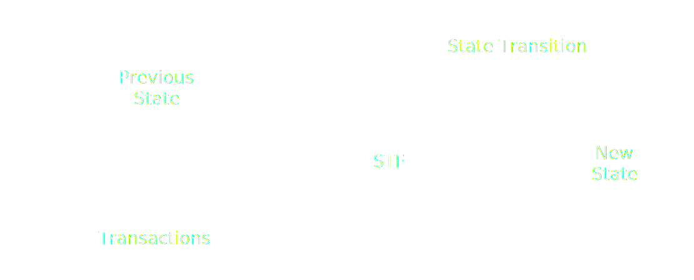
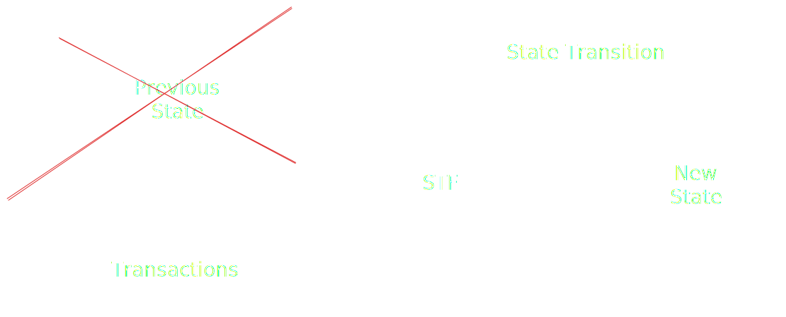

# Cumulus Deep Dive

Notes:

Cumulus is the glue which attaches substrate based chains to Polkadot, converting them into parachains.

---

### Outline

<pba-flex center>

1. What is Cumulus?
1. Cumulus and Para-Relay Communication

<!-- .element: class="fragment" data-fragment-index="1" -->

1. How Cumulus Keeps a Parachain Node Informed

<!-- .element: class="fragment" data-fragment-index="2" -->

1. Collation Generation and Advertisement

<!-- .element: class="fragment" data-fragment-index="3" -->

1. How Cumulus Collations Enable Parablock Validation

<!-- .element: class="fragment" data-fragment-index="4" -->

1. How Cumulus Enables Runtime Upgrades

<!-- .element: class="fragment" data-fragment-index="5" -->

</pba-flex>

---

## What is Cumulus

A collection of code libraries extending a Substrate FRAME chain so that it can interface with the Polkadot API, run relay chain based consensus, and submit parachain blocks for validation.

---

<div class="r-stack">


<!-- .element: class="fragment" data-fragment-index="1" -->

<!-- .element: class="fragment" data-fragment-index="2" -->
</div>

Notes:

- Substrate is a framework for building blockchains
- But only "solo" chains
- Split into runtime/node side
- Both Polkadot and Cumulus extend substrate
- Polkadot provides APIs to collators

---

## Review, Collators and Collations

<pba-flex center>

> What is a collator?

> What is a collation?

> What is the PoV?

</pba-flex>

Notes:

- Collator:
  - Part of consensus authority set
  - Author and submit collations
- Collation: Info necessary for validators to process and validate a parachain block.
- Collations include: upward and horizontal messages, new validation code, resulting head data, proof of validity, processed downward messages, and hrmp_watermark (relay block up to which all hrmp messages have been processed)
- PoV: The smallest bundle of information sufficient to validate a block.
  Will revisit in more detail.

---

## Cumulus' Key Processes

- Follow relay "new best head" to update para "new best head"
- Follow relay finalized block to update para finalized block

<!-- .element: class="fragment" data-fragment-index="1" -->

- Request parablocks not shared by peers from relay (data recovery)

<!-- .element: class="fragment" data-fragment-index="2" -->

- Collation generation and announcement

<!-- .element: class="fragment" data-fragment-index="3" -->

Notes:

- New best head: New block at the head of the fork most preferred by BABE

---

## Cumulus and Para-Relay Communication

<div class="r-stack">


<!-- .element: class="fragment" data-fragment-index="1" -->
</div>

Notes:

- How do these communication channels service our key processes?

---

## Handling Incoming Relay Information

Before addressing collation generation let's first address the other three key Cumulus processes.
These drive parachain consensus and ensure the availability of parachain blocks.

<br />
Together they keep parachain nodes up to date such that collating is possible.

Notes:

To recap, these key processes are:

- Follow relay "new best head" to update para "new best head"
- Follow relay finalized block to update para finalized block
- Request parablocks not shared by peers from relay (data recovery)

---

### Consensus Mechanism

Parachain consensus is modified to:

<pba-flex center>

- Achieve sequencing consensus
- Leave finality to the relay chain

</pba-flex>

Notes:

- Sequencing consensus: Decide on an accepted ordering of blocks and of transactions within a block
- Sequencing consensus requires that we update our knowledge of the new best head of the parachain.
  That way nodes are in agreement about which block to build on top of.
- Sequencing options: Aura consensus, tendermint style consensus
- When a parablock is included in a relay block that becomes finalized, that parablock is finalized by extension.

---

### Import Driven Block Authoring

Collators are responsible for authoring new blocks, and they do so when importing relay blocks.
Honest Collators will choose to author blocks descending from the best head.

```rust[|4-8]
// Greatly simplified
loop {
    let imported = import_relay_chain_blocks_stream.next().await;

    if relay_chain_awaits_parachain_candidate(imported) {
        let pov = match parachain_trigger_block_authoring(imported) {
            Some(p) => p,
            None => continue,
        };

        relay_chain_distribute_pov(pov)
    }
}
```

<!-- .element: class="fragment" data-fragment-index="1" -->

Notes:

- `parachain_trigger_block_authoring` itself can decide if it wants to build a block.
- e.g. the parachain having a block time of 30 seconds
- With asynchronous backing, parachain block authoring is untethered from relay block import.

---

### Finality

To facilitate shared security, parachains inherit their finality from the relay chain.

<br />

```rust[|4-8]
// Greatly simplified
loop {
    let finalized = finalized_relay_chain_blocks_stream.next().await;

    let finalized_parachain_block =
      match get_parachain_block_from_relay_chain_block(finalized) {
        Some(b) => b,
        None => continue,
    };

    set_finalized_parachain_block(finalized_parachain_block);
}
```

---

### Ensuring Block Availability

As a part of the parachains protocol, Polkadot makes parachain blocks available for several hours after they are backed.
<br /><br />

<pba-flex center>

- Why is this needed?
  - Approvals
  - Malicious collator

</pba-flex>

Notes:

- Approvers need the PoV to validate
- Can't just trust backers to distribute the PoV faithfully
- Malicious or faulty collators may advertise collations to validators without sharing them with other parachain nodes.
- Cumulus is responsible for requesting missing blocks in the latter case

---

#### Brief Aside, Candidate Receipt

The PoV is too big to be included on-chain when a parablock is backed, so validators instead produce a constant size **Candidate Block Receipt** to represent the freshly validated block and its outputs

Notes:

The Candidate Receipt contains mainly Hashes so the only valuable use is to be used to verify the correctness of known PoVs
The Candidate Receipt only references a PoV, it does not substitute it

---

### Malicious collator example

<div class="r-stack">

<!-- .element: class="fragment fade-out" data-fragment-index="1" -->

<!-- .element: class="fragment" data-fragment-index="1" -->

<!-- .element: class="fragment" data-fragment-index="2" -->
</div>

Notes:

- On a Parachain, a block only needs to be accepted by the relay chain validators to be part of the canonical chain,
- The problem is that a collator can send a block to the relay chain without distributing it in the Parachain network
- So, the relay chain could expect some parent block for the next block that no one is aware of

---

### The Availability Process

<pba-flex center>

- Erasure coding is applied to the PoV, breaking it into chunks
- 3x original PoV size, vs 300x to store copies

<!-- .element: class="fragment" data-fragment-index="1" -->

- 1/3 of chunks sufficient to assemble PoV

<!-- .element: class="fragment" data-fragment-index="2" -->

- 2/3 of validators must claim to have their chunks

<!-- .element: class="fragment" data-fragment-index="3" -->

</pba-flex>

---

## Availability Outcome


---

# Collation Generation and Advertisement

---

## Collation Generation

The last of our key processes

<pba-flex center>

1. Relay node imports block in which parachain's avail. core was vacated
1. `CollationGeneration` requests a collation from the collator

<!-- .element: class="fragment" data-fragment-index="1" -->

1. Parachain consensus decides whether this collator can author

<!-- .element: class="fragment" data-fragment-index="2" -->

1. Collator proposes, seals, and imports a new block

<!-- .element: class="fragment" data-fragment-index="3" -->

1. Collator bundles the new block and information necessary to process and validate it, a **collation!**

<!-- .element: class="fragment" data-fragment-index="4" -->

</pba-flex>

Notes:

- Aura is current default parachain consensus, but this consensus is modular and changeable

---

## Collation Distribution


Notes:

A subset of Para-Relay communication

---

#### From Collator to Relay Node and Parachain Nodes

- Sent from Collator, which owns both `CollatorService` and `ParachainConsensus`
- Sent to tethered relay node `CollationGeneration` subsystem to be repackaged and forwarded to validators
- Sent to parachain node import queues

```rust[1|5]
let result_sender = self.service.announce_with_barrier(block_hash);

tracing::info!(target: LOG_TARGET, ?block_hash, "Produced proof-of-validity candidate.",);

Some(CollationResult { collation, result_sender: Some(result_sender) })
```

---

# How Cumulus Collations Enable Parablock Validation

---

### What is Runtime Validation?

<pba-flex center>

- The relay chain ensures that every parachain block follows the rules defined by that parachain's current code.

<!-- .element: class="fragment" data-fragment-index="1" -->

- Constraint: The relay chain must be able to execute runtime validation of a parachain block without access to the entirety of that parachain's state

<!-- .element: class="fragment" data-fragment-index="2" -->

</pba-flex>

<div class="r-stack">


<!-- .element: class="fragment" data-fragment-index="1" -->

<!-- .element: class="fragment" data-fragment-index="2" -->
</div>

<pba-flex center>

- Building Blocks to make this possible, the PVF and PoV, are delivered within collations

<!-- .element: class="fragment" data-fragment-index="3" -->

</pba-flex>

---

#### Parachain Validation Function - PVF

- The current STF of each Parachain is stored on the Relay Chain, wrapped as a PVF

```rust [6]
/// A struct that carries code of a parachain validation function and its hash.
///
/// Should be cheap to clone.
#[derive(Clone)]
pub struct Pvf {
    pub(crate) code: Arc<Vec<u8>>,
    pub(crate) code_hash: ValidationCodeHash,
}
```

<br />

- New state transitions that occur on a parachain must be validated against the PVF

Notes:

The code is hashed and saved in the storage of the relay chain.

---

#### Why PVF Rather than STF?

<pba-cols>
<pba-col center>


</pba-col>
<pba-col center>

- The PVF is not just a copy paste of the parachain Runtime

<br />

- The PVF contains an extra function, `validate_block`

<br />

**WHY!?**

<!-- .element: class="fragment" data-fragment-index="1" -->

</pba-col>
</pba-cols>

Notes:

PVF not only contains the runtime but also a function `validate_block` needed to interpret all the extra information in a PoV required for validation.
This extra information is unique to each parachain and opaque to the relay chain.

---

#### Validation Path Visualized

<div class="r-stack">


<!-- .element: class="fragment" data-fragment-index="1" -->
</div>

Notes:

The input of the runtime validation process is the PoV and the function called in the PVF is 'validate_block', this will use the PoV to be able to call the effective runtime and then create an output representing the state transition, which is called a CandidateReceipt.

---

#### What Does validate_block Actually Do?

<pba-flex center>

- The parachain runtime expects to run in conjunction with a parachain client
- But validation is occurring in a relay chain node

<!-- .element: class="fragment" data-fragment-index="1" -->

- We need to implement the API the parachain client exposes to the runtime, known as host functions

<!-- .element: class="fragment" data-fragment-index="2" -->

- The host functions most importantly allow the runtime to query its state, so we need a light weight replacement for the parachain's state sufficient for the execution of this single block

<!-- .element: class="fragment" data-fragment-index="3" -->

- `validate_block` prepares said state and host functions

<!-- .element: class="fragment" data-fragment-index="4" -->

</pba-flex>

---

#### Validate Block in Code

```rust [2|3-4|6|8-11]
// Very simplified
fn validate_block(input: InputParams) -> Output {
    // First let's initialize the state
    let state = input.storage_proof.into_state().expect("Storage proof invalid");

    replace_host_functions();

    // Run Substrate's `execute_block` on top of the state
    with_state(state, || {
        execute_block(input.block).expect("Block is invalid")
    })

    // Create the output of the result
    create_output()
}
```

<br />

> But where does `storage_proof` come from?

Notes:

We construct the sparse in-memory database from the storage proof and
then ensure that the storage root matches the storage root in the `parent_head`.

---

##### Host Function Replacement Visualized

<div class="r-stack">

<!-- .element: class="fragment fade-out" data-fragment-index="1" -->

<!-- .element: class="fragment" data-fragment-index="1" -->
</div>

---

### Collation Revisited

```rust[1|2-5|12-15|6-7|8-11]
pub struct Collation<BlockNumber = polkadot_primitives::BlockNumber> {
	/// Messages destined to be interpreted by the Relay chain itself.
	pub upward_messages: UpwardMessages,
	/// The horizontal messages sent by the parachain.
	pub horizontal_messages: HorizontalMessages,
	/// New validation code.
	pub new_validation_code: Option<ValidationCode>,
	/// The head-data produced as a result of execution.
	pub head_data: HeadData,
	/// Proof to verify the state transition of the parachain.
	pub proof_of_validity: MaybeCompressedPoV,
	/// The number of messages processed from the DMQ.
	pub processed_downward_messages: u32,
	/// The mark which specifies the block number up to which all inbound HRMP messages are processed.
	pub hrmp_watermark: BlockNumber,
}
```

Notes:

Code highlighting:

- CandidateCommitments: Messages passed upwards, Downward messages processed, New code (checked against validation outputs)
- head_data & PoV (the validation inputs)

---

### Proof of Validity (Witness Data)

- Acts as a replacement for the parachain's pre-state for the purpose of validating a single block
- It allows the reconstruction of a sparse in-memory merkle trie

<!-- .element: class="fragment" data-fragment-index="1" -->

- State root can then be compared to that from parent header

<!-- .element: class="fragment" data-fragment-index="2" -->

---

### Example of Witness Data Construction

<div class="r-stack">

<!-- .element: class="fragment fade-out" data-fragment-index="1" -->

<!-- .element: class="fragment" data-fragment-index="1" -->
</div>

<br />

- Only includes the data modified in this block along with hashes of the data from the rest of the trie

<!-- .element: class="fragment" data-fragment-index="2" -->

- This makes up the majority of the data in a collation (max 5MiB)

<!-- .element: class="fragment" data-fragment-index="3" -->

Notes:

orange: Data values modified in this block
green: Hash of the siblings node required for the pov
white: Hash of the nodes that are constructed with orange and green nodes
red: Unneeded hash
blue: Head of the trie, hash present in the previous block header

---

#### Parablock Validation in Summary

```rust [2|3-4|6]
// Very simplified
fn validate_block(input: InputParams) -> Output {
    // First let's initialize the state
    let state = input.storage_proof.into_state().expect("Storage proof invalid");

    replace_host_functions();

    // Run `execute_block` on top of the state
    with_state(state, || {
        execute_block(input.block).expect("Block is invalid")
    })

    // Create the output of the result
    create_output()
}
```

- Now we know where the **storage_proof** comes from!
- **into_state** constructs our storage trie

<!-- .element: class="fragment" data-fragment-index="1" -->

- Host functions written to access this new storage

<!-- .element: class="fragment" data-fragment-index="2" -->

---

## Cumulus and Parachain Runtime Upgrades

<pba-flex center>

- Every Substrate blockchain supports runtime upgrades

<!-- .element: class="fragment" data-fragment-index="0" -->

##### Problem

<!-- .element: class="fragment" data-fragment-index="1" -->

- What happens if PVF compilation takes too long?
  <!-- .element: class="fragment" data-fragment-index="1" -->
  - Approval no-shows
  - In disputes neither side may reach super-majority

<!-- .element: class="fragment" data-fragment-index="1" -->

> Updating a Parachain runtime is not as easy as updating a standalone blockchain runtime

<!-- .element: class="fragment" data-fragment-index="2" -->

</pba-flex>

---

### Solution

The relay chain needs a fairly hard guarantee that PVFs can be compiled within a reasonable amount of time.

<!-- .element: class="fragment" data-fragment-index="0" -->

<br />

- Collators execute a runtime upgrade but it is not applied
- Collators send the new runtime code to the relay chain in a collation
- The relay chain executes the **PVF Pre-Checking Process**
- The first parachain block to be included after the end of the process applies the new runtime

<!-- .element: class="fragment" data-fragment-index="1" -->

> Cumulus follows the relay chain, waiting for a go ahead signal to apply the runtime change

<!-- .element: class="fragment" data-fragment-index="2" -->

Notes:

<https://github.com/paritytech/polkadot-sdk/blob/9aa7526/cumulus/docs/overview.md#runtime-upgrade>

---

##### PVF Pre-Checking Process

- The relay chain keeps track of all the new PVFs that need to be checked
- Each validator checks if the compilation of a PVF is valid and does not require too much time, then it votes
  <!-- .element: class="fragment" data-fragment-index="1" -->
  - binary vote: accept or reject
  <!-- .element: class="fragment" data-fragment-index="1" -->
- Super majority concludes the vote

<!-- .element: class="fragment" data-fragment-index="2" -->

- The state of the new PVF is updated on the relay chain

<!-- .element: class="fragment" data-fragment-index="3" -->

Notes:

Reference: <https://paritytech.github.io/polkadot/book/pvf-prechecking.html>

---

## References

1. 🦸 [Gabriele Miotti](https://github.com/gabriele-0201), who was a huge help putting together these slides
1. <https://github.com/paritytech/polkadot-sdk/blob/9aa7526/cumulus/docs/overview.md>

---

<!-- .slide: data-background-color="#4A2439" -->

# Questions
