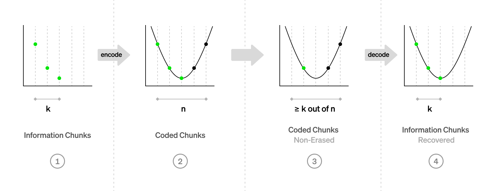
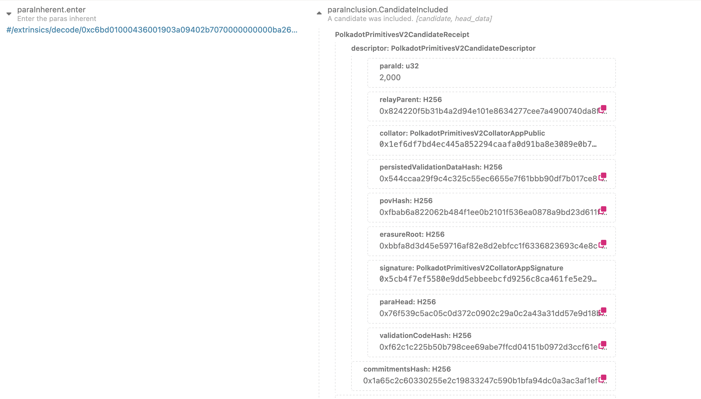

# Data Availability and Sharding

---

### Outline

<pba-flex center>

1. [Data Availability Problem](#data-availability-problem)
1. [Erasure coding](#erasure-coding)
1. [Data Availability Sampling](#data-availability-sampling)
1. [References](#references)

</pba-flex>

---

## Data Availability Problem

How do we ensure a piece of data is retrievable without storing it on every single node forever?

Incorrectness can be proven (fraud proofs), but unavailability can't.

---v

### Data Availability Problem: Parachains

Imagine a parachain collator produces a block, but only sends it to relay chain validators to verify.

What could such a collator do?

<pba-flex center>

- Prevent nodes and users from learning the parachain state
- Prevent other collators from being able to create blocks

</pba-flex>

We want other collators to be able to reconstruct the block from the relay chain.

---v

### Data Availability Problem: Relay Chain

If that block's PoV is only stored by a few validators, what if they go offline or rogue?

<pba-flex center>

- Honest approval-checkers are not able to verify validity

</pba-flex>

Notes:

This is really bad.
It means we could finalize an invalid parachain block.

---

## Problem


Notes:

I really like this comic from the paradigm article about Data Availability Sampling. But it works for our case as well with data sharding.

---

## Erasure coding

The goal:

<pba-flex center>

- Encode data of K chunks into a larger encoded data of N chunks
- Any K-subset of N chunks can be used to recover the data

</pba-flex>


---v

### In code

```rust
type Data = Vec<u8>;

pub struct Chunk {
	pub index: usize,
	pub bytes: Vec<u8>,
}

pub fn encode(_input: &Data) -> Vec<Chunk> {
	todo!()
}

pub fn reconstruct(_chunks: impl Iterator<Item = Chunk>) -> Result<Data, Error> {
	todo!()
}
```

---

### Polynomials


---v

### Polynomials: Line


---v

### Even More Polynomials


---v

### Polynomial we need



We want to have a polynomial, such that:

$$ p(x_i) = y_i$$

Notes:

Question: what is x_i and y_i wrt to our data?

---

### Lagrange interpolating polynomial

<!-- prettier-ignore -->
$$ \ell_j(x) = \frac{(x-x_0)}{(x_j-x_0)} \cdots \frac{(x-x_{j-1})}{(x_j-x_{j - 1})} \frac{(x-x_{j+1})}{(x_j-x_{j+1})} \cdots \frac{(x-x_k)}{(x_j-x_k)} $$

<!-- prettier-ignore -->
$$ L(x) = \sum_{j=0}^{k} y_j \ell_j(x) $$

---

### Reed-Solomon codes

Congrats! You've just learned Reed-Solomon encoding (almost).

Actual Reed-Solomon codes are defined over finite-fields.

It can detect and correct combinations of errors and erasures.

Notes:

The simplest example of a finite field is arithmetic mod prime number.
Computers are quite bad at division by prime numbers.
Reed-Solomon codes are used in CDs, DVDs, QR codes and RAID 6.

---v

### Reed-Solomon with Lagrange interpolation

1. Divide the data into elements of size $P$ bits.
1. Interpret the bytes as (big) numbers $\mod P$.
1. Index of each element is $x_i$ and the element itself is $y_i$.
1. Construct the interpolating polynomial $p(x)$ and evaluate it at additional $n - k$ points.
1. The encoding is $(y_0, ..., y_{k-1}, p(k), ... p(n - 1))$ along with indices.

Notes:

How do we do reconstruction?

---

## Polkadot's Data Availability Protocol

<pba-flex center>

- Each PoV is divided into $N_{validator}$ chunks
- Validator with index i gets a chunk with the same index
- Validators sign statements when they receive their chunk
- Once we have $\frac{2}{3} + 1$ of signed statements,<br />PoV is considered available
- Any subset of $\frac{1}{3} + 1$ of chunks can recover the data

</pba-flex>

Notes:

The total amount of data stored by all validators is PoV \* 3.
With 5MB PoV and 1k validators, each validator only stores 15KB per PoV.
With this protocol, we've killed two birds with one stone!

---

### CandidateIncluded



---

### Availability Bitfields


Notes:

Each validator actually signs a statement per relay chain block, not per PoV to reduce the number of signatures.
These statements are gossiped off-chain and included in a block in a ParachainsInherent.

---

### Challenge 1

How does a validator know if a chunk corresponds to the committed data?


---v

### Not that Merkle!


---

### Challenge 2

How do we know if what can be reconstructed from chunks is the same data that was encoded with Reed-Solomon?

<pba-flex center>

- Polkadot uses approval-voting/disputes mechanism for that
- Celestia uses Fraud Proofs
- Danksharding uses KZG commitments

</pba-flex>

---

## Data Availability Sampling

Ethereum (Danksharding) and Celestia adopt an approach of Data Availability Sampling, where each light client makes its own judgement of availability by sampling and distributing a few random chunks.

This can eliminate honest majority assumption!

This approach guarantees there's at least one honest full nodes that has the data with high probability.

<br />

> <https://arxiv.org/abs/1809.09044>

---

## Safety of Polkadot's protocol

If we have at most $f$ out of $3f + 1$ malicious + offline validators, then if the data is marked as available, it **can** be recovered.

What if that assumption is broken?

If $2f + 1$ are malicious, every PoS is doomed anyway.

Notes:

We'll see in the next lesson, how approval-voting can prevent unavailable blocks from being finalized even with $>f$ malicious nodes.

---

## 2D Reed-Solomon Encoding


Notes:

The approach of 2D Reed-Solomon Encoding can reduce the size of
a Fraud Proof used by Celestia.
But it adds an overhead computationally and on the amount of data stored.

---

## Comparison with other approaches

- Both Danksharding and Celestia use 2D encoding and DAS
- Celestia doesn't implement data sharding
- Data availability is only part of ensuring validity
- Polkadot's DA is able to process dozens of MB per second

Notes:

Danksharding is aiming at 1.3 MB/s and Celestia < 1 MB/s.

---

## Ideas to Explore

<pba-flex center>

- Data Availability Sampling for parachain<br />light clients and full nodes
- Consider using KZG commitments
- Reducing the number of signatures to verify
- A Data Availability Parachain

</pba-flex>

---

<!-- .slide: data-background-color="#4A2439" -->

# Questions

---

### Bonus

<pba-flex center>

- Polkadot uses a field of size $2^{16}$ with efficient arithmetic
- Polkadot uses an FFT-based Reed-Solomon algorithm (no Lagrange)

</pba-flex>

> <https://github.com/paritytech/reed-solomon-novelpoly>

---

## References

1. <https://www.youtube.com/watch?v=1pQJkt7-R4Q>
1. <https://notes.ethereum.org/@vbuterin/proto_danksharding_faq>
1. <https://www.paradigm.xyz/2022/08/das>
