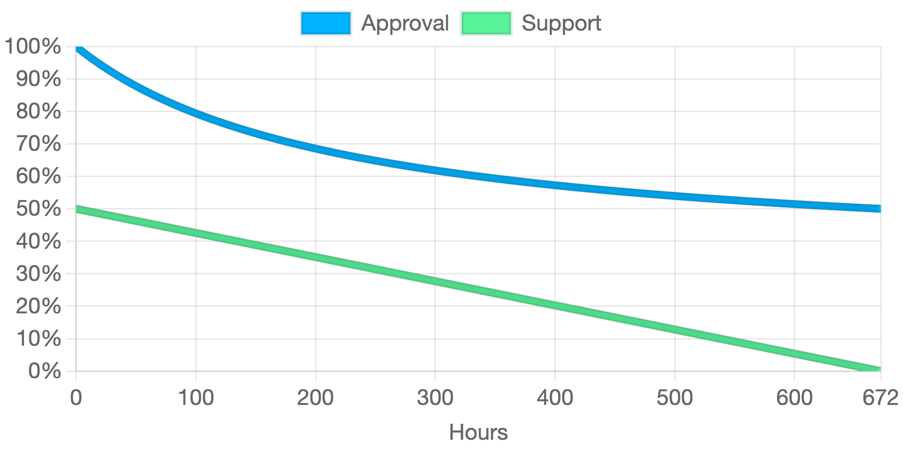
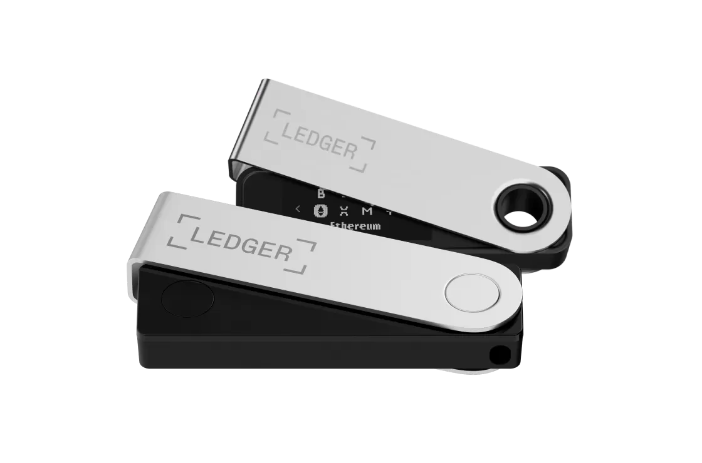
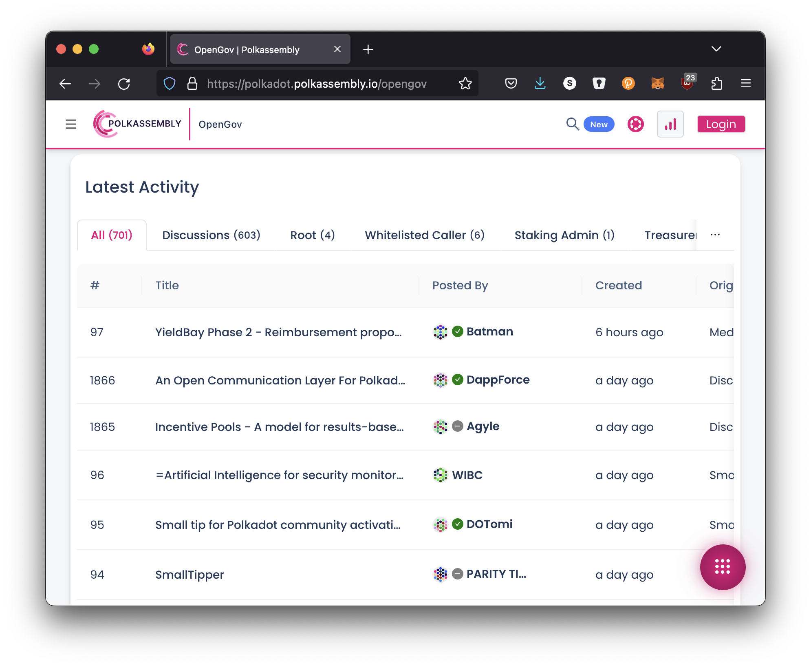
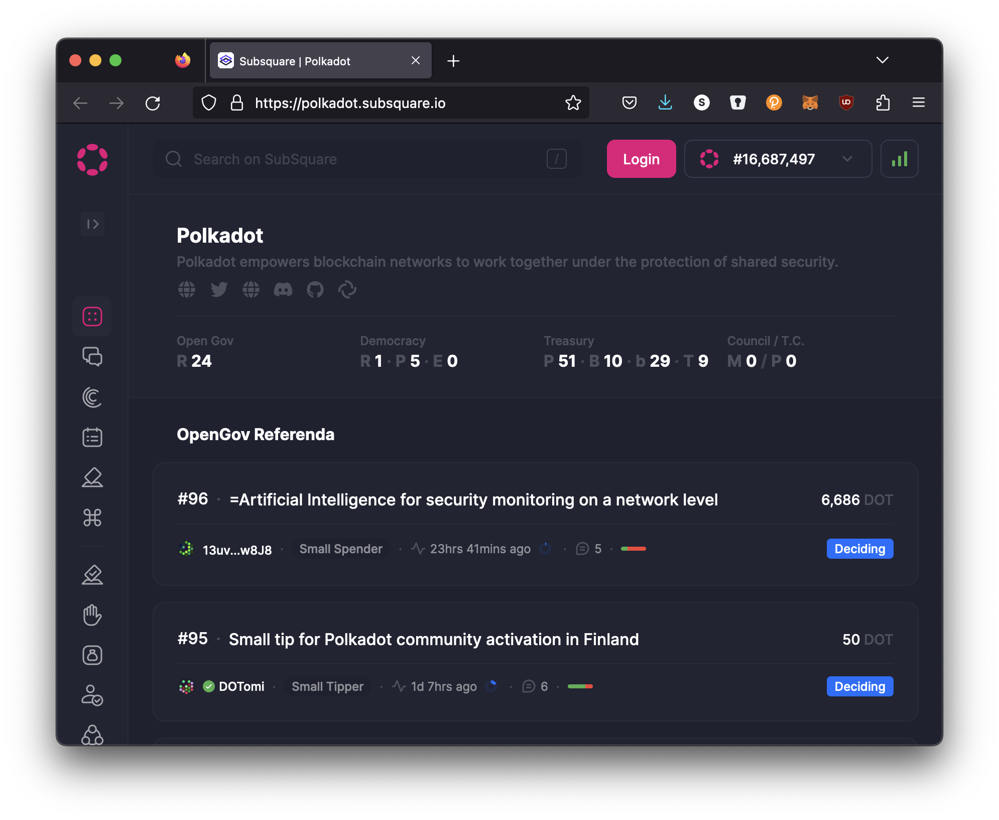

# Ecosystem and Economy

---

## Ecosystem and Economy

This presentation will give you a high level overview of the ecosystem and economy of the Polkadot Network.

Unfortunately this presentation could never be fully exhaustive, but perhaps it will shed light on areas previously unknown.

---

# Economy

---

## The DOT Token

<div class="grid grid-cols-2">

<div>


</div>

<div class="text-left">

The DOT token can be in one of the following states:

1. Transferable
2. Locked (Frozen)
3. Reserved (Held)

</div>

</div>

---

## Reserved vs Locked Balance

- New terms "Frozen" and "Held" are not quite used in Polkadot yet...
- Both states belong to the user... but cannot be spent / transferred.
- Reserved balances stack on top of one another.
  - Useful for user deposits, or other use cases where there is sybil concerns.
  - Ex: Deposit for storing data on-chain,
- Locked balances can overlap each other.
  - Useful when you want to use the same tokens for multiple use cases.
  - Ex: Using the same tokens for both staking and voting in governance.

---

## Storage Bloat

One blockchain scaling problem is storage bloat over time.

<br />

Consider the "cost" of storing data on Ethereum:

- A one time gas fee based on the amount of data stored.
- Once is it placed on the network, it lives there forever, with no additional costs.
- Over a long enough period of time, the cost of storage per time will reduce to zero.

---

## Storage Deposits

To solve this problem, Polkadot additionally takes a storage deposit (in the form of Reserved Balance) for any data stored in the blockchain.

- This deposit is returned to the user when the user removes the data from the chain.

- This deposit can be quite extreme, since it is returned to the user, and can represent the impermanence or lack of "importance" of the data.

---

## Dust Accounts & Existential Deposit

The most bloat-ful storage on most blockchains are user accounts:

- Both Ethereum and Bitcoin are riddled with "dust accounts" which have such a small balance, they are not worth "cleaning up".

- Polkadot solves this by having an "existential deposit" that all users must hold a minimum amount of DOT, else their account data will be cleaned up.

- Existential deposit can be thought of as a storage deposit for account data.

---

## DOT is a Utility Token

<div class="grid grid-cols-3">

<div>


</div>

<div class="text-left col-span-2">

The DOT token serves multiple purposes to help the Polkadot network function:

- Staking
- Bonding for Parachain Slots / Execution Cores
- On-Chain Decision Making
- Value Bearing for Trading / Using

</div>
</div>

---

## Ideal Usage of DOT Tokens


Approximately...

Notes:

- 50% Staking / Governance
- 30% Parachains
- 20% Tradable / Useable

---

## DOT Inflation

<div class="grid grid-cols-2">

<div>


</div>

<div class="text-left">

DOT is currently configured to have a fixed inflation rate of 10% per year.

Newly minted tokens are distributed to stakers (validators / nominators) and the treasury.

</div>

</div>

---

## Ideal Staking Rate

We cannot force / tell users how to use their tokens, so we encourage "ideal" behavior by associating DOT token usage to how inflation is distributed.

There’s a function that redirects some of the 10% inflation to the Treasury, instead of the stakers, when `ideal_rate != staking_rate`.

Token holders are financially incentivized to maximize their staking returns, and thus distribute their tokens appropriately.

---

## DOT Inflation vs Staking


> Blue: Inflation vs Staking Rate
>
> Green: APY of Stakers vs Staking Rate
>
> Black: Total Inflation vs Staking Rate

---

## DOT Utility: Parachains

Polkadot provides many utilities, but arguably its most important utility is providing flexible, secure, and scalable blockspace.

Developers can purchase this blockspace as fixed-term or on-demand Parachains, **only** with the DOT token.

<br />

> If you believe that flexible and secure blockspace has value, then you agree that DOT also has value.

---

## Expected Parachain Costs

Back of the napkin math:

- ~1 Billion DOT
- 30% Locked Up for Parachains = 300 Million
- ~100 Parachain = 3 Million DOT per Parachain Slot

At equilibrium...

---

## Parachain Economics Updates

There is a lot of ongoing discussion about updating the economics of Parachains.

Likely, these mechanics will update pretty soon, and continually over time.

---

## DOT Utility: Staking

<div class="grid grid-cols-3">

<div class="col-span-2 text-left">

Given the existence of a value bearing token, it can be used to provide security to Polkadot:

- If users want to provide security to the network, they can stake their tokens.

- Stakers are rewarded for good behavior, and punished for bad behavior.

- Punishments are aggressive enough that rational actors would never act maliciously.

<https://www.polkadot.network/features/staking/>

</div>

<div>


</div>

</div>

---

## Staking: Validators and Nominators

<div class="grid grid-cols-3">

<div class="col-span-2 text-left">

In the staking system, there are two roles:

- Validators: Those who run block producing / parachain validating nodes for Polkadot.
- Nominators: Users who place their tokens behind validators they think will perform their job well.

Validators (and their nominators) are rewarded based on work done for the network. Rewards may vary day to day, but should be consistent over long periods of time.

</div>

<div>


</div>

</div>

---

## DOT Utility: Governance

<div class="grid grid-cols-3">

<div class="col-span-2 text-left">

The future of Polkadot is decided by token holders.

Polkadot has an on-chain governance system called OpenGov which is used to:

- Spend Treasury Funds
- Upgrade the Network
- Manage the Fellowship
- Support Parachain Teams
- etc...

<https://www.polkadot.network/features/opengov/>

</div>

<div>


</div>

</div>

---

## Conviction Voting

Polkadot utilizes an idea called voluntary locking / conviction voting.

This allows token holders to increase their voting power by locking up their tokens for a longer period of time.

```text
votes = tokens * conviction_multiplier
```

The conviction multiplier increases the vote multiplier by one every time the number of lock periods double.

<div class="text-small">

| Lock Periods | Vote Multiplier | Length in Days |
| ------------ | --------------- | -------------- |
| 0            | 0.1             | 0              |
| 1            | 1               | 7              |
| 2            | 2               | 14             |
| 4            | 3               | 28             |
| 8            | 4               | 56             |
| 16           | 5               | 112            |
| 32           | 6               | 224            |

</div>

---

## Tracks

The OpenGov system has different voting tracks which have different levels of power, and proportionally different level of difficulty to pass.

Here are just some of the currently 15 tracks:

| ID  |       Origin       | Decision Deposit | Prepare Period | Decision Period | Confirm Period | Min Enactment Period |
| :-: | :----------------: | :--------------: | :------------: | :-------------: | :------------: | :------------------: |
|  0  |        Root        |    100000 DOT    |    2 Hours     |     28 Days     |     1 Day      |        1 Day         |
|  1  | Whitelisted Caller |    10000 DOT     |   30 Minutes   |     28 Days     |   10 Minutes   |      10 Minutes      |
| 10  |   Staking Admin    |     5000 DOT     |    2 Hours     |     28 Days     |    3 Hours     |      10 Minutes      |
| 11  |     Treasurer      |     1000 DOT     |    2 Hours     |     28 Days     |    3 Hours     |        1 Day         |
| 12  |    Lease Admin     |     5000 DOT     |    2 Hours     |     28 Days     |    3 Hours     |      10 Minutes      |

---

## Approval and Support Curves

Each track has their own set of curves which determine if the proposal has passed or failed.

All votes will eventually resolve one way or another.


You can find these curves on the Polkadot JS Developer Console.

---

## Example: Root

The origin with the highest level of privileges. Requires extremely high levels of approval and support for early passing. The prepare and enactment periods are also large.



For instance, a referendum proposed in this track needs to amass 48.2% support (total network issuance) by the end of the first day with over 93.5% approval to be considered to be part of the confirm period.

---

## Governance Token Mechanics

- DOT tokens are locked when you vote on a proposal.
- You can reuse your locked tokens across multiple proposals.
  - Voting for one proposal does not affect your ability to vote on another proposal.
- You can also reuse staked tokens (which are also just locked).
- You can update your vote while the proposal is ongoing.
- If you used conviction voting, your tokens might be locked for long periods of time passed the end of a proposal.

---

## Treasury

Polkadot has an on-chain treasury which is used to support permissionless and decentralized development of the network.

Treasury gets its funds through inefficiencies in the inflation curve, slashing, and by taking 80% transaction fees.

Treasury will automatically burn a 1% of its funds every spending period (24 days), placing pressure on spending the tokens.

---

## Treasury Outlets

- Proposals: Instant payments to individuals approved by governance.
- Bounties: Multi-stage payments to individuals managed by governance and an appointed bounty curator.
- Tips: Small payments to individuals that can be made more easily through specific governance tracks.

The Polkadot Treasury currently has over 45,000,000 DOT.

---

# Ecosystem

---

## Alternative Polkadot Clients

The main Polkadot Client is built using Rust in Substrate.

However, other clients for Polkadot are under development:

- Kagome (C++17): <https://github.com/qdrvm/kagome>
- Gossamer (Go): <https://github.com/ChainSafe/gossamer>

Over time, this can help provide additional resilience to the network from software bugs.

---

## Types of Parachains

- Polkadot System Chains
- Market Bought Parachains

<br />

Perhaps this list will grow once more agile core allocation systems are implemented.

---

## System Chains

- System parachains contain core Polkadot protocol features, on a parachain rather than the Relay Chain.
- Polkadot uses its own parallel execution scaling technology scale itself.
- System parachains remove transactions from the Relay Chain, allowing more Relay Chain blockspace to be used for Polkadot's primary purpose: validating parachains.
- System Chains are allocated by governance.

Notes:

<https://wiki.polkadot.network/docs/learn-system-chains>

---

## Current and Future System Chains

Current:

- Asset Hub: Allows creation and registration of tokens (FT & NFTs).
- Collectives: Acts as a place for coordination of the Polkadot DAOs.
- Bridge Hub: A chain for managing bridges to other networks.
- Encointer: A third-party built chain providing Proof of Personhood.

Future:

- Staking: Manage all the validator and nominator logic, rewards, etc...
- Governance: Manage all the various proposals and tracks.
- Eventually everything...

Notes:

<https://wiki.polkadot.network/docs/learn-system-chains>

---

## Market Bought Parachains

<div class="grid grid-cols-2">

<div>

Anyone with a great idea, and access to DOT token, can launch a parachain on Polkadot.

Dozens of teams from around the world have already done that, and are taking advantage of the features that Polkadot provides.

</div>

<div>


</div>

</div>

Notes:

<https://polkadot.subscan.io/parachain>

---

## Ecosystem Verticals

While this list is not exhaustive, some of the verticals we have seen appear in Polkadot are:

<div class="grid grid-cols-5">

<div class="col-span-3">

- Smart Contract Chains
- Decentralized Finance (DeFi)
- Decentralized Social (DeSo)
- Decentralized Identity (DID) Services
- Tokenization (Real World Assets)

</div>

<div class="col-span-2">

- Gaming
- NFTs (Music, Art, etc...)
- Bridges
- File Storage
- Privacy

</div>

</div>

Notes:

<https://substrate.io/ecosystem/projects/>

---

## Wallets

Thanks to the treasury and Polkadot community, a number of different wallets have been developed across the ecosystem.

<div class="text-small">

|     Wallet      |                  Platforms                  | Staking and Nomination Pools | NFTs | Crowdloans | Ledger support | Governance |
| :-------------: | :-----------------------------------------: | :--------------------------: | :--: | :--------: | :------------: | :--------: |
|     Enkrypt     | Brave, Chrome, Edge, Firefox, Opera, Safari |            No, No            | Yes  |     No     |      Yes       |     No     |
|    PolkaGate    |        Brave, Chrome, Firefox, Edge         |           Yes, Yes           |  No  |    Yes     |      Yes       |    Yes     |
|    SubWallet    | Brave, Chrome, Edge, Firefox, iOs, Android  |           Yes, Yes           | Yes  |    Yes     |      Yes       |     No     |
|    Talisman     |        Brave, Chrome, Edge, Firefox         |           Yes, Yes           | Yes  |    Yes     |      Yes       |     No     |
| Fearless Wallet |         Brave, Chrome, iOS, Android         |           Yes, Yes           |  No  |     No     |       No       |     No     |
|   Nova Wallet   |                iOS, Android                 |           Yes, Yes           | Yes  |    Yes     |      Yes       |    Yes     |
|   Polkawallet   |                iOS, Android                 |           Yes, Yes           |  No  |    Yes     |       No       |    Yes     |

</div>

<!-- FIXME TODO ensure this is updated! Consider more pretty with icons or other images -->

Notes:

---

## Ledger Support w/ Metadata

<div class="grid grid-cols-3">

<div class="col-span-2">

Polkadot has been working with Ledger to provide rich support for the Polkadot network.

Users can get clear visibility into the transactions they are signing, and perform complicated tasks such as batching, multisigs, staking, governance, and more.

</div>

<div>



</div>

</div>

---

## Block Explorers

- Polkadot-JS Apps Explorer - Polkadot dashboard block explorer. Supports dozens of other networks, including Kusama, Westend, and other remote or local endpoints.
- Polkascan - Blockchain explorer for Polkadot, Kusama, and other related chains.
- Subscan - Blockchain explorer for Substrate chains.
- DotScanner - Polkadot & Kusama Blockchain explorer.
- 3xpl.com - Fastest ad-free universal block explorer and JSON API with Polkadot support.
- Blockchair.com - Universal blockchain explorer and search engine with Polkadot support.
- Polkaholic.io - Polkadot & Kusama Blockchain explorer with API and DeFi support across 40+ parachains.

Notes:

<https://wiki.polkadot.network/docs/build-tools-index#block-explorers>

---

## Governance Dashboards

The most popular ones at the moment:

<div class="grid grid-cols-2">

<div>

### Polkassembly



</div>

<div>

### Subsquare



</div>

</div>

---

## Polkadot Forum


Notes:

<https://forum.polkadot.network/>

---

## Fellowship

The Polkadot Fellowship is a decentralized technical collective on the Polkadot network designed to recognize, nurture, and incentivize contributors to the core Polkadot protocol.

---

## Fellowship Manifesto


Notes:

<https://github.com/polkadot-fellows>

---

## Fellowship Members


Notes:

<https://polkadot.js.org/apps/?rpc=wss%3A%2F%2Fkusama-rpc.polkadot.io#/fellowship>

---

## RFCs


---

<!-- .slide: data-background-color="#4A2439" -->

# Questions

Did I miss anything?
