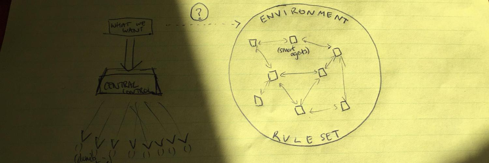
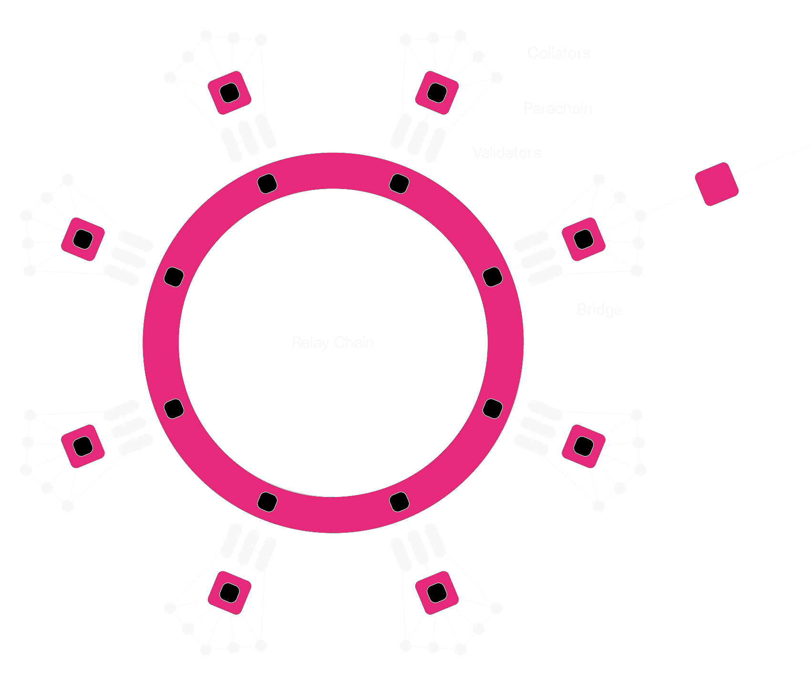
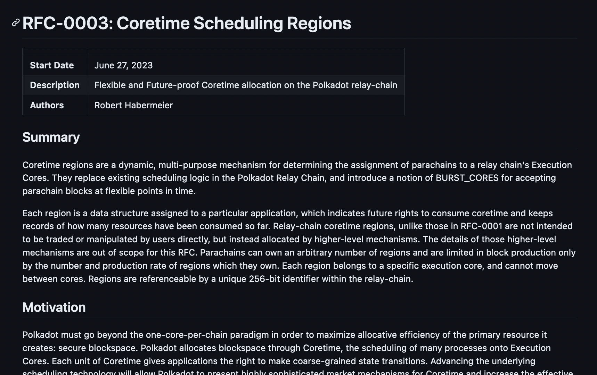

<!-- .slide: data-background-color="#000" -->

# Introduction to Polkadot

---

## What is Polkadot?

> Polkadot is a scalable, heterogeneous, sharded, multi-chain network.

> Polkadot is a permissionless and ubiquitous computer

> Polkadot is a decentralized open-source community

> Polkadot is a digital-native sovereign network

---

## Environment

Polkadot has many faces, both technical and social.

It is the real-world instantiation of the technology described within this module.

These technologies only define the limits of the environment.
Polkadot is everything which happens within it.

---

### Agents

Within the environment, various types of agents may take action according to its rules.

These may be human users, silicon users, governments, or legal entities.

They likely have different agendas and activity levels, and may be located anywhere in the world.

Polkadot is an online economy for smart agents.

---

### Games

Polkadot fulfills its goals with a combination of mechanisms and games which provide incentives and disincentives for nodes to work together and construct this environment.

---

### All Together

Notes:

source: banner image from <https://twitter.com/gavofyork>

---

## Goals of the Environment

1. Real-time, secure, global consensus on system state
1. Trustless, censorship-resistant, and permissionless transaction at scale
1. Explicit network-wide governance and co-evolution
1. General programmable computation with full security
1. Secure and trust-minimized interoperability between processes

---

## Goals: Breakdown

> (1) Real-time, secure, global consensus on system state

Polkadot's state should update as close to real-time as possible.

A global, unique history of everything that has happened is maintained.

Notes:

State consisting of account balances, chains, governance votes, etc.

---

## Goals: Breakdown

> (2) Trustless, censorship-resistant, and permissionless transaction at scale

Only a private key and a balance is needed to interact with the network, and without trusting any single third party.

It aims to do so at high scale.

---

## Goals: Breakdown

> (3) Explicit network-wide governance and co-evolution

Polkadot stakeholders explicitly govern and evolve the network, with the ability to set new rules.

---

## Goals: Breakdown

> (4) General programmable computation with full security

Polkadot is extended by general programs, usually taking the form of blockchains which themselves may be programmable environments.

Generalized computation allows the capabilities of the network to be extended arbitrarily, while inheriting the full security of the network.

---

## Goals: Breakdown

> (5) Secure and trust-minimized interoperability between processes

Processes deployed on Polkadot need to:

<pba-flex center>

- Communicate with each other.
- "Trade" with each other without entirely trusting them.
- Protect trade routes and enforced trade agreements.

</pba-flex >

---

## Validators

Validators decide to participate in the upkeep of the network.

Validators participate in the core **games** of Polkadot.

---

## Validators

Validators are _incentivized_ to do things like put user transactions in blocks or contribute to other activities, but may opt out of many of these tasks.

Validators are strongly punished for explicitly doing their job wrongly.

The games work as long as enough validators are doing their job and also not misbehaving.

---

<!-- .slide: data-background-color="#000" -->

# Polkadot Architecture

Notes:

A high level look into the architecture of Polkadot and the actors which maintain the network.

---

## Polkadot: Major Systems

---

Validators are made to provide accurate execution for processes deployed on top of Polkadot.

These processes, defined as WebAssembly Code, are colloquially known as **parachains**.

Polkadot scales by sharing the load of validating these parachains across many validators.

---

---

Notes:

Simplified Polkadot Architecture (Parachains)

---

## The Relay Chain

The relay chain is the "hub" of Polkadot, providing the main games which validators play.
It is built with Substrate.

Notably, the functionality of the relay chain is minimized, with the expectation that more complex functionalities will be pushed to less critical parts of the system.

---

## Relay Chain Functionality:

<pba-flex center>

- Governance (moving to parachain)
- Staking
- Registration, scheduling, and advancement of parachains
- Communication between parachains
- Consensus Safety
- Balance Transfers

</pba-flex>

---

## Relay Chain Games:

The Relay Chain consists of two key games:

<pba-flex center>

- Relay Chain Consensus
- Parachain Consensus

</pba-flex>

These games are the enablers of all activity within Polkadot.

---

## Game: Relay Chain Consensus (simplified)

<pba-flex left>

**Goal:**

- Grow and finalize the relay chain, comprised of only valid blocks

</pba-flex>
<pba-flex left>

**Rules:**

</pba-flex>

- Validators put skin in the game in the form of tokens.
- Validators are incentivized to make new relay chain blocks (BABE)
- Validators are incentivized to vote to finalize recent relay chain blocks (GRANDPA)
- Validators are incentivized to include user transactions in their relay chain blocks.
- Validators get nothing for building bad blocks or building on top of them.
- Validators are slashed for making blocks out of turn.

 

**The game works whenever <1/3 of validators misbehave.**

---

## Game: Parachain Consensus (simplified)

<pba-flex left>

**Goal:**

- Grow registered parachains and post only valid updates to the Relay Chain

</pba-flex>
<pba-flex left>

**Rules:**

</pba-flex>

- Validators are incentivized to attest to new parachain updates
- Whichever Validator makes the next Relay Chain block includes some attested parachain updates
- Validators are slashed if they attest to incorrect parachain updates
  - incorrect means "not according to the parachain's Wasm code"
- Validators check each others' work to initiate the slashing procedure

 

**The game works whenever <1/3 of validators misbehave.**

---

All other functionalities of the relay chain (staking, governance, balances, etc.) are just baked into the definition of **valid block** and **valid transaction**.

---

## Staking: Nominated Proof-of-Stake

As the Relay Chain progresses, it operates a system for selecting and accruing capital behind validators.

Accounts on Polkadot may issue a "nominate" transaction to select validators they support.
Every day, an automated election selects the validators for the next 24 hours.

Nominators share in both the reward and slashing of their nominees.

---

## Message Passing: Trustless Communication

The Relay Chain manages message queues and channels between parachains, as well as between each parachain and the Relay Chain itself.

Part of the Validators' job is to ensure that message queues are properly maintained and updated.

---

## Registering Parachains

In 1.0: this is done via Slot Auctions to get a large bulk allocation

In the future: this will be done on a more granular / ad-hoc basis

---

<!-- .slide: data-background-color="#000" -->

## Governance & Evolution

---

## OpenGov

Polkadot has on-chain governance by stakeholder referendum, voting on subjects such as:

<pba-flex center>

- Forkless upgrades of the network
- Administration of the Treasury funds
- Configuration of the Parachains protocol
- Configuration of fees
- Rescue & recovery operations
- All other mechanisms of control over the platform

</pba-flex>

Notes:

<https://www.polkadot.network/features/opengov/>

---

## Treasury

<pba-flex center>

- Polkadot ensures that a portion of network fees are collected treasury.
- The treasury is managed by governance.
- Tokens are burned if they are not spent.

</pba-flex>
 

The intention of the treasury is to pay people to help grow Polkadot itself.
As tokens are burned, this creates pressure to fund public projects.

---

### The Fellowship

A collective of developers, coordinated through on-chain activities.

These are node maintainers, developers, or researchers.

They set the technical direction for the network through RFCs.

---

<!-- .slide: data-background-color="#111" -->

<pba-cols>

</pba-cols>

---

<!-- .slide: data-background-color="#000" -->

## Revisiting Goals

---

> (1) Real-time, secure, global consensus on system state

This is provided by the validators participating in **Relay Chain Consensus**.
Every block they make and finalize advances the system state.

---

> (2) Trustless and permissionless transaction at scale

"at scale" is the caveat that drives most of the engineering in Polkadot.

Polkadot scales by virtue of the **Parachain Consensus** game, where the parachains themselves process most of the transactions in the network.

The more efficiently this game is implemented, the more Polkadot scales.

---

> (3) Explicit network-wide governance and co-evolution

This is handled by OpenGov and the Treasury.
Polkadot is a "meta-protocol" where OpenGov can update anything in the network, including the network's own rules.

---

> (4) General programmable computation with full security

This is provided by the **Parachain Consensus** game, as most parachains are registered by users and validators are on the hook for valid updates.

Parachains themselves may also provide generalized computational functionality, e.g. EVM contracts.

---

> (5) Secure and trust-minimized interoperability between processes

The Relay Chain maintains message queues between chains to provide interoperability (protected trade routes), however, full trust-minimization (enforced trade agreements) requires future protocol features to land.

---

<!-- .slide: data-background-color="#000" -->

## At Scale: Polkadot's Value Proposition

---

## From This

---

## To This

---

## Blockchain Scalability Trilemma

<pba-cols>
<pba-col>
<pba-flex center>

1. Security: how much does it _cost_ to attack the network?
1. Scalability: how much work can the network do?
1. Decentralization: how decentralized is the network?

</pba-flex>
</pba-col>
<pba-col>

</pba-col>
</pba-cols>

Challenge: Scale while navigating the trilemma.

---

## Scaling vs. Scheduling

Scaling is important, but resources must be _allocated_ efficiently to make best use of that.

Polkadot allocates its resources to parachains through **Execution Cores**.

---

## Execution Cores

Just like a decentralized CPU, Polkadot multiplexes many processes across cores.

When a parachain is assigned to a core, it can advance. 
Otherwise, it lies dormant.

Execution Cores enable efficient allocation through _Coretime_ trading.

---

<!-- .slide: data-background-color="#000000" -->

## One Chain Per Core

Time -->

---

<!-- .slide: data-background-color="#000000" -->

## Execution Cores: Endgame

Time -->

---

## Coretime: Polkadot's Product

Coretime is what applications buy to build on Polkadot. 
Goal: be like cloud.

Primary and secondary markets are key enablers.

Scalability + Scheduling

---

## Full Circle

> Polkadot is a scalable, heterogeneous, sharded, multi-chain network.

> Polkadot is a permissionless and ubiquitous computer

> Polkadot is a decentralized open-source community

> Polkadot is a digital-native sovereign network

---

<!-- .slide: data-background-color="#4A2439" -->

# Questions
