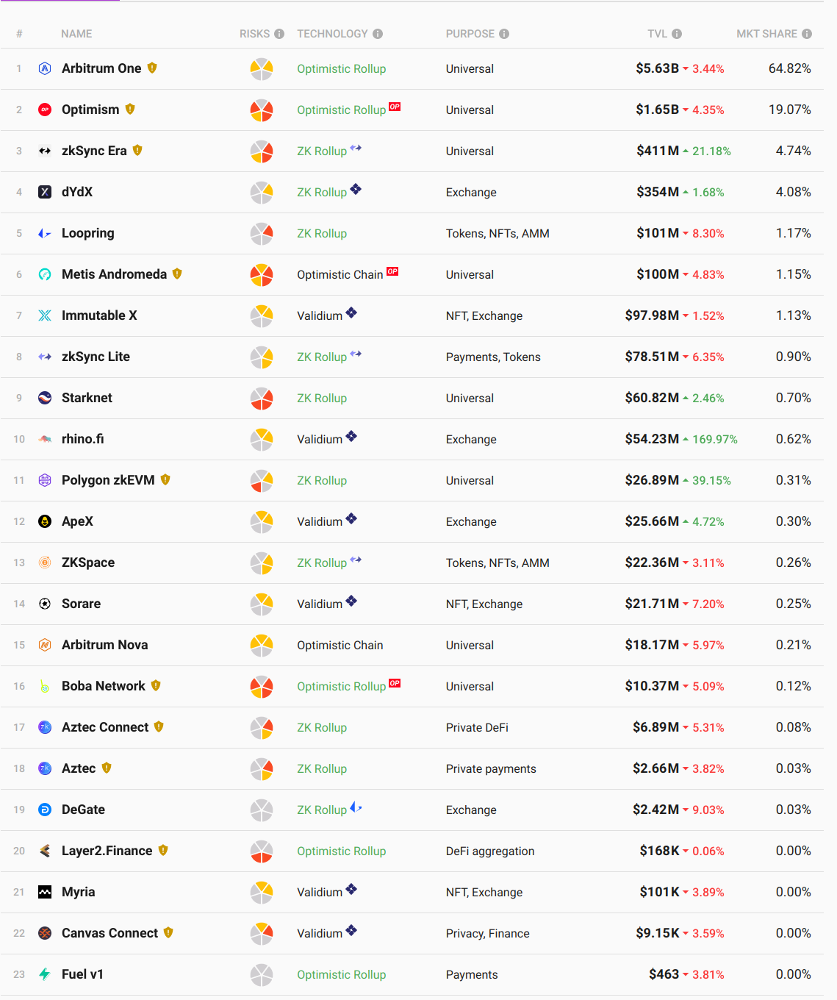

# Blockchain Scaling

## Modular and Heterogeneous

---

## Modularity: decoupling roles of an L1

- Sequencing: ordering operations as input to STF
  - Necessary, but always off-chain
- Ordering state transitions
  - Definition of a blockchain
  - In the case of L2s: commitments to state transitions (usually state roots) of other chains stored on L1 chain
- Executing state transitions
  - By definition L2s move execution off-chain
- Data Availability
  - Decoupling DA from ordering is often referred to as "modular blockchains" (Celestia)

---

## Taxonomy of L2s

Notes:

- <https://l2beat.com/scaling/summary>

---

## Taxonomy of L2s

- Sidechains
  - Inherit ordering from L1
  - Honest majority bridge (e.g. 5-of-8 multisig)

---

## Taxonomy of L2s

- Smart Contract Rollups
  - Inherit ordering and availability from L1
  - "Trust-minimized" bridge:
    - STF correctness with validity or fraud proofs
    - Inbox: option for transactions proposed through base layer to avoid sequencer/proposer censorship

---

## Taxonomy of L2s

- Validiums
  - Inherit ordering from L1
  - Trust-minimized bridge
  - Off-chain DA

Notes:

https://www.starknet.io/en/posts/developers/rollup-validium-volition-where-is-your-data-stored

---

## Taxonomy of L2s

- Sovereign Rollups
  - Inherit ordering and availability from L1 (even Bitcoin lol)
  - No trust-minimized bridge: correctness and censorship-resistance entirely off-chain

Notes:

- <https://celestia.org/learn/sovereign-rollups/an-introduction/>
- <https://rollkit.dev/blog/sovereign-rollups-on-bitcoin-with-rollkit>

---

## Settlement?

- Many in the Ethereum community define rollups by their bridges
  - Makes sense if the purpose is scaling ETH transactions
- Rollup nodes can fork the rollup and point at different bridge
  - L1 native tokens remain locked
  - L2 native tokens retain value
- Some modular consensus layers don't allow settlement: Polkadot and Celestia

Notes:

- <https://dba.mirror.xyz/LYUb_Y2huJhNUw_z8ltqui2d6KY8Fc3t_cnSE9rDL_o>

---

## Data Availability

---

## Data Availability

- _Not_ data storage. Only for a limited time.
- Two purposes:
  - Security: to verify STF correctness in optimistic systems (one week in ORUs, ~30s in Polkadot)
  - Liveness: for sequencers to download in order to build on top of. Must be a bit longer than STF correctness (~1 day in Polkadot, 30 days in danksharding)
- Cannot use fraud proofs (fisherman's dilemma)
- Simplest option is to post on L1 (Ethereum calldata)

---

## Data Availability Committee (DAC)

- Nodes each redundantly hold data
- Can be off-chain or using committees of L1 validators
- Post threshold signature to L1 attesting to availability
- Coordination can be expensive for rollup users: which shard has my data?

---

## Data Availability Sampling (DAS)

- Data is erasure encoded
- Light clients can verify availability by randomly sampling nodes
- e.g. Celestia (standalone DA layer), Danksharding (Ethereum roadmap), Polygon Avail (built on Substrate), ZKPorter, Eigenlayer

Notes:

- <https://arxiv.org/abs/1809.09044>
- <https://github.com/availproject/data-availability/blob/master/reference%20document/Data%20Availability%20-%20Reference%20Document.pdf>

---

## How to ensure coding was done correctly?

- SNARKs: too expensive
- Fraud proofs: requires 2D encoding to be efficient
- KZG commitments: also allows distributed reconstruction (chunking)

---

## 2D Reed Solomon

<pba-cols>
<pba-col>

</pba-col>
<pba-col>

- Computes Merkle roots for rows and columns
- Requires storing 2$\sqrt{n}$ state roots instead of one
- Allows O($\sqrt{n}$) fraud proofs of encoding

</pba-col>
</pba-cols>

---

## DA in Celestia

- Full nodes each redundantly hold erasure coded data off-chain
- Light clients sample 50% and participate in consensus
- Possible incentive problem: easier to scale data than execution so standalone DA layers can more easily be undercut

Notes:

- <https://docs.celestia.org/learn/how-celestia-works/data-availability-layer>

---

## DA in Danksharding

- 2D erasure coded using KZG polynomial commitments
  - Also provide proof of encoding
  - KZG requires trusted setup, ceremony done earlier this year
- Distributed construction: no nodes need build all rows and columns
- Distributed reconstruction:
  - Chunking and sharding similar to Polkadot
  - Higher threshold due to 2D encoding
- Allows light client consensus through sampling
- Data removed after 30 days

Notes:

- <https://notes.ethereum.org/@vbuterin/proto_danksharding_faq>
- <https://dankradfeist.de/ethereum/2020/06/16/kate-polynomial-commitments.html>
- <https://www.youtube.com/watch?v=4L30t_6JBAg>

---

## Rollup Security

---

## Validity Proofs for Scaling

- Recursive proofs for constant space blockchains (Mina)
- zk-rollups
  - Transactional (private or public): e.g. Aztec
  - Application-specific: e.g. STARKDex, Loopring
  - Smart contract: e.g. ZEXE (Aleo), zkEVM (Polygon, ZKSync, Scroll)

Notes:

- <https://medium.com/hackernoon/scaling-tezo-8de241dd91bd>
- <https://eprint.iacr.org/2020/352.pdf>
- <https://github.com/barryWhiteHat/roll_up>
- <https://zkhack.dev/whiteboard/>

---

## Optimistic Rollups: Fraud Proofs

“Don’t go to court to cash a check — just go if the check bounces.”

- Proposers post a state root to L1 with deposit
- Challengers can submit fraud proofs within period (typically 7 days)
  - If successful, rewarded portion of deposit
- Fraud proofs can be interactive (Arbitrum) or non-interactive (Optimism)

Notes:

- <https://www.usenix.org/system/files/conference/usenixsecurity18/sec18-kalodner.pdf>

---

## Rollup Training Wheels

- Stage 0
  - On-chain DA
  - Must have inbox
  - No STF correctness
- Stage 1
  - STF correctness (fraud or validity proof)
  - 6-of-8 multisig can override SC security
  - SC upgrades with either same multisig threshold or same delay as challenge period
- Stage 2
  - Security override only in case of bugs (discrepancy between two prover implementations)
  - Upgrades must have delay greater than 30 days

Notes:

- <https://ethereum-magicians.org/t/proposed-milestones-for-rollups-taking-off-training-wheels/11571>

---

## Rollup Sequencers

- Currently centralized (unlike Polkadot collators)
- Shared sequencing: e.g. Espresso, OP Superchain
- Proposer-builder separation

Notes:

- <https://docs.espressosys.com/sequencer/espresso-sequencer-architecture/readme>
- <https://stack.optimism.io/docs/understand/explainer/>
- <https://ethereum.org/nl/roadmap/pbs/>

---

## Optimistic Rollups: Permissionless?

- Spam state roots stall the chain
  - Arbitrum allows multiple to be posted (fork and prune) similar to Nakamoto consensus
- Spam challenges can delay confirmation
  - They typically must be executed separately and sequentially to prevent collusion
  - Arbitrum BOLD allows challenges to be executed together, bounds time at 7 days
- Spam necessitates permissioned proposer/verifier sets

Notes:

- <https://github.com/OffchainLabs/bold/blob/main/docs/research-specs/BOLDChallengeProtocol.pdf>
- <https://medium.com/offchainlabs/solutions-to-delay-attacks-on-rollups-434f9d05a07a>

---

## Optimistic Rollups: Verifier’s Dilemma

- Challenge reward isn't enough to incentivize verifying all state roots
  - Proposers don't face gambler's ruin on L1
  - Verifiers aren't rewarded for executing valid state transitions
- Attention challenges

Notes:

- <https://medium.com/offchainlabs/the-cheater-checking-problem-why-the-verifiers-dilemma-is-harder-than-you-think-9c7156505ca1>
- <https://medium.com/offchainlabs/cheater-checking-how-attention-challenges-solve-the-verifiers-dilemma-681a92d9948e>

---

## Rollup Security Assumptions

- ORUs are only as secure as their verifiers
  - Typically centralized or small permissioned set
  - Don't have similar incentives to L1 validation
  - Reputational damage argument
- Bridging is slow
  - LPs can provide exit liquidity for small transactions...
  - ...but then a small number of whales are checking all rollups

---

## How Does Polkadot Compare to Other Rollup Protocols?

- Approval checking is a decentralized shared watchtower network
- The value proposition of Polkadot is making consistent security assumptions across the modular stack
