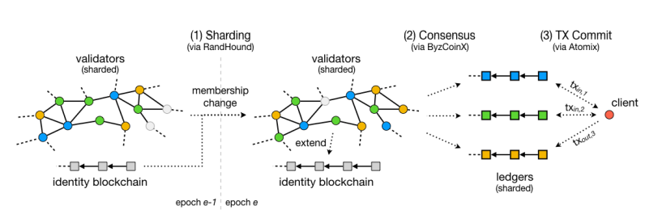

# Blockchain Scaling

## Monolithic and Homogeneous

---

## Lesson format

- Two approaches:
  - Historically, we move from protocols that are monolithic and homogeneous to ones that are modular and heterogeneous
  - Structurally, we can compare in terms of security assumptions and design trade-offs
- First half covers theory, homogeneous sharding, shared security
- Second half is rollups and beyond

---

## What do we mean by scaling?

- Increasing throughput: data executed through state transitions
- TPS:
  - Widely stated
  - Often gamed
    - Individually signed user transactions (no inherents)
    - Peak vs. sustained load
    - sTPS used in Polkadot (no db caching)
  - Not currently the driver of throughput needs (DeFi + NFT drops)

---

## Horizontal vs. Vertical Scaling

- Vertical scaling: adding more resources per machine
- Horizontal scaling: adding more machines

---

## Scalability Trilemma

- Why do we care about horizontal scaling for blockchains?
  - Lower barrier of entry -> more decentralization

---

## Vertical scaling approaches

- Adaptive responsiveness (HotStuff)
- Mempool optimization:
  - Pipelining: building future blocks before previous ones have been included
  - DAG-based (Narwhal)
  - To avoid MEV (for Polkadot: Sassafras)
- Parallel execution
  - UTXOs
  - Move Language: STM with linear types
  - For Polkadot: elastic scaling

Notes:

- <https://dahliamalkhi.files.wordpress.com/2018/03/hot-stuff-arxiv2018.pdf>
- <https://arxiv.org/pdf/2305.13556.pdf>
- <https://arxiv.org/pdf/2105.11827.pdf>
- <https://eprint.iacr.org/2023/031.pdf>
- <https://move-book.com/>

---

## Restaking

- Existing validator sets (Cosmos Hub, Ethereum with Eigenlayer) can opt-in to validating other protocols using same bond
- Capital scaling, not throughput scaling
- All validators must validate all protocols in order to have the same security

---

## Restaking

- Two arguments in favor (shared with Polkadot)
  - Shared economic security against market buying tokens to attack PoS
  - Reduces capital costs to validators, while increasing revenue sources -> security is much cheaper for client protocols
- Appchain thesis: flexible blockspace has advantages over generalized smart contract platforms (including for throughput)

---

## Sharding

---

## Sharding

- Term from traditional databases
- Definition: distributing over subsets of machines (committees)
- Execution vs. data sharding

Notes:

- <https://vitalik.ca/general/2021/04/07/sharding.html>

---

## Problem Space: Byzantine Thresholds

- Typically can't assume f holds within committees
  - Unless they're statistically representative
  - Alternatively we rely on 1-of-n assumptions

---

## Problem Space: Adaptive Corruption

- Easier to corrupt (DOS, bribe, etc.) small committees than entire validator set
- Must be sorted with strong on-chain randomness (e.g. VRFs not PoW hashes)
- Must be frequently rotated
- Weaker assumption: adaptive corruption isn't immediate

---

## Problem Space: Cross-shard Messaging

- Imbalanced message queues (different with heterogeneous vs. homogeneous shards)
- Creates a dependency when shards are rolled back -> easier when finality is tied together and fast
- Undirected graph approach (Casper/Chainweb):
  - Only allows messaging between adjacent shards
  - Adjacent shards are validated together

---

## Solutions: 1-of-n assumptions

- Polkadot (eager)
- Optimistic rollups (lazy)
- Nightshade (Near)
  - Optimistic homogeneous sharding
  - Availability protocol based on Polkadot's

Notes:

- <https://near.org/papers/nightshade>

---

## Solutions:

## Statistically Representative Committees

- Statistically representative committees (Omniledger, Polkadot with multiple relay chains)
- Very large validator sets (thousands)
- Large (hundreds) statistically representative committees
- Committees aren't rotated every block (weaker adaptive corruption assumption)
- 4f trust assumption in validator set -> 2f+1 in Committees
- Separate "beacon" chain for Sybil resistance

Notes:

- <https://eprint.iacr.org/2017/406.pdf>

---

## Solutions: Validity proofs (zk-rollups)

- Cryptographic proofs of execution
- Asymmetry between proving and verifying times
  - Proving is slow
  - Verifying is fast and constant time
- Proofs are succinct, can go on chain
- Typically ZK proofs, but not necessary

---

## State Channels, Plasma, and Beyond

---

## State Channels

- Part of state is locked, updated off-chain between closed set of participants, then unlocked and committed to chain
- Payment channels, e.g. Lightning network, are a special case
- Composition between channels sharing parties
- Can be application-specific or generalized (e.g. Counterfactual)

Notes:

- <https://vitalik.ca/general/2021/01/05/rollup.html>
- <https://www.jeffcoleman.ca/state-channels/>
- <https://lightning.network/lightning-network-paper.pdf>

---

## State Channels

- Greater liveness assumptions:
  - The chain will accept stale state transitions as final
  - Someone must be regularly online to submit later ones
  - This can be outsourced to watchtower networks
  - Typically challenge period after closing channel

---

## State Channels

- Cannot be used for all kinds of operations
  - Sending funds to new parties outside the channel
  - State transitions with no owner (e.g. DEX operations)
  - Account-based systems

---

## Plasma

- "Ether + Lightning"
- Like state channels, but hashes published to L1 at regular checkpoints
- "Map-reduce" blockchains, PoS on top of PoW Ethereum
- Downsides:
  - State transitions still need "owner"
  - Still not ideal for account-based systems
  - Mass exit problem in case of data unavailability

Notes:

- <https://plasma.io/plasma-deprecated.pdf>

---

## Flavors of Plasma

- Plasma MVP: UTXO-based
- Plasma Cash: NFT-based -> only prove ownership of own coins
- Polygon: Plasma and PoS bridges

Notes:

- <https://ethresear.ch/t/plasma-world-map-the-hitchhiker-s-guide-to-the-plasma/4333>
- <https://ethresear.ch/t/plasma-cash-plasma-with-much-less-per-user-data-checking/1298>
- <https://ethresear.ch/t/minimal-viable-plasma/426>

---

## The Life and Death of Plasma

<pba-cols>
<pba-col>

</pba-col>
<pba-col>

- 2017-2019: Plasma paper to the emergence of rollups
  - zk-rollups
  - Merged consensus
  - Generalized fraud proofs
- Plasma Group becomes Optimism

</pba-col>
</pba-cols>

Notes:

- <https://medium.com/dragonfly-research/the-life-and-death-of-plasma-b72c6a59c5ad>
- <https://ethresear.ch/t/minimal-viable-merged-consensus/5617>
