Security is a matter of balance, not too much, not less. Only **adequate security**.

---

Security is about your **residual risks**, not what you have prevented.

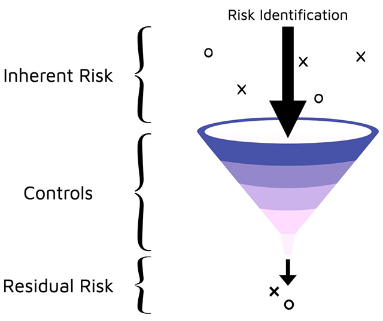

---

# Application Security

---

## Overview

<pba-flex center>

1. [Securing SDLC](#securing-sdlc)
1. [Appsec Design Principles](#appsec-design-principles)
1. [Components of AppSec](#components-of-appsec)
1. [Known Attack Surfaces and Vectors](#known-attack-surfaces-and-vectors)

</pba-flex>

---

# Securing SDLC

---

## The Big Picture of AppSec

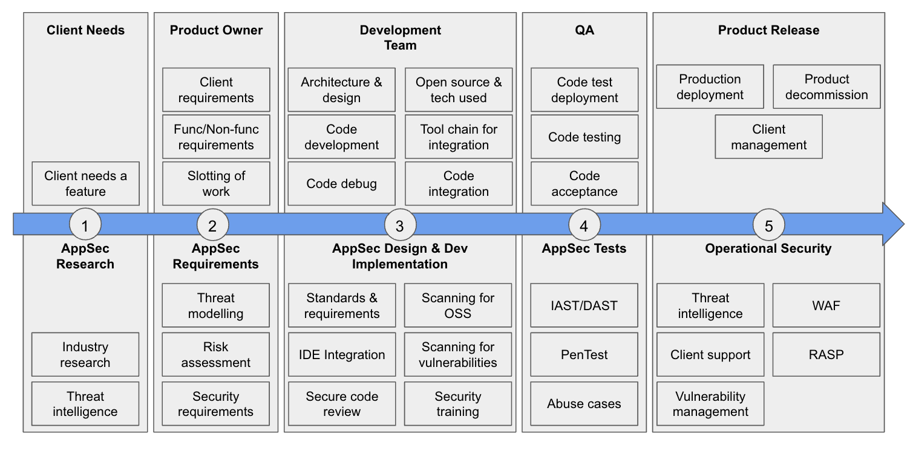

We will visit this picture multiple times.

---

## Security Enforced Through Controls

Controls must be:

<pba-flex center>

- Designed
- Developed
- Implemented
- Configured
- Operated
- Monitored
- Improved

</pba-flex>

---

## How do we decide on Controls?

The likelihood of a threat exploiting a vulnerability and thereby causing damage to an asset.

---

## ICYMI: The CIA Triad

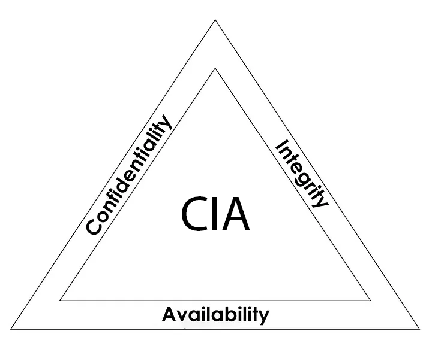

---

## Things to Ensure

- **Confidentiality:** Ensure that only authorized people can access their authorized entities.
- **Integrity:** Ensure that only authorized changes are made by authorized entities.
- **Availability:** Ensure that the data will always be available when it is required.

---

## The AAA + NR

- **Authentication:** Who you are
- **Authorization:** What you allowed to do
- **Accountability:** Who is responsible
- **Non-Repudiation:** Can't deny your involvement

---

# Appsec Design Principles

_In Brief_

---

## Good Enough Security

Don’t spend $10.000 on a safe to protect a $20 bill

---

## Least Privilege

Don't give your safe's key to everybody, give only what they need

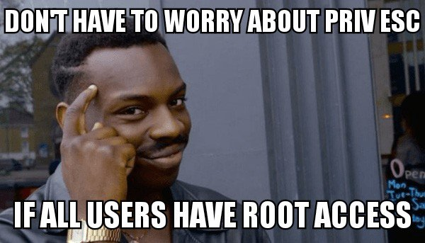

---

## Separation of Duties

Don't give the power of creating invoices, approving invoices and sending money to one person

---

## Defense in Depth

A castle has a moat, thick walls, restricted access points, high points for defense, multiple checkpoints inside etc.; what do you have?

---

## Fail-Safe

Any function that is not specifically authorized is denied by default

---

## Economy of Mechanism

Security is already a complex topic, don’t make it more complicated (KISS)

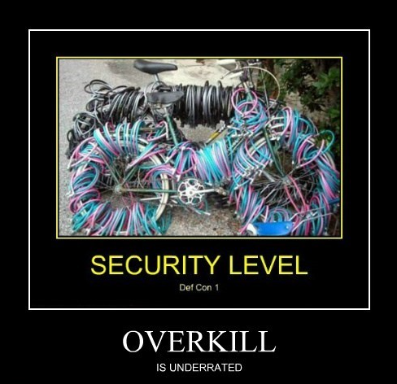

---

## Complete Mediation

Every critical operation must have verification at every time.

---

## Open Design

Don't even try: Security over obscurity

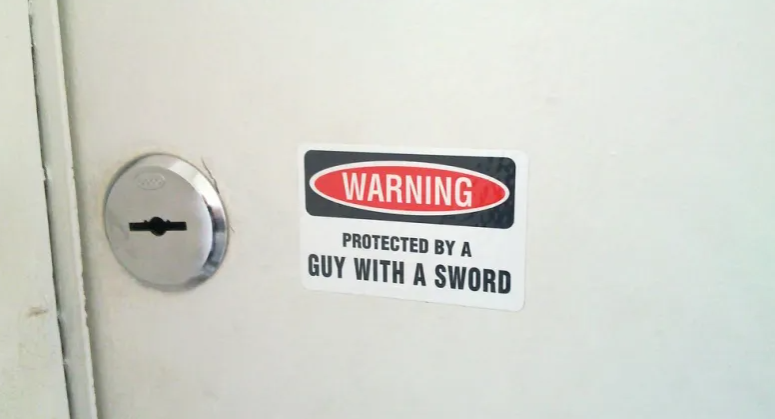

---

## Least Common Mechanism

Is like the rarest key that opens specific locks, not used often but still can cause significant damage when it does.

---

## Psychological Acceptability

There is no point if users cannot use your security controls seamlessly.

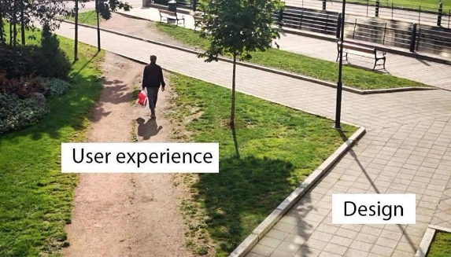

---

## Weakest Link

A chain is only as strong as its weakest link

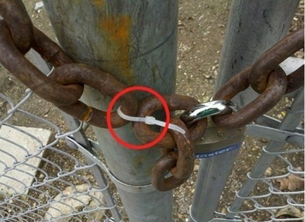

---

## Leverage Existing Components

Fewer components, fewer attack surface, but more;

---

## Single Point of Failure

If SPoF fails, means the entire system fails

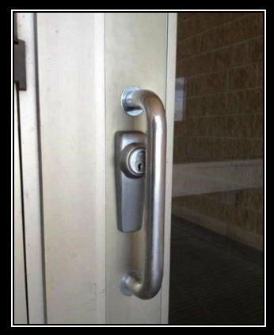

---

## Securing Software is Very Simple(!?)

---

<pba-flex center>

- **Identify Attack Surfaces**
  What potential surfaces do you have?
- **Identify Attack Vectors**
  What potential vectors do you have?
- **Allocate Security Controls**
  Risk based approach + Security Controls

</pba-flex>

---

## Security Controls are Easy(!?)

---

## Security controls can be;

- **Directive (Safeguard \[Proactive\] - means before the incident)** \* The policy is an example. This is what you are allowed to do, or you are not allowed to do

---

## Security controls can be;

- **Deterrent (Safeguard \[Proactive\] - means before the incident)**
  - Discourage somebody from doing something wrong. For ex. watching people with a security camera. Once they know they are under observation, they will hesitate.

---

### Deterrent

---

## Security controls can be;

- **Preventive (Safeguard \[Proactive\] - means before the incident)** \* Try to stop a person from doing something wrong. For ex. Password is a preventive control.

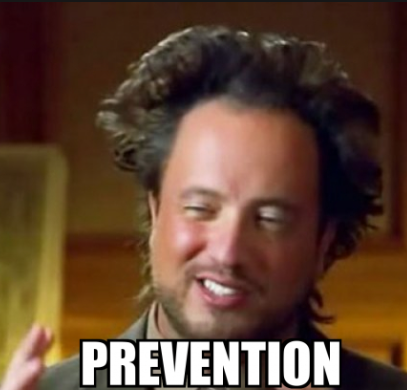

---

## Security controls can be;

- **Detective (Countermeasures \[Reactive\] - means in the incident moment or afterwards)** \* Trying to detect an incident. For ex. logs

---

## Security controls can be;

- **Corrective (Countermeasures \[Reactive\] - means afterwards)** \* Tries to reestablish control after an incident and correct the immediate problem.

---

## Security controls can be;

- **Restoration/Recovery (Countermeasures \[Reactive\] - means afterwards)** \* Try to rebuild and get back to normal.

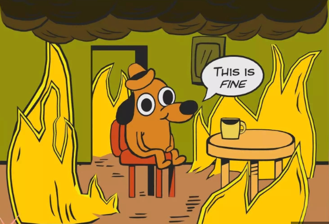

---

## Implementation is tough, sorry

<pba-flex center>

- Secure coding practices
- Separation of environments
- Proper testing
- Validation and discovery
- Mitigation
- Root cause analysis
- Documentation in every steps

</pba-flex>

---

# Components of AppSec

---

<pba-flex center>

- **Threat Modelling:** Manuel or Automated
- **Security Testing:** SAST, DAST, IAST, SCA, RASP
- **Vuln. Collection & Prioritization:** Jira, Asana

</pba-flex>

---

There will be blood (**risk**), you need to manage the blood. But how?

---

## Risk Management but how?

- **Risk Avoidance:** This approach mitigates risk by refraining from activities that could negatively impact the organization.

---

## Risk Management but how?

- **Risk Reduction:** This risk management method aims to limit the losses rather than completely eradicate them. It accepts the risk but works to contain potential losses and prevent their spread.

---

## Risk Management but how?

- **Risk Sharing:** In this case, the risk of potential loss is distributed among a group instead of being borne by an individual.

---

## Risk Management but how?

- **Transferring Risk:** This involves contractually shifting risk to a third party. For instance, insuring against property damage or injury transfers the associated risks from the property owner to the insurance company.

---

## Risk Management but how?

- **Risk Acceptance and Retention:** After applying risk sharing, risk transfer, and risk reduction measures, some risk inevitably remains, as it's virtually impossible to eliminate all risks. This remaining risk is known as residual risk.

---

## Vulnerability Disclosure Program vs Bug Bounty

---

## Shifting Left vs Right

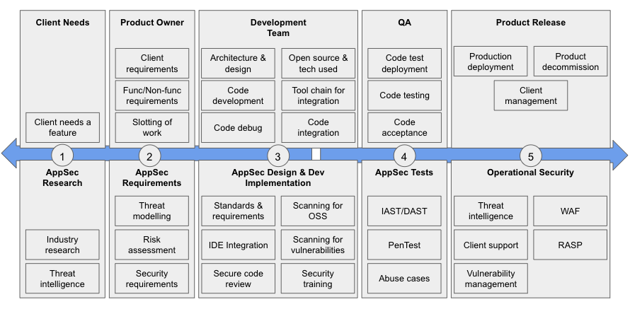

---

# Known Attack Surfaces and Vectors

---

## Known Rust Vulnerabilities

<pba-flex center>

1. Rust-specific issues
1. Unsafe code
1. Cryptographic errors

</pba-flex>

---

## Known Substrate Vulnerabilities

<pba-flex center>

1. Insufficient testing
1. Centralization vulnerabilities
1. Pallet-specific vulnerabilities

</pba-flex>

---

## Known ink! Vulnerabilities

<pba-flex center>

1. Incorrect access control
1. Denial-of-Service (DoS)
1. Timestamp dependence
1. Outdated version

</pba-flex>

---

**Summary:** Do the damn input validation, good to go!

---

**Question:** How would you defend a castle if there is no castle to defend?
