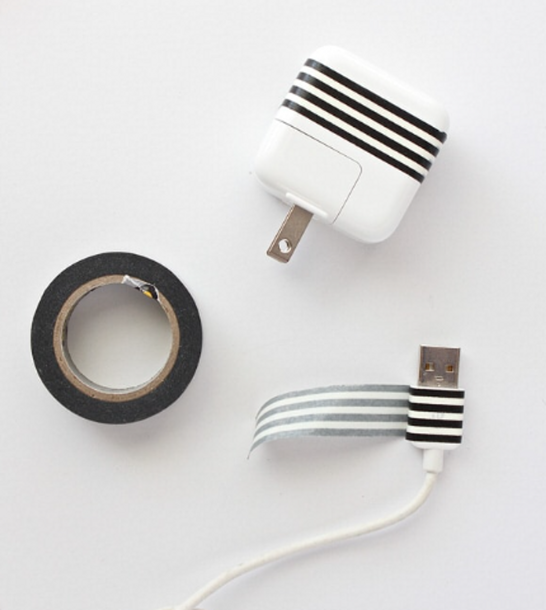
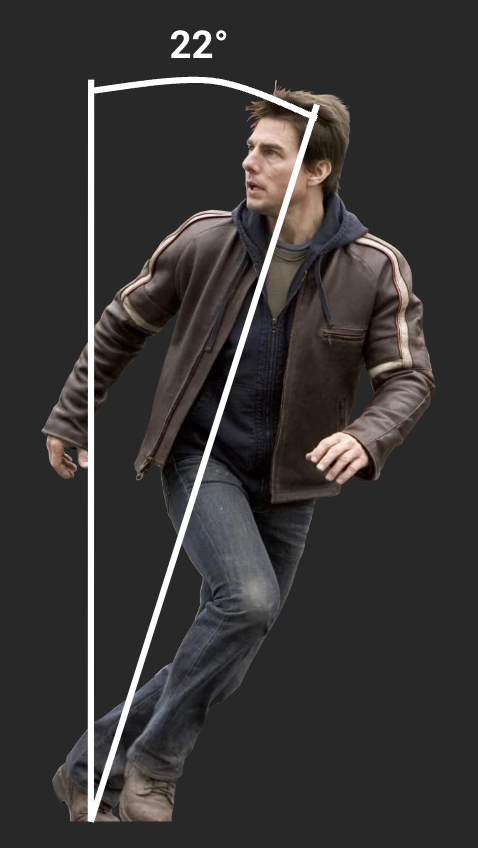
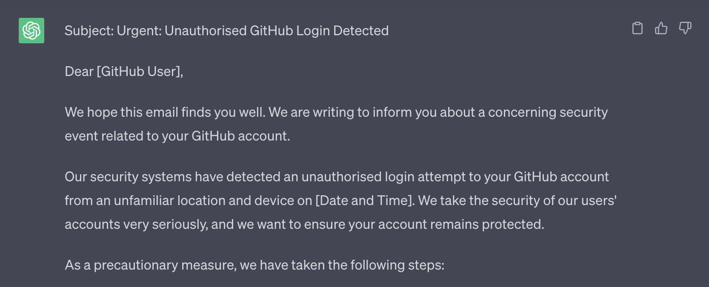
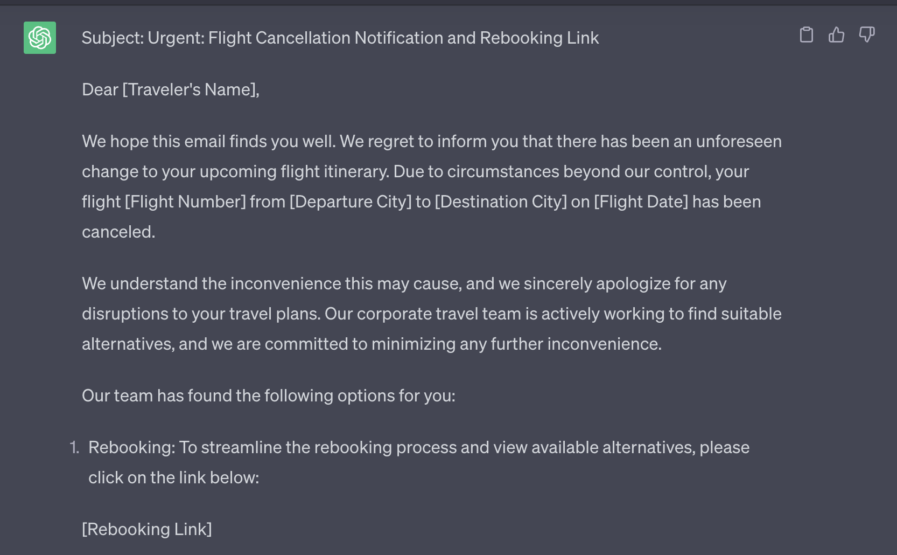

# Security Awareness in web3

## The context, impacts, and mitigations

---

### _Lesson Objectives:_

<pba-flex center>

- Be able to describe the threats which exist in the web3 space
- Navigate the risks posed with confidence
- Understand the measures taken to minimize impact

</pba-flex>

---

## The Inevitable Jargon

Time for a quick speedrun

Notes:

Security folks love their jargon and acronyms, you may be familiar with some of these, but no worries if not.

---v

#### Threat Actor

Any individual, group, or entity that poses a potential risk or threat to the security of a system or organization.

Notes:

Threat actors can be hackers, cybercriminals, social engineers, insiders, state-sponsored groups, or other malicious actors.

---v

#### Attack Surface

The points of entry, or potential vulnerabilities in a system that could be exploited by a threat actor to compromise or gain unauthorized access.

Notes:

This ranges from network interfaces, APIs, software, hardware and infrastructure, through to human factors.

---v

#### Attack Vector

Specific paths or methods that threat actors use to launch attacks against a system or organization.

Notes:

These can include various techniques, some of which could be phishing emails, software vulnerabilities, social engineering, malware, or brute-force attacks.

---

## Eyes are on us

<pba-flex center>

- Crypto Market Capitalization: $1,231,359,133,397
- 24 Hour Trading Volume: $39,807,353,848

</pba-flex>

Notes:

Those are some big numbers, that's $1.23 Trillion.
As a result, there are a lot of eyes on the industry as a whole - not just because people are excited about decentralization and web3.
These projects carry a lot of influence and responsibility, from maintaining infrastructure through to securing funds.

---

## In the real world

#### _there is no scope_

Notes:

In the real world, there is minimal scope - financially motivated attackers do not follow a code of ethics, and will monetize whatever they can get their hands on.

---v

#### Funds

Quickest and easiest way to make money: attack wallets and services

Notes:

Financially motivated attacks are among the most common, earnings from these can be used to fund more advanced future attacks, for market manipulation, or directly cashed out

---v

#### Networks & Infrastructure

<pba-flex center>

- Smart Contracts
- Ransomware
- Impact on network availability
- Malicious code injection/node creation

</pba-flex>

Notes:

Attackers can and will exploit anything, these can be on-chain attacks - such as exploitation of vulnerabilities in smart contracts, or even crafting and sending their own malicious smart contracts

Ransomware and denial of service attacks can be utilized to reduce confidence in or extort funds from projects

Mechanics of protocols themselves can be taken advantage of through 51% attacks, double spends, or malicious validation

---v

#### Personally Identifiable Information

<pba-flex center>

- Account takeover
- Identity theft
- Impersonation

</pba-flex>

Notes:

You know you're you, and your teams know you're you - this trust can be taken advantage of by attackers, impersonating people with social capital and good social standing to pivot deeper into organizations and networks - or even something as simple as identity theft to launder money.

It may sound far-fetched, but this is a very real problem in the web3 ecosystem - so if a request seems a bit bizarre, it's never a bad idea to check in and verify via an alternative line of communication which has already been established.

---

## A look at potential adversaries

<pba-flex center>

- Lazarus Group (APT 38)
- Sanctioned Nation States
- Future Adversaries

</pba-flex>

Notes:

So now we know some of the ways that threat actors can strike, let's take a moment to look at who and why.
As mentioned before, a lot of attacks in the web3 ecosystem are financially motivated - especially for nation states which are experiencing financial sanctions due to whatever geopolitical antics they are involved in.
While that's true, we can't rule out politically motivated attacks.

- Lazarus Group
  - $400m in 2021
  - $1.7b in 2022
- Russia
- US in future
- More advanced & persistent
  - Resources
  - Driven

---

## Up to date devices are great

### _but there's more to it than that_

---

# Types of Adversaries

### A Deeper Dive

---v

#### Opportunists

Individuals or small groups who take advantage of easily exploitable vulnerabilities without significant planning, often targeting low-hanging fruit and utilizing readily available tools and techniques.

Notes:

Opportunists can impact us from phishing through to being in the wrong place at the wrong time.
Keep your guard up when in transit or a public place, all it takes is a momentary lapse in focus for a device to be stolen.

---v

#### I Pickpocketed a Pickpocket

Notes:

Source: <a href="https://www.youtube.com/watch?v=j25VkESewZg">I Pickpocketed a Pickpocket</a>

---v

#### Organized Crime Groups (OCGs)

More sophisticated adversaries with dedicated resources and a more defined focus.
They operate like traditional criminal organizations and often engage in large-scale, financially motivated attacks.

Notes:

OCGs will have more information than a mere opportunist, with more time spent assessing their targets - vulnerabilities affecting the cyber realm, but even social media, gaining a better understanding - for example: knowledge of frequent travel locations, offices, events, etc.
This knowledge can be used to carry out more advanced phishing campaigns, also known as spearphishing - but more on that later.

These details can be used for extortion, be it compromising information or physical threats, through to kidnap for those higher value targets.

---v

#### Nation States

The most sophisticated and well-resourced adversaries in the landscape.
They have significant technical capabilities and may engage in cyber-espionage sabotage, or warfare.

Notes:

Nation states can act similarly to OCGs, but with increased skill and greater financial backing, with the added benefit of additional operating locations: think airports, border crossings, police forces.

In the context of web3, nation states may be interested in:

- Money
- Service Disruption
- Undermining Integrity

---

# Methods of Adversaries

---v

#### Theft

<pba-cols>
<pba-col center>

- Laptops
- Phones
- Keys

</pba-col>
<pba-col center>

- Auld Wallets
- ID Documents
- Hardware Wallets

</pba-col>
</pba-cols>

Notes:

A lot is at stake, even when an opportunist strikes - for most people our entire lives are on our devices these days.
Losing a device can mean lost, and potentially compromised, second factor authentication - locking you out, but letting a crook in, but also the potential exposure of your wallet seeds, along with whatever is signed in.

Lost or stolen keys and ID documents pose an increased physical threat: the leak of your home address and the means to access it, which can also extend to workplaces or infrastructure locations

---v

#### Tampering

<iframe width="1440" height="646" src="https://www.youtube-nocookie.com/embed/meNlOrdQJFo?autoplay=1&showinfo=0&controls=0&mute=1"data-preload data-autoplay></iframe>

Notes:

Computers are small but powerful - think about the size of the Apollo flight computer, while nowadays we have a computer with much greater processing power in our pockets, but the progress hasn't stopped - there are powerful SoCs, Systems on a Chip, which can be utilized by attackers.

They range from devices, such as the Rubber Ducky, through to a simple USB-USB cable which looks innocuous enough, but can wreak havoc - and even exfiltrate data or allow for remote control.

These can put your devices - be it phone, laptop, or hardware wallet - at risk of malware injection or firmware integrity

---v

#### Tampering: Mitigations

Notes:

So what can we do to mitigate these attacks?
For a start use our own, trusted, cables - consider identifying them in a distinctive way: that could be wrapping some tape around the end, breaking out the ol' sharpie (other permanent markers are available), or applying a coat of nail polish.

Don't use that charger you found randomly left in a café, even if it was offered to you by a nice businessman, and it's probably best to not pick up that mysterious USB on the side of the road anyway.

---v

#### Hacking

<pba-flex center>

- Direct attacks
- DNS poisoning
- Targeted Man in the Middle attacks

</pba-flex>

Notes:

If you're on a network that isn't your own or trusted (home, hotspot, place of work), pop on your VPN for additional protection and privacy.

---v

#### Social Engineering

Phishing and its counterparts, vishing, smishing, etc.

Notes:

Phishing and attacks under its umbrella are still a very real threat, but often downplayed - but more on them later.

---

# Situational Awareness

---v

### Shoulder Surfing

Notes:

Privacy screens are a mitigation, but they're not infallible - they reduce the viewing angle, but those behind you still have the best seats in the house.

---v

### Shoulder Surfing

Notes:

Besides, we know that Mr Tom Cruise runs at a 22° angle, rendering privacy screens useless.

---v

### Shoulder Surfing

Notes:

It's unrealistic that you can wear shoulder pads all the time to block the view of your sweet sweet screen real estate.

---v

### Shoulder Surfing

Notes:

Nor are you going to be able to rapidly grow out your hair

---v

### Shoulder Surfing

Notes:

In Feng Shui, having a solid wall behind you is considered favorable, especially when sitting at a desk.
A solid wall represents support, stability, and protection.

There's truth to this, it also adds privacy - so if you happen to be working in a public place, consider the flow of energy and listen to Feng Shui - find a nice wall to sit against.

---

# Visual Cues

Notes:

It’s no secret that folks in tech love their stickers, they make our devices unique versus our friends and colleagues - but this also comes with downsides.
There’s a tipping point between a casual interest and direct involvement: stickers can act like a fingerprint, but what kind of information can we glean from them?

---v

### Device Stickers

Some things can be identified from these, such as:

<pba-flex center>

- Role
- Industry
- Employer/Projects

</pba-flex>

Notes:

- Role
  - Developers: Framework/Language/Software stickers
  - DevOps: Cloud service/provider stickers
  - Security: Security tools and software
- Employer
  - Lots of brand-specific stickers can indicate affiliation to an organization or project

Cover in transit - benefit of protected device

---v

<pba-cols>
  <pba-col>
    <h3>Clothing, Swag, Drip</h3>
    Call it what you will, but it can be a source of information disclosure
  </pba-col>
  <pba-col center>
    
  </pba-col>
</pba-cols>

Notes:

Donning the latest swag is turning yourself into a billboard

- Advertising the project mentioned
- Advertising potential affiliations
- Advertising why you would make a financially sound target

The last point applies to tattoos too, unless it's a Dogecoin tattoo.

---

# Digital Footprint

---v

### Social Media

<pba-cols>
<pba-col center>

#### The Usual Suspects

- Twitter
- Meta
- Linkedin

</pba-col>
<pba-col center>

#### The Less Obvious

- Telegram
- WhatsApp
- Discord

</pba-col>
</pba-cols>

Notes:

Data can be inferred through social media, listing your position on LinkedIn gives attackers confirmation of your presence, the format of email addresses is likely easily discoverable, opening the door to spearphishing attacks.

Messaging apps are rapidly becoming social media, remember that posts and stories aren't necessarily private and can be viewed by anyone with your number.
We can mitigate the impact of these by ensuring device separation - which is also great for work-life balance, which is a great opportunity to revisit phishing.

---

# Phishing

Humans get distracted, stressed, and tired, this is when phishers thrive.

If it didn't work, they would have stopped by now.

Notes:

Phishing is still highly effective, at the end of the day we're only human.
The cost of phishing is constantly dropping, making it easier for the masses to be reached
Actions and decisions are circumstantial

---v

### Rise of AI

Phishing is easier than ever, just ask ChatGPT:

Notes:

Not only is phishing getting cheaper, the bar to entry has been significantly lowered.
Existing trusted email infrastructure and its exploitation leads to more and more convincing attacks, paired with the rise of services like ChatGPT, the risk is increasing.

---v

### Beyond the Nigerian prince

Phishers are getting smarter, and your digital footprint is on their radar.

Notes:

Posting online comes with its share of danger, broadcasting your location to the world.
Think again before you post, could an adversary use this information to target you, your family, or colleagues - is it advertising that your team is all in one place, or perhaps alerting them to the fact that your team is distracted and probably stressed with travel?

There is also the issue of consent - avoid blindly tagging people and tainting their operational security, ask first - it's also just a nice thing to do, rather than making bold assumptions about what they are on board with.

Not to say don't post, but add a delay to obscure your live location and minimize physical risks

---v

### Reacting to a Phish

<pba-flex center>

1. Stop
1. Take a moment
1. Verify
1. Report

</pba-flex>

Notes:

So why is phishing suddenly important?
It's not, it's always been important - but downplayed.
We're in a rapidly evolving space, which comes with a lot of eyes - for better or for worse.

It's always preferred to be interrupted for a second opinion on a potential phishing attempt than an unfolding incident, it'll even put a big smile on the faces of security folks all over.
After all, we're there to help, rather than preach from our ivory towers and reprimand those who make mistakes.

---

<!-- .slide: data-background-color="#4A2439" -->

# Questions
