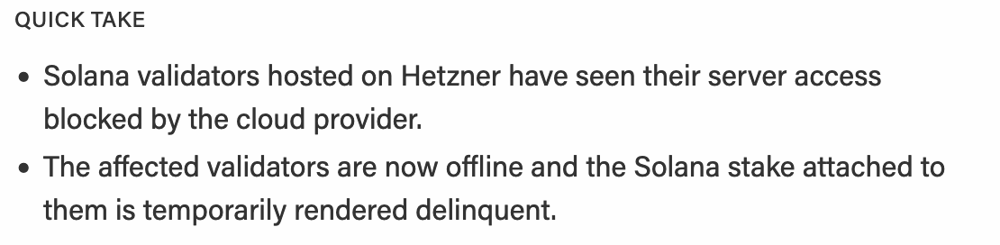
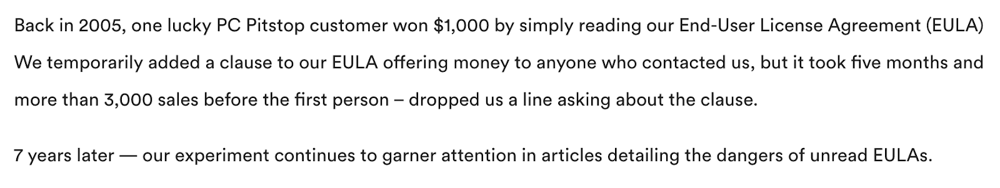
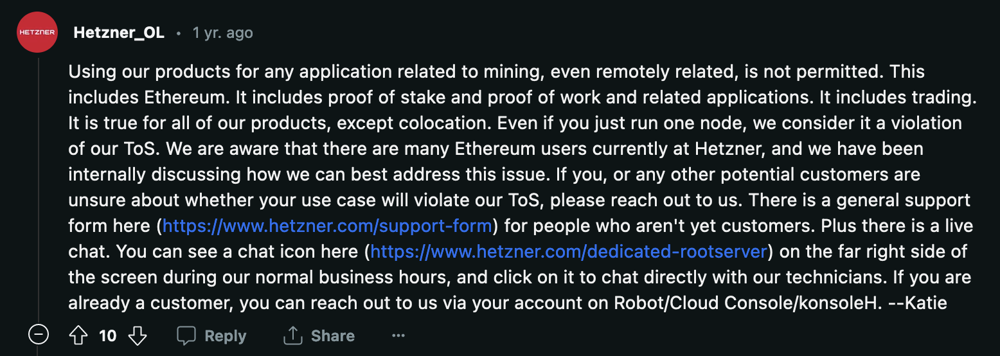
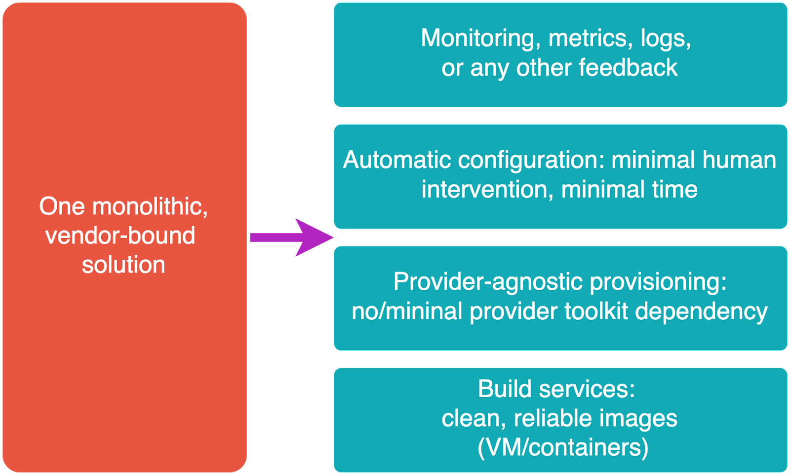
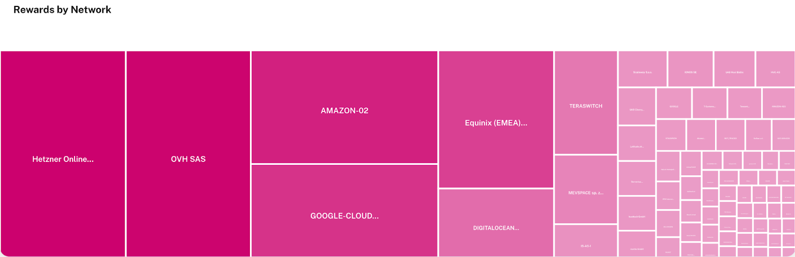
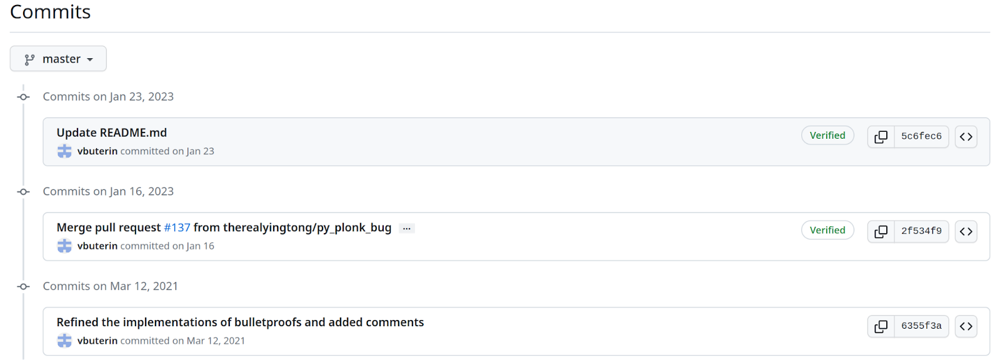
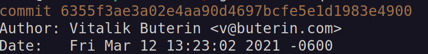
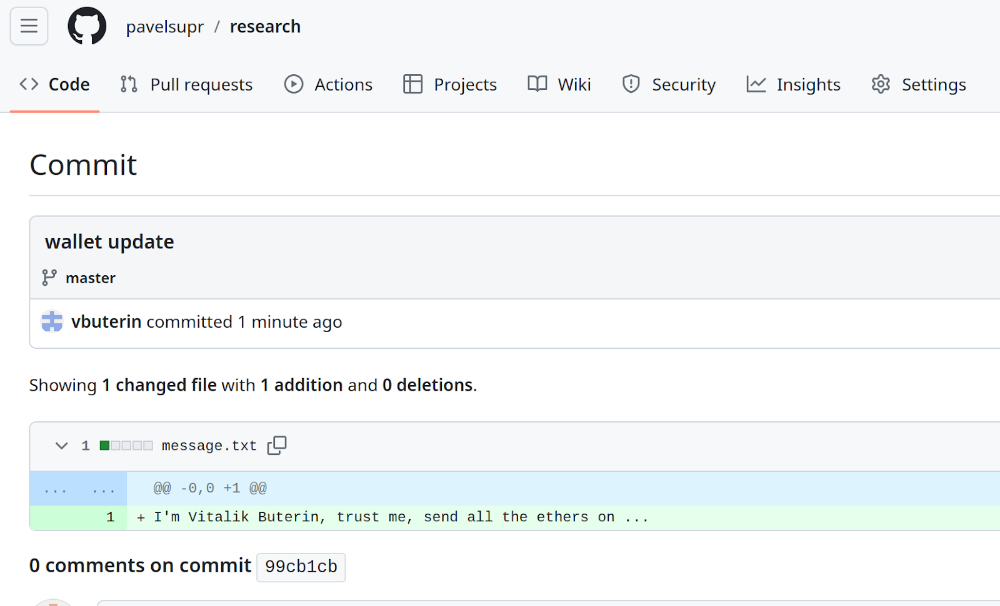

# Web3 Infrastructure Security

Notes:

I'm going to speak about how securely deploy your web3 infrastructure.
But, instead of talking about very common information topics like best practices, strong authentication and others well discussed like firewalling, I’m going to talk about some often overlooked problems that significantly affects web3 infrastructure protection and about how they should be handled.

But if you want to ask me about firewalling, welcome to the Q&A section!

---

## Overview

<pba-flex left>

- Concentration and deplatforming risks
  - Digging into the Solana case (end of 2022)
  - Selection of providers
  - Mitigation of the risks
- Supply chain attacks
  - Where it can happen and how to prevent
- Two uncommon attacks against infrastructure
- Tips about key and password management

</pba-flex>

---

## Deplatforming risk

<pba-flex center>

- Deplatforming happens when some resource is removed from service by a provider.
- Web3 is supposed to be decentralized, but it may rely on the centralized infrastructure behind it, with some legal and technical rules.
  Therefore, this risk should not be overlooked.

</pba-flex>

Notes:

The first overlooked risk is the deplatforming risk.
Deplatforming is, briefly speaking, when someone or something, suddenly goes offline without a wish to do it.
It can happen on any layer of the technological stack, with everyone/everything, with proper legal ground or not.
Today web3 and cryptoassets are receiving a lot of attention from different regulators.
If some platform decides that your web3 stuff is unwanted, they can just suspend the accounts and delete the data.
From this perspective, web3 infrastructure, which is running on top of centralized infrastructure, is still unfortunately partly centralized.

---

### Solana case (Nov. 22)



[Web source: 1000 solana validators go offline by TheBlock](https://www.theblock.co/post/182283/1000-solana-validators-go-offline-as-hetzner-blocks-server-access)

Notes:

At the beginning of November 2022, the nodes of Solana in Hetzner, were removed at one moment.
A big pain for the node operators, a major reputational risk for the network.
Solana tokens became cheaper the next few days (to be honest, I can’t say that there is a straight connection between the event and the token price, but anyway).

---

### Solana case. Going deeper

_What’s Hetzner in a nutshell? Why did many people go to it?_

- A German Hosting Provider
- Gives people extremely cheap bare metal servers
- Price per CPU/RAM is very low
- True power of raw non-virtualized hardware
- Control over the CPU/RAM for people who want to control the environment.

Notes:

Sounds good, isn’t it? But, Germany has high electricity prices, human work is expensive, and the hosting is still so cheap, why?

---

### Solana case. Going deeper

_Why is Hetzner so cheap?_

- Mostly consumer-level hardware, not “robust enterprise servers” in terms of Service Level Agreement.
  It can be seen if you see the available configurations.
- _Covert expectations of low resource load from the customers_

Notes:

The first is almost clear.
Now lets explain what the second means.

---

### ToS/ToU/EULA that people don’t read

_A small cool story first_



[Web source: PCMatic](https://www.pcmatic.com/blog/it-pays-to-read-license-agreements-7-years-later/)

Notes:

There is a small joke, which is actually not a joke, about the fact that people just skip over the reading of license agreements.
Some company offered a prize for reading ToS till the end, by placing an easter egg in the text of ToS.

---

### Hetzner strikes back



[Web source: Reddit](https://www.reddit.com/r/hetzner/comments/wucxs4/comment/ilfoj8u/)

Notes:

Literally Hetzner said: we don’t care about your consensus (PoW vs PoS), we just call everything “mining”, please remove your software or we do it by ourselves.

---

### But… Why and how?

Q: **Why** do providers act against blockchain, and **how** do they detect it?

- A1: Business model: _covert expectations of low resource load from the customers:_
  - Nominal link speed is probably not fully guaranteed, but shared.
  - Crypto databases tear the ordinary disks.
    They die 10x faster.
  - The nodes are attacked 24x7.
    Headache for network engineers.
  - Server consumes not “average” power, but more close to the limit.
- A2: More direct reasons: regulations/sanctions/other paper blockers.

Notes:

In short, the hardware resources are shared where possible, the hardware is low-level, and the business model is similar to insurance companies or banks from a far perspective.
If all of the users demand their resources at one time, the company just doesn’t have them available.

---

### How do ISPs detect blockchain?

- Q: And why a Blockchain node wasn't banned immediately?
- A: It has not been detected on time, probably.
  Or the size of a particular setup is not worth the deplatforming efforts.

Let’s talk about the detection.

---

### How do ISPs detect blockchain?

Joke: how does a provider see your node:


Notes:

It is a joke of course, but how the provider engineer can see your web3 server.

---

### How do ISPs detect blockchain?

- Known “bad” DNS names resolution and contact with specific IP addresses
- Memory (RAM) Scanning for virtual machines:
- Example, Google Cloud case for [their VMs](https://cloud.google.com/security-command-center/cryptomining-protection-program#section-4).

Notes:

In short, it is very hard to hide the node.
Tricks like VPN, obfuscation give a lot of performance penalty.

---

### Okay, and how to mitigate that?

Moving to platform independency:

- Decomposition of the solution layers from the beginning is the best friend (opposite to the classical monolithic configuration, which is target-dependent)
- Modern DevOps and CI/CD
- Partial “landing” of the infrastructure from the clouds
- Client-side only websites (no backend)

Notes:

It is impossible to mitigate this risk in full.

---

## Deplatforming risk mitigation

Idea #1. Decomposition of the solution



Notes:

Instead of having all-in-one solution (example: manually go to the server and compile/configure from scratch, or use a specific toolkit for a single provider like AWS), we can have the following independent components, even for a couple of servers.

- Build services - produce clean, ready to use, tested images (containers, virtual machines). Key target: readiness (achievable by regular testing).
- Provider-agnostic provisioning of the infrastructure - makes a “landscape” to fill it with the services. Key target: minimal dependencies from a particular vendor.
- Automatic server configuration and delivery of the services: Key target: no manual intervention, clear feedback about actions.
- Monitoring. It gives the health metrics/feedback in the long run.

It is not a full set of blocks, but the major parts.

---

### Modern DevOps and CI/CD

Idea #2. _One of the solutions_ - IaC:

- Infrastructure as a code (IaC) approach. Clear, declarative, history trackable configuration storage
- IaC can utilize regular CI/CD processes to control provision and configuration for servers.
- Separation of provision (example - Terraform) and configuration (example - Ansible) makes the solution close to be provider-agnostic.
- Only really unique data is backup-ed or synchronized - quick move & restore procedures.

---

### Partial “landing” of the external dependencies

Idea #3. Working with dependencies.

- Instead of having just one ecosystem, be adaptive to another one. Example: Github <-> Gitlab (caveat: up to 100% of additional work).
- Use configuration bastion approach (example: your own Gitlab server).
- Have multiple service image registries and other storages
- Fork 3rd party local source code to your repos (to prevent abandoning of dependencies and supply chain attacks caused by abandoning).
- Use centralized facilities? Typical: a single RPC server? Run your own or use light clients.

---

### Deplatforming risk mitigation

**Final objective**: to find a proper balance between duplication of efforts and the time to recover if a resource disappears.

---

### Concentration risk

One picture that says everything (on Polkadot - the whole ecosystem):



[Web Source: Polkawatch](https://polkadot.polkawatch.app/network/)

---

### Concentration risk

- It is a consequence of decentralization. People are free to do this.
- About 17% of DOT rewards are coming to nodes in Hetzner (July 2023).
- Four of the major providers take 50% of the rewards (July 2023).

Notes:

This is a concentration risk in one picture. Since the web3 world is decentralized, there is no proper handle to prevent this. However, node operators should realize that their individual actions affect the whole ecosystem.

---

## Caveats of the supply chain management

- Let’s assume that we have deplatforming-resistance infrastructure and some well known preventions in place. Your password is not your name plus your birthday.

What’s next?

- Now let’s talk about the modern issues of supply chain management in the infrastructure.
- Supply chain attack: when someone compromises only a small component of a product and gets access to the whole product.
- The same can be applied to any part on a random entity (orgs, dev libs, people relations)

---

## Supply chain protection basics

Like dependencies in the regular code, all of the infrastructure components can be compromised by supply chain attacks as well. The most risky components are ... (spoiler - almost all).

---

### Where to expect the attack

- Integrations that can’t be restricted by scope to a specific need. Example: [GitHub OAuth token leak'22](https://github.blog/2022-04-15-security-alert-stolen-oauth-user-tokens/)
- Yet another small component that solves once again a well known problem. Usage of it increases the attack surface.
- Components that don’t have proper support. Can be abandoned and squatted one day.
- Suddenly, most popular products, but for another reason: be careful with the names and scopes to avoid [typosquatters](https://en.wikipedia.org/wiki/Typosquatting).

---

### Basic prevention of the supply chain attacks

- Prevention of replacing the content of dependency (80% result by 20% of efforts):
  - Scoping dependencies. For some ecosystems (ex. - Docker, NPM) - the same thing can be looked up in different locations. Specific lookup locations (repos) are highly recommended.
  - Pinning dependency to a specific commit (e.g. lib@aaabbbccc…). Pinning to a tag (lib@tagname) is not efficient. Commit is a hash, tag is human-defined.
  - Forking and re-targeting the dependency to the new controllable fork.

---

### Basic prevention of the supply chain attacks

- Increasing the dependency quality (20% of result by 80% efforts):
  - For advanced usage: tracking the vulnerabilities related to the component (update or downgrade the version)
  - self reviewing the code of the component
  - extracting the direct functionality from the dependency.

---

## Uncommon infrastructure attacks

Some examples.

Simple, but very efficient.

---

### Abusing of CI/CD misconfigurations

- Abusing CI/CD by triggering the pipeline with modified code, which makes malicious actions - steal your repo secrets or break your CI/CD.
- Mitigation: understand the triggering event, restrict who can trigger the CI and set the scopes for the CI/CD:
  - Runners
  - Secrets
  - Other components

---

### Social engineering: forging the GIT commits

**We can commit on behalf of someone else!** But there is a small detail…

---

### Git doesn’t have authentication

How does it work:

GIT itself is not responsible for authentication. Everyone can set random username and email in the commit metadata, and to push the branch or create a pull request.

It is the nature of git. A great field for social engineering!

---

### Exploiting git

Get a target repo, find a "victim" - a popular person,<br />uses mixed verified and unverified commits:



- <https://github.com/ethereum/research/commits?author=vbuterin>
- <https://github.com/jayphelps/git-blame-someone-else>

---

### Exploiting git

Clone the repo and find the victim’s git metadata

`git show --quiet 6355f3a`



---

### Exploiting git

Change the local git settings.

```sh
git config commit.gpgSign false
git config user.email v@buterin.com
git config user.name "Vitalik Buterin"
```

---

### Exploiting git

Make a definitely trustworthy commit:

```sh
echo "I'm Vitalik Buterin, trust me, send all the ethers on ..." > message.txt
git add message.txt
git commit -a -m "wallet update"
git push origin master
```

**What stops the app-ocalypse**: an attacker needs write permissions to push, which is defined by credentials from the code storage.

But the attacker still can play around Pull Requests, mix forged/non-forged commits, etc.

---

### Exploiting git

See the result (a fork was created to have write access):

<https://github.com/pavelsupr/research/commit/99cb1cbe3b729cfada10aa53d531b5f2bcb5aa7f>



---

### Mitigation from commit forgery

- Commit signing + Vigilant mode, protection of the branches, reviewing the pull request about what’s going on - and reviewing them one more time!

- Dismiss a pull request when new commits arrived
- Caveat: impossible to properly revoke the signing key - all the previous commits will be considered as “unverified” in the Vigilant mode.

- Solution: use hardware keys, which is very hard to compromise + destroy all the software keys, but don’t remove the public key fingerprint from the repo storage.

---

## Secure key management on the nodes

Polkadot-specific.

---

### Basics

- A separated browser profile or/and OS account for web3 operations
- Lock this profile with a password to prevent stealing the data
- No 3rd-party operations and browser extensions on the “secured” profile
  - Or, replacing all the above: A separated device as an ideal paranoid mode option
- All significant accounts only on a cold wallet + paper seed backup (ref: Banana Split)
- Client disk encryption and other device health checks

---

### Node running

- Node accounts: proper combination of Stash and Staking proxy (prev. Controller) accounts
  - Stash - use cold wallet
  - Controller != Stash
- Remember that a node process has to store some keys on the disk (session keys). Keep the node isolated
- Apply all the well known measures: firewalling, strong passwords, 2FA, disk encryption, etc.
- Containers are NOT protecting your node from the OS/kernel

---

### Password management for the infrastructure

- Use keys instead of passwords where possible
- SSH and GPG keys on hardware keys (one primary key and backup)
- 2FA everywhere, hardware based when possible
- Use password manager (preferable with API), don't re-use passwords
- NEVER place any secrets in the code or files, even for testing, use environment variables instead
- Advanced: connect your code with the API of your password manager
- (life hack only for Bash users) one space before `export VAR=SECRET_VALUE` command will not place this command in the Bash history

---

<!-- .slide: data-background-color="#4A2439" -->

# Questions
