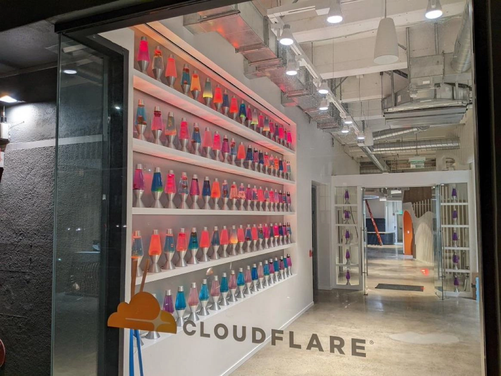
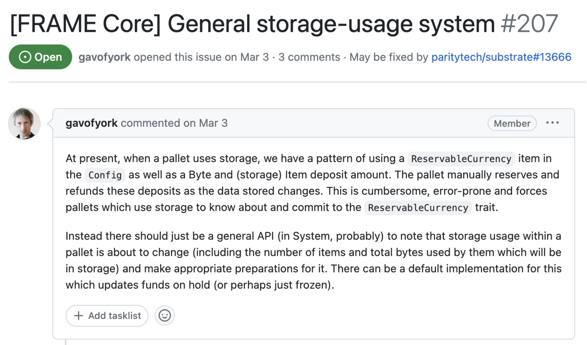
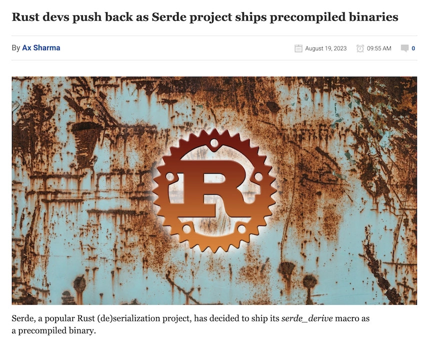
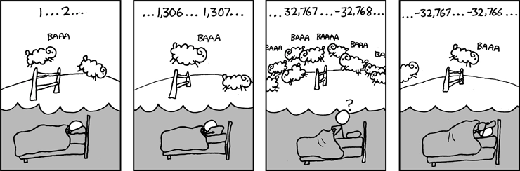
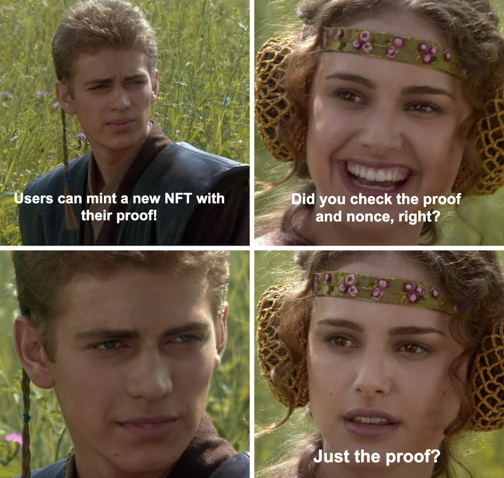
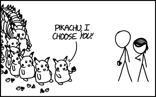
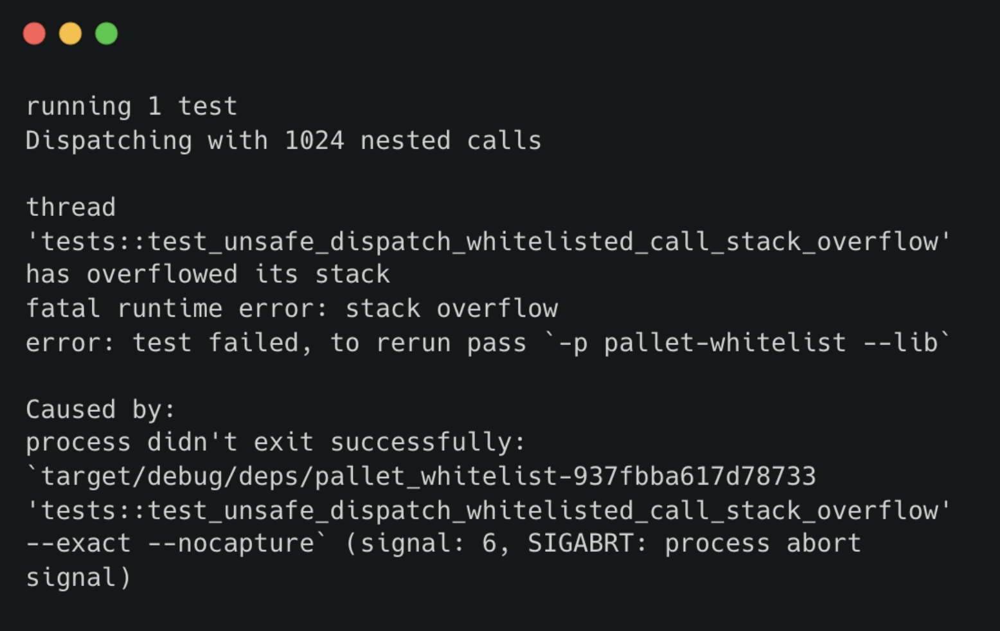
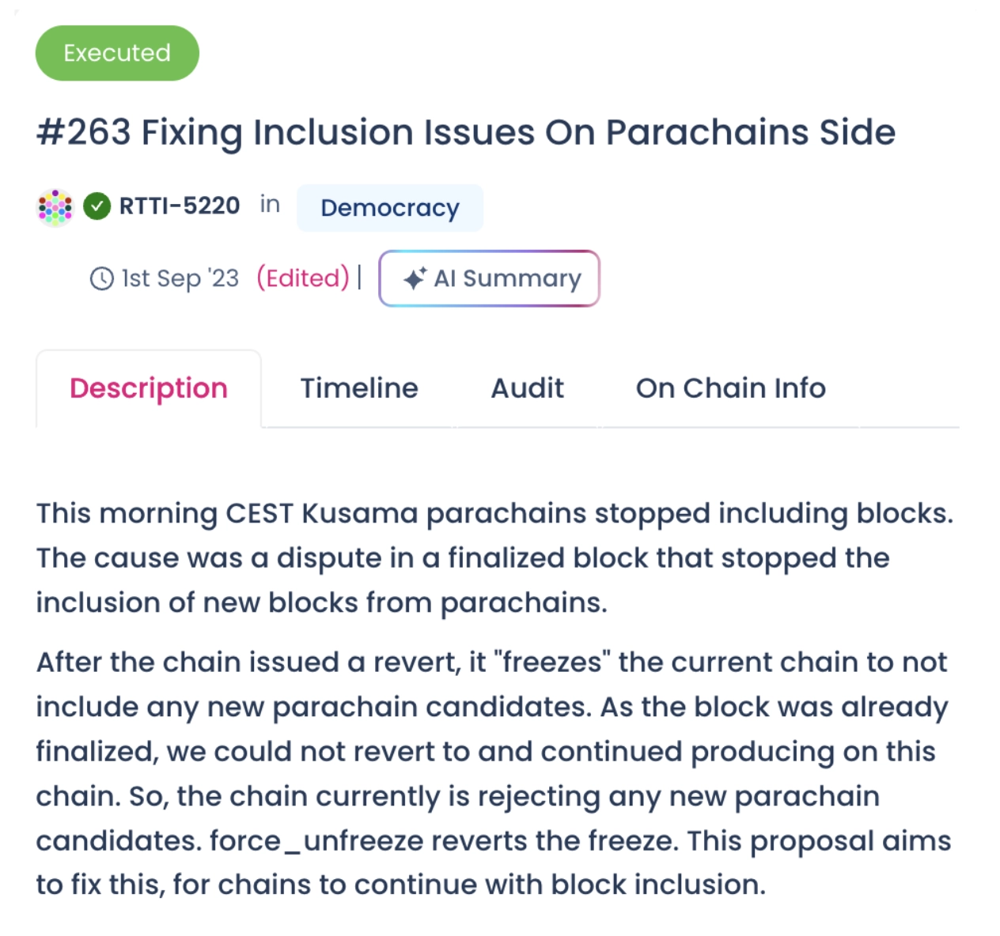

# Common Security Risks in **Polkadot SDK** Development

---

<pba-cols>
<pba-col left>

This presentation discuss common security risks in **Polkadot SDK (Polkadot, Substrate, Cumulus, etc.)** development, and methods to mitigate them.

Each security risk is composed of: **Challenge, Risk, Case Studies, Mitigation and Takeaways**.

</pba-col>
<pba-col left>

<!-- .element: class="fragment" data-fragment-index="1" -->

## Security Risks

1. Insecure Randomness
2. Storage Exhaustion
3. Insufficient Benchmarking
4. Outdated Crates
5. XCM Misconfiguration
6. Unsafe Math
7. Replay Issues
8. Unbounded Decoding
9. Verbosity Issues
10. Inconsistent Error Handling

</pba-col>
</pba-cols>

---

## Disclaimer

> Apart from the mitigations suggested here, it is always important to **ensure a properly audit and intense testing**.
>
> Specially, if your system handles real value assets, considering that if they are exploited, it could hurt their owners.

---

## Insecure Randomness

---v

### Challenge

**On-chain randomness on any public, decentralized, and deterministic system like a blockchain is difficult!**

<pba-cols>
<pba-col>

- Use of **weak cryptographic algorithms** or **insecure randomness** in the system can compromise the integrity of critical functionalities.
- This could allow attackers to predict or manipulate outcomes of any feature that rely on secure randomness.

</pba-col>
<pba-col>



</pba-col>
</pba-cols>

---v

### Risk

<pba-cols>
<pba-col>

- Manipulation or prediction of critical functionalities, leading to compromised integrity and security.
- Potential for attackers to gain an unfair advantage, undermining trust in the system.

</pba-col>
<pba-col>


</pba-col>
</pba-cols>

---v

### Case Study - Randomness Collective Flip

- Randomness Collective Flip pallet from Substrate provides a random function that generates low-influence random values based on the block hashes from the previous 81 blocks.
- Low-influence randomness can be useful when defending against relatively weak adversaries.
- Using this pallet as a randomness source is advisable primarily in low-security situations like testing.

---v

### Case Study - Randomness Collective Flip

<div style="font-size: smaller">

```rust [1-12|14-36]
/// substrate/frame/insecure-randomness-collective-flip/src/lib.rs
fn on_initialize(block_number: BlockNumberFor<T>) -> Weight {
    let parent_hash = <frame_system::Pallet<T>>::parent_hash();
    /// ...
    <RandomMaterial<T>>::mutate(|ref mut values| {
        if values.try_push(parent_hash).is_err() {
            let index = block_number_to_index::<T>(block_number);
            values[index] = parent_hash;
        }
    });
    /// ...
}
/// ...
fn random(subject: &[u8]) -> (T::Hash, BlockNumberFor<T>) {
    let block_number = <frame_system::Pallet<T>>::block_number();
    let index = block_number_to_index::<T>(block_number);
    /// ...
    let hash_series = <RandomMaterial<T>>::get();
    let seed = if !hash_series.is_empty() {
        // Always the case after block 1 is initialized.
        hash_series
            .iter()
            .cycle()
            .skip(index)
          // RANDOM_MATERIAL_LEN = 81
            .take(RANDOM_MATERIAL_LEN as usize)
            .enumerate()
            .map(|(i, h)| 
              (i as i8, subject, h)
              .using_encoded(T::Hashing::hash)
          ).triplet_mix()
    } else {
        T::Hash::default()
    };
    (seed, block_number.saturating_sub(RANDOM_MATERIAL_LEN.into()))
}
```

</div>

---v

### Case Study - VRF

- There are two main secure approaches to blockchain randomness in production today: [RANDAO](https://github.com/randao/randao) and VRF. **Polkadot uses VRF**.

  > **VRF**: mathematical operation that takes some input and produces a random number along with a proof of authenticity that this random number was generated by the submitter.

- With VRF, the proof can be verified by any challenger to ensure the random number generation is valid.

---v

### Case Study - VRF

<div style="font-size: smaller">

- Babe pallet randomness options
  1. Randomness From Two Epochs Ago
     - Use Case: For consensus protocols that need finality.
     - Timing: Uses data from two epochs ago.
     - Risks: Bias if adversaries controlling block production at specific times.
  2. Randomness From One Epoch Ago (**Polkadot Parachain Auctions**)
     - Use Case: For on-chain actions that don't need finality.
     - Timing: Uses data from the previous epoch.
     - Risks: Bias if adversaries control block prod. at end/start of an epoch.
  3. Current Block Randomness
     - Use Case: For actions that need fresh randomness.
     - Timing: Appears fresh but is based on older data.
     - Risks: Weakest form, bias if adversaries don't announce blocks.
- Randomness is affected by other inputs, like external randomness sources.

</div>

---v

### Case Study - VRF

<div style="font-size: smaller">

```rust [1-19|21-36|37-46]
/// substrate/frame/babe/src/lib.rs
/// Compute randomness for a new epoch. rho is the concatenation of all
/// VRF outputs in the prior epoch.
/// an optional size hint as to how many VRF outputs there were may be provided.
fn compute_randomness(
	last_epoch_randomness: BabeRandomness,
	epoch_index: u64,
	rho: impl Iterator<Item = BabeRandomness>,
	rho_size_hint: Option<usize>,
) -> BabeRandomness {
	let mut s = Vec::with_capacity(
      40 + rho_size_hint.unwrap_or(0) * RANDOMNESS_LENGTH);
	s.extend_from_slice(&last_epoch_randomness);
	s.extend_from_slice(&epoch_index.to_le_bytes());
	for vrf_output in rho {
		s.extend_from_slice(&vrf_output[..]);
	}
	sp_io::hashing::blake2_256(&s)
}
/// ...
/// Call this function exactly once when an epoch changes, to update the
/// randomness. Returns the new randomness.
fn randomness_change_epoch(next_epoch_index: u64) -> BabeRandomness {
    let this_randomness = NextRandomness::<T>::get();
    let segment_idx: u32 = SegmentIndex::<T>::mutate(|s| sp_std::mem::replace(s, 0));
    // overestimate to the segment being full.
    let rho_size = (segment_idx.saturating_add(1) * UNDER_CONSTRUCTION_SEGMENT_LENGTH) as usize;
    let next_randomness = compute_randomness(
        this_randomness,
        next_epoch_index,
        (0..segment_idx).flat_map(|i| UnderConstruction::<T>::take(&i)), // VRF (From Digest)
        Some(rho_size),
    );
    NextRandomness::<T>::put(&next_randomness);
    this_randomness // -> Randomness::<T>::put(..);
}
/// substrate/frame/babe/src/randomness.rs
impl<T: Config> RandomnessT<T::Hash, BlockNumberFor<T>> for RandomnessFromOneEpochAgo<T> {
  fn random(subject: &[u8]) -> (T::Hash, BlockNumberFor<T>) {
    let mut subject = subject.to_vec();
    subject.reserve(RANDOMNESS_LENGTH);
    subject.extend_from_slice(&NextRandomness::<T>::get()[..]); 

    (T::Hashing::hash(&subject[..]), EpochStart::<T>::get().1)
  }
}
```

</div>

---v

### Mitigation

- All validators can be trusted

  > VRF

- Not all validators can be trusted
  - Profit from exploiting randomness is substantially more than the profit from building a block

    > Trusted solution (Oracles, MPC, Commit-Reval, etc.)

  - Otherwise

    > VRF

---v

### Takeaways

- On-chain randomness is difficult.
- Polkadot uses VRF (i.e. Auctions).
- On VRF (Pallet BABE), randomness can only be manipulated by the block producers. If all nodes are trusted, then the randomness can be trusted too.
- You can also inject trusted randomness into the chain via a trusted oracle.
- **Don’t use Randomness Collective Flip in production!**

---

## Storage Exhaustion

---v

### Challenge

**Your chain can run out of storage!**

<pba-cols>
<pba-col left>

- Inadequate charging mechanism for on-chain storage, which allows users to occupy storage space without paying the appropriate deposit fees.
- This loophole can be exploited by malicious actors to fill up the blockchain storage cheaply, making it unsustainable to run a node and affecting network performance.

</pba-col>
<pba-col right>


</pba-col>
</pba-cols>

---v

### Risk

- Unsustainable growth in blockchain storage, leading to increased costs and potential failure for node operators.
- Increased susceptibility to DoS attacks that exploit the inadequate storage deposit mechanism to clutter the blockchain.

---v

### Case Study - Existential Deposit

- If an account's balance falls below the existential deposit, the account is reaped, and its data is deleted to save storage space.
- Existential deposits are required to optimize storage. The absence or undervaluation of existential deposits can lead to DoS attacks.
- The cost of permanent storage is generally not accounted for in the weight calculation for extrinsics, making it possible for an attacker to fill up the blockchain storage by distributing small amounts of native tokens to many accounts.

---v

### Case Study - Existential Deposit

```rust [1-10|12-20]
/// relay/polkadot/constants/src/lib.rs
/// Money matters.
pub mod currency {
  /// The existential deposit.
  pub const EXISTENTIAL_DEPOSIT: Balance = 100 * CENTS;
  /// ...
  pub const UNITS: Balance = 10_000_000_000;
  pub const DOLLARS: Balance = UNITS; // 10_000_000_000
  pub const CENTS: Balance = DOLLARS / 100; // 100_000_000
}

/// relay/polkadot/src/lib.rs
parameter_types! {
  pub const ExistentialDeposit: Balance = EXISTENTIAL_DEPOSIT;
  /// ...
}
impl pallet_balances::Config for Runtime {
  type ExistentialDeposit = ExistentialDeposit;
  /// ...
}
```

---v

### Case Study - General Storage Usage System



[Issue in Polkadot SDK](https://github.com/paritytech/polkadot-sdk/issues/207)

---v

### Case Study - NFT Pallet Manual Deposit

<div style="font-size: smaller">

```rust [1-22|24-49|29-30]
/// substrate/frame/nfts/src/lib.rs
/// ...
/// Origin must be either `ForceOrigin` or Signed and the sender should be the Admin of the
/// `collection`.
///
/// If the origin is Signed, then funds of signer are reserved according to the formula:
/// `MetadataDepositBase + DepositPerByte * data.len` taking into
/// account any already reserved funds.
/// ...
#[pallet::call_index(24)]
#[pallet::weight(T::WeightInfo::set_metadata())]
pub fn set_metadata(
  origin: OriginFor<T>,
  collection: T::CollectionId,
  item: T::ItemId,
  data: BoundedVec<u8, T::StringLimit>,
) -> DispatchResult {
  let maybe_check_origin = T::ForceOrigin::try_origin(origin)
    .map(|_| None)
    .or_else(|origin| ensure_signed(origin).map(Some).map_err(DispatchError::from))?;
  Self::do_set_item_metadata(maybe_check_origin, collection, item, data, None)
}

/// substrate/frame/nfts/src/features/attributes.rs
fn do_set_item_metadata {
  /// ...
  let mut deposit = Zero::zero();
  if collection_config.is_setting_enabled(CollectionSetting::DepositRequired) 
    // Next line was added to fix the issue 
    || namespace != AttributeNamespace::CollectionOwner
  {
    deposit = T::DepositPerByte::get()
      .saturating_mul(((data.len()) as u32).into())
      .saturating_add(T::MetadataDepositBase::get());
  }
  
  let depositor = maybe_depositor.clone().unwrap_or(collection_details.owner.clone());
  let old_depositor = old_deposit.account.unwrap_or(collection_details.owner.clone());
  
  if depositor != old_depositor {
    T::Currency::unreserve(&old_depositor, old_deposit.amount);
    T::Currency::reserve(&depositor, deposit)?;
  } else if deposit > old_deposit.amount {
    T::Currency::reserve(&depositor, deposit - old_deposit.amount)?;
  } else if deposit < old_deposit.amount {
    T::Currency::unreserve(&depositor, old_deposit.amount - deposit);
  }
  /// ...
}
```

</div>

[Commit](https://github.com/paritytech/substrate/commit/e907e15e0bda28b5c5db90e6a0bce3393fbc59f1)

---v

### Mitigation

- **Existential Deposit:** ensure a value similar to the defined by the relay chain.
- **Storage Deposit:** implement a good logic similar to the following:

<div style="font-size: smaller">

```rust
// Deposit calculation (bytes * deposit_per_byte + deposit_base)
let mut deposit = T::DepositPerByte::get()
        .saturating_mul(((key.len() + value.len()) as u32).into())
        .saturating_add(T::DepositBase::get());

// Deposit reserve (dynamic data size)
if old_deposit.account.is_some() && 
   old_deposit.account != Some(origin.clone()) {
    T::Currency::unreserve(
      &old_deposit.account.unwrap(), old_deposit.amount);
    T::Currency::reserve(&origin, deposit)?;
} else if deposit > old_deposit.amount {
    T::Currency::reserve(&origin, deposit - old_deposit.amount)?;
} else if deposit < old_deposit.amount {
    T::Currency::unreserve(&origin, old_deposit.amount - deposit);
}
```

</div>

---v

### Takeaways

- Always explicitly require a deposit for on-chain storage (in the form of Reserved Balance).
- Deposit is returned to the user when the user removes the data from the chain.
- Ensure the existential deposit is greater than N. To determine N you can start from values similar to relay chain and monitor users activity.
- If possible, limit the amount of data that a pallet can have. Otherwise, ensure some friction (reserve deposit) in the storage usage.

---

## Insufficient Benchmarking

---v

### Challenge

**Benchmarking can be a difficult task...**

<pba-cols>
<pba-col>

- Incorrect or missing benchmarking can lead to overweight blocks, causing network congestion and affecting the overall performance of the blockchain.
- This can happen when the computational complexity or storage access is underestimated, leading to inaccurate weight for extrinsics.

</pba-col>
<pba-col>


</pba-col>
</pba-cols>

---v

### Risk

<pba-cols>
<pba-col>

- **Overweight extrinsics** can slow down the network.

- Leads to delays in transaction processing and affects UX.

</pba-col>
<pba-col>

- **Underweight extrinsics** can be exploited to spam the network.

- Leads to a potential Denial of Service (DoS) attack.

</pba-col>
</pba-cols>

---v

### Case Study - Benchmark Input Length - Issue

<div style="font-size: smaller">

```rust [0|9-10|27-29]
/// substrate/frame/remark/src/lib.rs (modified)
#[frame_support::pallet]
pub mod pallet {
	/// ...
	#[pallet::call]
	impl<T: Config> Pallet<T> {
		/// Index and store data off chain.
		#[pallet::call_index(0)]
		#[pallet::weight(T::WeightInfo::store())]
		pub fn store(origin: OriginFor<T>, remark: Vec<u8>) -> DispatchResultWithPostInfo {
			ensure!(!remark.is_empty(), Error::<T>::Empty);
			let sender = ensure_signed(origin)?;
			let content_hash = sp_io::hashing::blake2_256(&remark);
			let extrinsic_index = <frame_system::Pallet<T>>::extrinsic_index()
				.ok_or_else(|| Error::<T>::BadContext)?;
			sp_io::transaction_index::index(extrinsic_index, remark.len() as u32, content_hash);
			Self::deposit_event(Event::Stored { sender, content_hash: content_hash.into() });
			Ok(().into())
		}
	}
	/// ...
}


/// substrate/frame/remark/src/benchmarking.rs (modified)
benchmarks! {
	store {
		let caller: T::AccountId = whitelisted_caller();
	}: _(RawOrigin::Signed(caller.clone()), vec![])
	verify {
		assert_last_event::<T>(Event::Stored { sender: caller, content_hash: sp_io::hashing::blake2_256(&vec![0u8; l as usize]).into() }.into());
	}

	impl_benchmark_test_suite!(Remark, crate::mock::new_test_ext(), crate::mock::Test);
}
```

</div>

---v

### Case Study - Benchmark Input Length - Mitigation

<div style="font-size: smaller">

```rust [0|9-10|27-30]
/// substrate/frame/remark/src/lib.rs
#[frame_support::pallet]
pub mod pallet {
	/// ...
	#[pallet::call]
	impl<T: Config> Pallet<T> {
		/// Index and store data off chain.
		#[pallet::call_index(0)]
		#[pallet::weight(T::WeightInfo::store(remark.len() as u32))]
		pub fn store(origin: OriginFor<T>, remark: Vec<u8>) -> DispatchResultWithPostInfo {
			ensure!(!remark.is_empty(), Error::<T>::Empty);
			let sender = ensure_signed(origin)?;
			let content_hash = sp_io::hashing::blake2_256(&remark);
			let extrinsic_index = <frame_system::Pallet<T>>::extrinsic_index()
				.ok_or_else(|| Error::<T>::BadContext)?;
			sp_io::transaction_index::index(extrinsic_index, remark.len() as u32, content_hash);
			Self::deposit_event(Event::Stored { sender, content_hash: content_hash.into() });
			Ok(().into())
		}
	}
	/// ...
}


/// substrate/frame/remark/src/benchmarking.rs
benchmarks! {
	store {
		let l in 1 .. 1024*1024;
		let caller: T::AccountId = whitelisted_caller();
	}: _(RawOrigin::Signed(caller.clone()), vec![0u8; l as usize])
	verify {
		assert_last_event::<T>(Event::Stored { sender: caller, content_hash: sp_io::hashing::blake2_256(&vec![0u8; l as usize]).into() }.into());
	}

	impl_benchmark_test_suite!(Remark, crate::mock::new_test_ext(), crate::mock::Test);
}
```

</div>

---v

### Mitigation

- Run benchmarks using the worst case scenario conditions.

  > For example, more amount of DB reads and write that could ever happen in a extrinsic.

- Primary goal is to keep the runtime safe.
- Secondary goal is to be as accurate as possible to maximize throughput.
- For non-hard deadline code use **metering**.

---v

### Takeaways

- Benchmarking ensures that parachain’s users are not using resources beyond what is available and expected for our network.
- Weight is used to track consumption of limited blockchain resources based on Execution Time (Reference Hardware) and Size of Data required to create a Merkle Proof.
- 1 second of compute on different computers allows for different amounts of computation.

---

## Outdated Crates

---v

### Challenge

**Dependencies can become a nightmare!**

<pba-cols>
<pba-col>

- Using outdated or known vulnerable components, such as pallets or libraries, in a Substrate runtime can expose the system to broad range of security risks and exploits.

</pba-col>
<pba-col>


</pba-col>
</pba-cols>

---v

### Risk

- Exposure to known vulnerabilities that could be exploited by attackers.
- Compromised network integrity and security, leading to potential data breaches or financial loss.

---v

### Case Study - Serde Precompiled Binary

<pba-cols>
<pba-col>

- Polkadot uses `serde` with the `derive` feature as a dependency.
- **Issue**: Serde developers decided to ships it as a precompiled binary. [Article](https://www.bleepingcomputer.com/news/security/rust-devs-push-back-as-serde-project-ships-precompiled-binaries/).
- **Mitigation**: Dependency was fixed to a version that doesn't include the precompiled binary.

</pba-col>
<pba-col>



</pba-col>
</pba-cols>

**A trustless system, such as Polkadot, can't blindly trust binaries.**

---v

### Mitigation

- Always uses the latest stable version of Polkadot, Substrate, Cumulus, and any other third party crate.
- If possible, avoid using too many crates.
- Use tools such as `cargo audit` or `cargo vet` to monitor the state of your system’s dependencies.
- Don't use dependencies that include precompiled binaries.

---v

### Takeaways

- Outdated crates can lead to vulnerabilities in your system even if the crate don’t have a vulnerability.
- Outdated crates can contain known vulnerabilities that could be easily exploited in your system.
- Don’t use the latest version of a crate (in production) until it is declared as stable.

---

## XCM Misconfiguration

---v

### Challenge

**Configuring correctly XCM needs a lot of attention!**

- XCM needs to be configured through different pallets and configs.
- Determining the access control to the XCM pallet and the incoming queues needs to be done carefully.
- For new parachains, it is difficult to determine which XCM messages are needed and which are not.
- If the config is not correctly setup the chain could be vulnerable to attacks, become spam targets if incoming XCM messages are not handled as untrusted and/or sanitized properly, or even be used as a **bridge** to attack other parachains by not enforcing a good Access Control in **send** operations.

---v

### Risk

- Unauthorized manipulation of the blockchain state, compromising the network's integrity.
- Execution of unauthorized transactions, leading to potential financial loss.
- Be used as an attack channel to parachains.

---v

### Case Study - Rococo Bridge Hub - Description

- The `MessageExporter` type (`BridgeHubRococoOrBridgeHubWococoSwitchExporter`) in the Rococo's Bridge Hub XcmConfig was using the `unimplemented!()` macro in [`validate`](https://github.com/paritytech/polkadot-sdk/blob/f6560c2b7226ea756ade18df42018c3eaf3be2e0/cumulus/parachains/runtimes/bridge-hubs/bridge-hub-rococo/src/xcm_config.rs#L391) and `deliver` methods, what is equivalent to the `panic!()` macro. This was exposing the Rococo Bridge Hub runtime to non-skippable panic reachable by any parachain allowed to send messages to the Rococo Bridge Hub.
- This issue was trivial to execute for anyone that can send messages to the Bridge Hub, as the only needed is to send a valid XCM message that includes an ExportMessage instruction trying to bridge to a network that is not implemented.

---v

### Case Study - Rococo Bridge Hub - Issue

```rust [0|14-21|22-29|30]
/// cumulus/parachains/runtimes/bridge-hubs/bridge-hub-rococo/src/xcm_config.rs
pub struct BridgeHubRococoOrBridgeHubWococoSwitchExporter;
impl ExportXcm for BridgeHubRococoOrBridgeHubWococoSwitchExporter {
	type Ticket = (NetworkId, (sp_std::prelude::Vec<u8>, XcmHash));

	fn validate(
		network: NetworkId,
		channel: u32,
		universal_source: &mut Option<InteriorMultiLocation>,
		destination: &mut Option<InteriorMultiLocation>,
		message: &mut Option<Xcm<()>>,
	) -> SendResult<Self::Ticket> {
		match network {
			Rococo => ToBridgeHubRococoHaulBlobExporter::validate(
				network,
				channel,
				universal_source,
				destination,
				message,
			)
			.map(|result| ((Rococo, result.0), result.1)),
			Wococo => ToBridgeHubWococoHaulBlobExporter::validate(
				network,
				channel,
				universal_source,
				destination,
				message,
			)
			.map(|result| ((Wococo, result.0), result.1)),
			_ => unimplemented!("Unsupported network: {:?}", network),
		}
```

---v

### Case Study - Rococo Bridge Hub - XCM Config

<div style="font-size: smaller">

```rust [0|30|7|40-59|48-50|13|61-88|71-73]
/// cumulus/parachains/runtimes/bridge-hubs/bridge-hub-rococo/src/xcm_config.rs
pub struct XcmConfig;
impl xcm_executor::Config for XcmConfig {
	type RuntimeCall = RuntimeCall;
	type XcmSender = XcmRouter;
	type AssetTransactor = CurrencyTransactor;
	type OriginConverter = XcmOriginToTransactDispatchOrigin;
	// BridgeHub does not recognize a reserve location for any asset. Users must teleport Native
	// token where allowed (e.g. with the Relay Chain).
	type IsReserve = ();
	type IsTeleporter = TrustedTeleporters;
	type UniversalLocation = UniversalLocation;
	type Barrier = Barrier;
	type Weigher = WeightInfoBounds<
		crate::weights::xcm::BridgeHubRococoXcmWeight<RuntimeCall>,
		RuntimeCall,
		MaxInstructions,
	>;
	type Trader =
		UsingComponents<WeightToFee, TokenLocation, AccountId, Balances, ToStakingPot<Runtime>>;
	type ResponseHandler = PolkadotXcm;
	type AssetTrap = PolkadotXcm;
	type AssetLocker = ();
	type AssetExchanger = ();
	type AssetClaims = PolkadotXcm;
	type SubscriptionService = PolkadotXcm;
	type PalletInstancesInfo = AllPalletsWithSystem;
	type MaxAssetsIntoHolding = MaxAssetsIntoHolding;
	type FeeManager = XcmFeesToAccount<Self, WaivedLocations, AccountId, TreasuryAccount>;
	type MessageExporter = BridgeHubRococoOrBridgeHubWococoSwitchExporter;
	type UniversalAliases = Nothing;
	type CallDispatcher = WithOriginFilter<SafeCallFilter>;
	type SafeCallFilter = SafeCallFilter;
	type Aliasers = Nothing;
}

/// This is the type we use to convert an (incoming) XCM origin into a local `Origin` instance,
/// ready for dispatching a transaction with Xcm's `Transact`. There is an `OriginKind` which can
/// biases the kind of local `Origin` it will become.
pub type XcmOriginToTransactDispatchOrigin = (
	// Sovereign account converter; this attempts to derive an `AccountId` from the origin location
	// using `LocationToAccountId` and then turn that into the usual `Signed` origin. Useful for
	// foreign chains who want to have a local sovereign account on this chain which they control.
	SovereignSignedViaLocation<LocationToAccountId, RuntimeOrigin>,
	// Native converter for Relay-chain (Parent) location; will convert to a `Relay` origin when
	// recognized.
	RelayChainAsNative<RelayChainOrigin, RuntimeOrigin>,
	// Native converter for sibling Parachains; will convert to a `SiblingPara` origin when
	// recognized.
	SiblingParachainAsNative<cumulus_pallet_xcm::Origin, RuntimeOrigin>,
	// Superuser converter for the Relay-chain (Parent) location. This will allow it to issue a
	// transaction from the Root origin.
	ParentAsSuperuser<RuntimeOrigin>,
	// Native signed account converter; this just converts an `AccountId32` origin into a normal
	// `RuntimeOrigin::Signed` origin of the same 32-byte value.
	SignedAccountId32AsNative<RelayNetwork, RuntimeOrigin>,
	// Xcm origins can be represented natively under the Xcm pallet's Xcm origin.
	XcmPassthrough<RuntimeOrigin>,
);

pub type Barrier = TrailingSetTopicAsId<
	DenyThenTry<
		DenyReserveTransferToRelayChain,
		(
			// Allow local users to buy weight credit.
			TakeWeightCredit,
			// Expected responses are OK.
			AllowKnownQueryResponses<PolkadotXcm>,
			WithComputedOrigin<
				(
					// If the message is one that immediately attempts to pay for execution,
					//then allow it.
					AllowTopLevelPaidExecutionFrom<Everything>,
					// Parent, its pluralities (i.e. governance bodies) and relay treasury
					// pallet get free execution.
					AllowExplicitUnpaidExecutionFrom<(
						ParentOrParentsPlurality,
						Equals<RelayTreasuryLocation>,
					)>,
					// Subscriptions for version tracking are OK.
					AllowSubscriptionsFrom<ParentOrSiblings>,
				),
				UniversalLocation,
				ConstU32<8>,
			>,
		),
	>,
>;
```

</div>

---v

### Mitigation

- Constantly, verify all your configs and compare with other chains.
- In XMC pallet, limit usage **execute** and **send** until XCM security guarantees can be ensured.
- In XCM executor, ensure a correct access control in your `XcmConfig`:
  - Only trusted sources can be allowed. Filter origins with `OriginConverter`.
  - Only the specific messages structures your parachain needs to receive can be accepted. Filter message structures with `Barrier` (general), `SafeCallFilter` (transact), `IsReserve` (reserve), `IsTeleporter` (teleport), `MessageExporter` (export), `XcmSender` (send), etc.
- In XCMP queue, ensure only trusted channels are open.

---v

### Takeaways

- XCM development and audits are still going on, so its security guarantees can be ensured at the moment.
- Allowing any user to use execute and send can have a serious impact on your parachain.
- Incoming XCMs need to be handled as untrusted and sanitized properly.
- Insufficient Access Control in your parachain can enable bad actors to attack other parachains through your system.

---

## Unsafe Math

---v

### Challenge

- Unsafe math operations in the codebase can lead to integer overflows/underflows, divisions by zero, conversion truncation/overflow and incorrect end results which can be exploited by attackers to manipulate calculations and gain an unfair advantage.
- This involve mainly the usage of primitive arithmetic operations.



---v

### Risk

- Manipulation of account balances, leading to unauthorized transfers or artificial inflation of balances.
- Potential disruption of network functionalities that rely on accurate arithmetic calculations.
- Incorrect calculations, leading to unintended consequences like incorrect account balances or transaction fees..
- Potential for attackers to exploit the vulnerability to manipulate outcomes in their favor.

---v

### Case Study - Frontier Balances - Description

- Frontier's [CVE-2022-31111](https://github.com/paritytech/frontier/security/advisories/GHSA-hc8w-mx86-9fcj) disclosure describes the issues found in the process of converting balances from EVM to Substrate, where the pallet didn't handle it right, causing the transferred amount to appear differently leading to a possible overflow.
- This is risky for two reasons:
  1. It could lead to wrong calculations, like messed-up account balances.
  2. People with bad intentions could use this error to get unfair advantages.
- To fix this, it's important to double-check how these conversions are done to make sure the numbers are accurate.

---v

### Case Study - Frontier Balances - Issue

<div style="font-size: smaller">

```rust [0|10|16]
/// substrate/frame/evm/src/lib.rs
#[pallet::genesis_build]
	impl<T: Config> GenesisBuild<T> for GenesisConfig {
		fn build(&self) {
			for (address, account) in &self.accounts {
				let account_id = T::AddressMapping::into_account_id(*address);

				// ASSUME: in one single EVM transaction, the nonce will not increase more than
				// `u128::max_value()`.
				for _ in 0..account.nonce.low_u128() {
					frame_system::Pallet::<T>::inc_account_nonce(&account_id);
				}

				T::Currency::deposit_creating(
					&account_id,
					account.balance.low_u128().unique_saturated_into(),
				);
```

</div>

---v

### Case Study - Frontier Balances - Mitigation

<div style="font-size: smaller">

```rust [0|15-18|24]
/// substrate/frame/evm/src/lib.rs
#[pallet::genesis_build]
  impl<T: Config> GenesisBuild<T> for GenesisConfig
  where
    U256: UniqueSaturatedInto<BalanceOf<T>>,
  {
    fn build(&self) {
      const MAX_ACCOUNT_NONCE: usize = 100;

      for (address, account) in &self.accounts {
        let account_id = T::AddressMapping::into_account_id(*address);

        // ASSUME: in one single EVM transaction, the nonce will not increase more than
        // `u128::max_value()`.
        for _ in 0..min(
          MAX_ACCOUNT_NONCE,
          UniqueSaturatedInto::<usize>::unique_saturated_into(account.nonce),
        ) {
          frame_system::Pallet::<T>::inc_account_nonce(&account_id);
        }

        T::Currency::deposit_creating(
          &account_id, 
          account.balance.unique_saturated_into()
        );
```

</div>

---v

### Mitigation

- Arithmetic
  - Simple solution but (sometimes) more costly

    > Use checked/saturated functions like `checked_div`.

  - Complex solution but (sometimes) less costly

    > Validate before executing primitive functions. For example: balance > transfer_amount

- Conversions
  - Avoid downcasting values. Otherwise, use methods like `unique_saturated_into` instead of methods like `low_u64`.
  - **Your system should be designed to avoid downcasting!**

---v

### Takeaways

- While testing pallets, system will panic (crash) if primitive arithmetic operation leads to overflow/underflow or division by zero.
  However, on release (production), pallets will not panic on overflow.
  Always ensure no unexpected overflow/underflow can happen.
- Checked operations use slightly more computational power than primitive operations.
- While testing pallets, system will panic (crash) if conversion leads to overflow/underflow or truncation.
  However, on release (production), pallets will not panic.
  Always ensure no unexpected overflow/underflow or truncation can happen.
- In a conversion, smaller the new type, more chances a overflow/underflow or truncation can happen.

---

## Replay Issues

---v

### Challenge

<pba-cols>
<pba-col>

- Replay issues, most commonly arising from unsigned extrinsics, can lead to spamming and, in certain scenarios, double-spending attacks.
- This happens when nonces are not managed correctly, making it possible for transactions to be replayed.

</pba-col>
<pba-col>



</pba-col>
</pba-cols>

---v

### Risk

- Spamming the network with repeated transactions, leading to congestion and reduced performance.
- Potential for double-spending attacks, which can compromise the integrity of the blockchain.

---v

### Case Study - Frontier STF - Description

- [CVE-2021-41138](https://github.com/paritytech/frontier/security/advisories/GHSA-vj62-g63v-f8mf) describes the security issues arose from the changes made in [Frontier #482](https://github.com/paritytech/frontier/pull/482). Before this update, the function `validate_unsigned` was used to check if a transaction was valid. This function was part of the **State Transition Function** (STF), which is important when a block is being made. After the update, a new function validate_self_contained does the job but it's not part of the STF. This means a malicious validator could submit invalid transactions, and even reuse transactions from a different chain.
- In the following sample from [Frontier](https://github.com/paritytech/frontier/blob/0a8e696fdfb9ce73a7f99941a2f2ec22eefd4f38/frame/ethereum/src/lib.rs#L249) is possible to observe how the `do_transact` function was used before the update, where the `validate_self_contained` was not used.
- In a later [commit](https://github.com/paritytech/frontier/commit/146bb48849e5393004be5c88beefe76fdf009aba), this is patch by adding the validations on block production. Between the changes can be observe that replace of `do_transact` for `validate_transaction_in_block` that contains the logic to validate a transaction that was previously in `validate_self_contained`.

---v

### Case Study - Frontier Balances - Issue

<div style="font-size: smaller">

```rust [0|]
fn on_initialize(_: T::BlockNumber) -> Weight {
  Pending::<T>::kill();
  // If the digest contain an existing ethereum block(encoded as PreLog), If contains,
  // execute the imported block firstly and disable transact dispatch function.
  if let Ok(log) = fp_consensus::find_pre_log(&frame_system::Pallet::<T>::digest()) {
    let PreLog::Block(block) = log;
    for transaction in block.transactions {
      let source = Self::recover_signer(&transaction).expect(
        "pre-block transaction signature invalid; the block cannot be built",
      );

      Self::do_transact(source, transaction).expect(
        "pre-block transaction verification failed; the block cannot be built",
      );
    }
  }

  0
}
```

</div>

---v

### Case Study - Frontier Balances - Mitigation

<div style="font-size: smaller">

```rust [0|12-14|32-39]
fn on_initialize(_: T::BlockNumber) -> Weight {
  Pending::<T>::kill();
  // If the digest contain an existing ethereum block(encoded as PreLog), If contains,
  // execute the imported block firstly and disable transact dispatch function.
  if let Ok(log) = fp_consensus::find_pre_log(&frame_system::Pallet::<T>::digest()) {
    let PreLog::Block(block) = log;
    for transaction in block.transactions {
      let source = Self::recover_signer(&transaction).expect(
        "pre-block transaction signature invalid; the block cannot be built",
      );

      Self::validate_transaction_in_block(source, &transaction).expect(
        "pre-block transaction verification failed; the block cannot be built",
      );
      Self::apply_validated_transaction(source, transaction).expect( // do_transact
        "pre-block transaction execution failed; the block cannot be built",
      );
    }
  }

  0
}

// Common controls to be performed in the same way by the pool and the
// State Transition Function (STF).
// This is the case for all controls except those concerning the nonce.
fn validate_transaction_common(
  origin: H160,
  transaction: &Transaction,
) -> Result<U256, TransactionValidityError> {
  // ...
  if let Some(chain_id) = transaction.signature.chain_id() {
    if chain_id != T::ChainId::get() {
      return Err(InvalidTransaction::Custom(
        TransactionValidationError::InvalidChainId as u8,
      )
      .into());
    }
  }
  // ...
}
```

</div>

---v

### Mitigation

- Ensure that the data your system is receiving from untrustworthy sources:
  - Can’t be re-used by implementing a nonces mechanism.
  - Is intended for your system by checking any identification type like ID, hashes, etc.

---v

### Takeaways

- Replay issues can lead to serious damage.
- Even if the chain ensure a runtime transaction can’t be replayed, external actors could replay a similar output by passing similar inputs if the they are not correctly verified.

---

## Unbounded Decoding

---v

### Challenge

<pba-cols>
<pba-col>

- Decoding objects without a nesting depth limit can lead to stack exhaustion, making it possible for attackers to craft highly nested objects that cause a stack overflow.
- This can be exploited to disrupt the normal functioning of the blockchain network.

</pba-col>
<pba-col>



</pba-col>
</pba-cols>

---v

### Risk

- Stack exhaustion, which can lead to network instability and crashes.
- Potential for Denial of Service (DoS) attacks by exploiting the stack overflow vulnerability.

---v

### Case Study - Whitelist Pallet - Description

- In [Substrate #10159](https://github.com/paritytech/substrate/pull/10159), the `whitelist-pallet` was introduced. This pallet contains the extrinsic `dispatch_whitelisted_call` that allow to dispatch a previously whitelisted call.
- In order to be dispatched, the call needs to be decoded, and this was being done with the decode method.
- Auditors detected this method could lead to an stack overflow and suggested the developers to use decode_with_depth_limit to mitigate the issue.
- Risk was limited due to the origin had specific restrictions, but if the issue is triggered, the resulting stack overflow could cause a whole block to be invalid and the chain could get stuck failing to produce new blocks.

---v

### Case Study - Whitelist Pallet - Issue

<div style="font-size: smaller">

```rust [0|18-19]
/// Remake of vulnerable whitelist pallet
pub fn dispatch_whitelisted_call(
    origin: OriginFor<T>,
    call_hash: PreimageHash,
    call_encoded_len: u32,
    call_weight_witness: Weight,
) -> DispatchResultWithPostInfo {
    T::DispatchWhitelistedOrigin::ensure_origin(origin)?;

    ensure!(
        WhitelistedCall::<T>::contains_key(call_hash),
        Error::<T>::CallIsNotWhitelisted,
    );

    let call = T::Preimages::fetch(&call_hash, Some(call_encoded_len))
        .map_err(|_| Error::<T>::UnavailablePreImage)?;

    let call = <T as Config>::RuntimeCall::decode(&mut &call[..])
        .map_err(|_| Error::<T>::UndecodableCall)?;
```

</div>

---v

### Case Study - Whitelist Pallet - Exploit PoC

<div style="font-size: smaller">

```rust [0|5-8|14-20|22-31|37-47]
/// Remake of vulnerable whitelist pallet
#[test]
fn test_unsafe_dispatch_whitelisted_call_stack_overflow() {
	new_test_ext().execute_with(|| {
		let mut call = 
			RuntimeCall::System(
				frame_system::Call::remark_with_event { remark: vec![1] }
			);
		let mut call_weight = call.get_dispatch_info().weight;
		let mut encoded_call = call.encode();
		let mut call_encoded_len = encoded_call.len() as u32;
		let mut call_hash = <Test as frame_system::Config>::Hashing::hash(&encoded_call[..]);

		// The amount of nested calls to create
		// This test will not crash as it the following value is less than minimum
		// amount of calls to cause a stack overflow
		let nested_calls = sp_api::MAX_EXTRINSIC_DEPTH;

		// The following line to get a stack overflow error on decoding (pallet)
		let nested_calls = nested_calls*4;

		// Create the nested calls
		for _ in 0..=nested_calls {
			call = RuntimeCall::Whitelist(crate::Call::dispatch_whitelisted_call_with_preimage {
				call: Box::new(call.clone()),
			});
			call_weight = call.get_dispatch_info().weight;
			encoded_call = call.encode();
			call_encoded_len = encoded_call.len() as u32;
			call_hash = <Test as frame_system::Config>::Hashing::hash(&encoded_call[..]);
		}

		// Whitelist the call to being able to dispatch it
		assert_ok!(Preimage::note(encoded_call.into()));
		assert_ok!(Whitelist::whitelist_call(RuntimeOrigin::root(), call_hash));

		// Send the call to be dispatched
		// This will throw a stack overflow if the nested calls is too high
		println!("Dispatching with {} nested calls", nested_calls);
		assert_ok!(
			Whitelist::dispatch_whitelisted_call(
				RuntimeOrigin::root(),
				call_hash,
				call_encoded_len,
				call_weight
			),
		);
	});
}
```

</div>

---v

### Case Study - Whitelist Pallet - Exploit Results



---v

### Case Study - Whitelist Pallet - Mitigation

<div style="font-size: smaller">

```rust [0|18-22]
/// Remake of vulnerable whitelist pallet
pub fn dispatch_whitelisted_call(
    origin: OriginFor<T>,
    call_hash: PreimageHash,
    call_encoded_len: u32,
    call_weight_witness: Weight,
) -> DispatchResultWithPostInfo {
    T::DispatchWhitelistedOrigin::ensure_origin(origin)?;

    ensure!(
        WhitelistedCall::<T>::contains_key(call_hash),
        Error::<T>::CallIsNotWhitelisted,
    );

    let call = T::Preimages::fetch(&call_hash, Some(call_encoded_len))
        .map_err(|_| Error::<T>::UnavailablePreImage)?;

    let call = 
        <T as Config>::RuntimeCall::decode_all_with_depth_limit(
            sp_io::MAX_EXTRINSIC_DEPTH,
            &mut &call[..],
        ).map_err(|_| Error::<T>::UndecodableCall)?;
```

</div>

---v

### Mitigation

- Use the `decode_with_depth_limit` method instead of `decode` method.
- Use `decode_with_depth_limit` with a depth limit lower than the depth that can cause an stack overflow.

---v

### Takeaways

- Decoding untrusted objects can lead to stack overflow.
- Stack overflow can lead to network instability and crashes.
- Always ensure a maximum depth while decoding data in a pallet.

---

## Verbosity Issues

---v

### Challenge

<pba-cols>
<pba-col>

- Lack of detailed logs from collators, nodes, or RPC can make it difficult to diagnose issues, especially in cases of crashes or network halts.
- This lack of verbosity can hinder efforts to maintain system health and resolve issues promptly.

</pba-col>
<pba-col>


</pba-col>
</pba-cols>

---v

### Risk

- Difficulty in diagnosing and resolving system issues, leading to extended downtime.
- Reduced ability to identify and mitigate security threats compromising network integrity.

---v

### Case Study

<pba-cols>
<pba-col>

- During [recent Kusama issue](https://kusama.polkassembly.io/referenda/263), the chain stopped block production for some hours.
- Engineers needed to check all the logs to understand what caused it or what triggered the incident.
- Logging system allowed them to detect that the cause was a dispute in a finalized block.

</pba-col>
<pba-col>



</pba-col>
</pba-cols>

- Consensus systems are complex and almost never halt, but when they do, it is difficult to recreate the scenario that led to it.
- A good logging system can therefore help to reduce downtime.

---v

### Mitigation

- Regularly review logs to identify any suspicious activity, and determine if there is sufficient verbosity.
- Implement logs in the critical parts of your pallets.
- Implement dashboards to detect anomaly patterns in logs and metrics. A great example is Grafana that is used by some node maintainers to be aware of recent issues.

---v

### Takeaways

- Logs are extremely important to diagnose and resolve system issues.
- Insufficient verbosity can lead to extended downtime.

---

## Inconsistent Error Handling

---v

### Challenge

<pba-cols>
<pba-col>

- Errors/exceptions need to be handled consistently to avoid attack vectors in critical parts of the system.
- While processing a collection of items, if one of them fails, the whole batch fails. This can be exploited by an attacker that wants to block the execution. This can become a critical problem if the processing is happening in a privileged extrinsic like a hook.

</pba-col>
<pba-col>


</pba-col>
</pba-cols>

---v

### Risk

- Privileged extrinsics Denial of Service (DoS).
- Unexpected behavior in the system.

---v

### Case Study - Decode Concatenated Data - Issue

```rust [0|6-11]
fn decode_concatenated_extrinsics(
  data: &mut &[u8],
) -> Result<Vec<<T as Config>::RuntimeCall>, ()> {
  let mut decoded_extrinsics = Vec::new();
  while !data.is_empty() {
    let extrinsic =
      <T as Config>::RuntimeCall::decode_with_depth_limit(
        sp_api::MAX_EXTRINSIC_DEPTH, 
        data
      ).map_err(|_| ())?;
    decoded_extrinsics.push(extrinsic);
  }
  Ok(decoded_extrinsics)
}
```

---v

### Case Study - Decode Concatenated Data - Issue

```rust [0|6-14]
fn decode_concatenated_extrinsics(
  data: &mut &[u8],
) -> Result<Vec<<T as Config>::RuntimeCall>, ()> {
  let mut decoded_extrinsics = Vec::new();
  while !data.is_empty() {
    if let Ok(extrinsic) =
      <T as Config>::RuntimeCall::decode_with_depth_limit(
        sp_api::MAX_EXTRINSIC_DEPTH, 
        data
      ) {
        decoded_extrinsics.push(extrinsic);
    } else {
      /// Handle corrupted extrinsic...
    } 
  }
  Ok(decoded_extrinsics)
}
```

---v

### Mitigation

- Verify the error handling is consistent with the extrinsic logic.
- During batch processing
  - If all items need to be processed always

    > Propagate directly the error to stop the batch processing.

  - If only some items need to be processed

    > Handle the error and continue the batch processing.

---v

### Takeaways

- Ensure error handling.
- Optimize your batch processing to handle errors instead of losing execution time.

---

<!-- .slide: data-background-color="#4A2439" -->

### Questions
