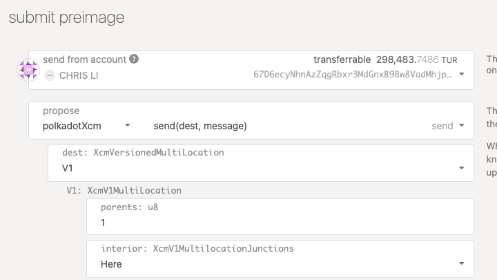
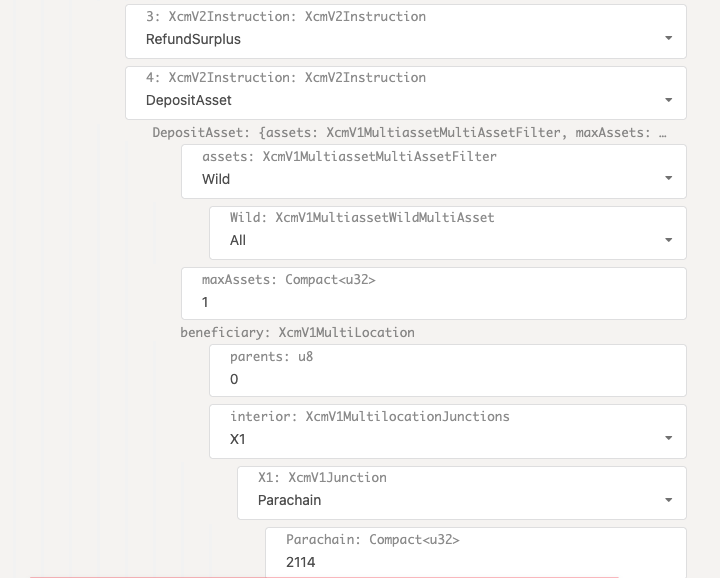

# XCM in Use

### Build dApps with XCM leveraging polkadot.js.org/apps and node.js

Notes:

As we learned in Chapter 3, the XCM pallet serves as a bridge between the XCVM subsystem and the FRAME subsystem.
It enables us to send and execute XCM and interact with the XCM executor.
In this chapter, I, as the founder of OAK Network and a parachain developer, will demonstrate how to build products using XCM and dispatch them from both polkadot.js apps and Javascript code.

---

### _At the end of this lecture, you will be able to:_

<pba-flex center>

1. Configure XCM for parachain HRMP messages.
1. Understand the construction and execution of XCM messages.
1. Perform HRMP transactions between parachains using templates.
1. Develop proficiency in debugging XCM using xcm-tools.

</pba-flex>

---

# Overview

<pba-flex center>

1. Define the product
1. Preparation
1. Compose XCM message
1. Build client code
1. Debug live

</pba-flex>

Notes:

In this session, I will guide you through the process of building a real use case of XCM, specifically from the perspective of a parachain developer.
Our main focus will be on developing for a parachain, not a relay chain like Polkadot.
Consequently, we will primarily concentrate on HRMP messages, enabling horizontal communication between two parachains.

1. Define Your Product: We'll start by defining the product or application we want to build, clarifying its objectives and functionalities.
1. Prepare Chain Config: Next, we'll prepare the necessary chain configurations, ensuring that our application is well-integrated with the target blockchain environment.
1. Compose XCM Message: We'll dive into composing XCM messages, which are crucial for communication and interactions between different components of our application.
1. Build Client Code: This step will involve the actual development of the client code for our application, implementing the logic and functionality we designed earlier.
1. Debug Live: Finally, we'll explore how to debug our application in a live environment, ensuring that it functions correctly and efficiently.

By the end of this presentation, you'll have a comprehensive understanding of the XCM framework and be well-equipped to build your own applications effectively.

Let's get started!

---

# Define the product

Objective: establish a seamless monthly recurring payment of MOVR on the Moonriver parachain.

Notes:

In this demo, our main objective is to establish a seamless monthly recurring payment of MOVR on the Moonriver parachain.
To accomplish this, we will utilize a powerful extrinsic call, `automationTime.scheduleXcmpTask`, executed remotely on the Turing Network.
This will trigger a payment at the end of each month, ensuring a smooth and automated payment process.

---v

## What we need to do

We need to perform one essential operation, which is to remotely execute automationTime.scheduleXcmpTask on the Turing Network.

To execute this operation, we will interact with the following components:

- Source Chain: Moonriver
- Source XCM Version: V3
- Source Extrinsic: `xcmTransactor.transactThroughSigned`

<br />Consequently, it will initiate the remote execution of the following call:

- Target Chain: Turing Network
- Target XCM Version: V3
- Target Extrinsic: `automationTime.scheduleXcmpTask`

---v

Upon successful XCM execution, a TaskScheduled event will fire on the Turing Network, indicating that the remote call has been executed successfully, thereby creating an automation task.

<figure>
  
  <figcaption>High-level product flow between Moonriver and Turing Network</figcaption>
</figure>

Notes:

explanation - The XCM call sets up a recurring task, that will auto-transfer of MOVR at the end of every month.
Turing Network is responsible for triggering the action when its condition is met.
The overall flow of the entire product is shown in the diagram below.

---

# Preparation

To kickstart our journey, we will begin by interacting with Moonriver's `xcmTransactor` pallet, which is similar to Polkadot/Kusama's `xcmPallet`.
Before diving into the actual XCM message, it is essential to ensure that we meet certain prerequisites:

Notes:

For this demo, we are using the existing xcmPallet built in Polkadot and Kusama.
This pallet provides common extrinsic interfaces that developers can use to easily compose an XCM message.
Moonriver has further encapsulated the function to make their own xcmTransactor.

---v

1. Ensure Barriers on the recipient chain.<br />
   In this case, an Allow Barrier\*\* `WithComputedOrigin<Everything>`, needs to be configured in the XCM config of Turing Network.
   This Barrier will allow the DescendOrigin instruction in XCM, which will reassign the origination of the transaction on Turing from Moonriver's sovereign account to the user's proxy account.
1. Configure user’s remote wallet on the recipient chainThe remote wallet, or proxy wallet acts as an account abstraction, allowing the blockchain to execute specific code on behalf of the user.

Notes:

1. We covered the Barrier topic in the previous chapter.
   Barriers are responsible for creating Allow or Deny rules for incoming messages.
   By adding this Barrier, we allow the DescendOrigin instruction in XCM, which will reassign the origination of the transaction on Turing from Moonriver's sovereign account to the user's proxy account.
1. This remote wallet acts as an account abstraction, empowering the blockchain to execute specific code on behalf of the user.
   By utilizing a user's sub-wallet for a specific extrinsic call, we create granular control, allowing the user's wallet to perform the necessary actions efficiently and securely.

---

# Compose XCM message

In this section, we will initiate the execution by calling the `xcmTransactor.transactThroughSigned` extrinsic on Moonriver.

Notes:

This extrinsic serves as the gateway to composing the XCM message, incorporating all the necessary instructions for the desired cross-chain message.

---v

## XCM configs

The following are the parameters you need to decide before sending an XCM message:<br /><br />

1. **Version number**: Check the XCM version on both recipient (Turing Network) and source (Moonriver) chains.
   Ensure their XCM versions are compatible.
1. **Weight**: Each chain defines a different weight for XCM instructions, impacting computation, storage, and gas fees.
1. **Fee per Second**: If using an asset other than the recipient chain's native token (TUR) to pay fees, establish the MOVR-to-TUR conversion rate.

Notes:

In section #4 of the Chain Config in XCM document, we have reviewed various chain configurations.
In this section, we will illustrate their usage through our demo.
Although there are several variables to be decided, once you become familiar with them and establish a few templates, you can continue to use them.

1. For example, V3 is backward compatible with V2 but the its config requires safeXcmVersion set.
1. The weight of an XCM instruction is defined with a different value on each chain.
   It specifies how much computational power as well as storage (PoV size), are required for the execution of each instruction and determines the gas, or fee, for the XCM execution.
1. In addition to the weight, if we use an asset other than the native token of the recipient chain, TUR in this case, to pay for the fee, the value of the asset must be converted in relation to the recipient chain's native token.
   The Fee per Second defines the conversion rate between MOVR and TUR, assuming we want to use MOVR to pay for all the fees in this transaction.

With these parameters decided, proceed to construct the instruction sequence for the XCM message.

---v

## Message elements

To construct the XCM message, we utilize Moonriver's `xcmTransactor.transactThroughSigned` extrinsic.
It requires the following parameters:

**Destination**: It specifies the target chain, or for our case, the Turing Network, identified by {Relay, 2114} on Kusama.

<br />

<figure>
  
  <figcaption>The parameters in the `transactThroughDerivative()` extrinsic</figcaption>
</figure>

---v

**InnerCall**

This represents the encoded call hash of the transaction on the destination chain.
This value will be passed on to the Transact XCM instruction.

**Fees**

`transactRequiredWeightAtMost` restricts the gas fee of the innerCall, preventing excessive fee token costs.
Likewise, `overallWeight` sets an upper limit on XCM execution, including the Transact hash.

---v

## Initiating the XCM Message

---v



Once all the parameters are set, we can proceed by submitting and signing the transaction.
The XCM message can be conveniently triggered directly from the extrinsic tab of [polkadot.js apps](https://polkadot.js.org/apps/).

---v


`DescendOrigin(descend_location)`: The first instruction in the XCM array is DescendOrigin, transferring authority to the user's proxy account on the destination chain.

---v


`WithdrawAsset` and `BuyExecution`: These two instructions work together to deduct XCM fees from the user's proxy wallet and reserve them for execution.

---v


XCM message - Buy Execution
---v



`Transact(origin_type, require_weight_at_most, call)`: The Transact instruction executes the encoded innerCall on the target chain.
We ensured that the gas cost does not exceed the specified limit by setting requireWeightAtMost during the call.

---v


<div style="font-size: 0.82em;">

`RefundSurplus` and `DepositAsset`: In case there is any remaining fee token after Transact execution, these instructions ensure that they are refunded and transferred to the specified location, typically the user's wallet.

After successfully firing the message, XCM events from both the sender and recipient parachains should appear in the Polkadot.js app Network tab.

</div>

---v

## Inspection of the message

Once the transaction above is submitted and finalized on the chain, we can use the xcm-tools built by the Moonbeam team to inspect the XCM message.
The code and scripts for the tool are listed in [this Github repo](https://github.com/Moonsong-Labs/xcm-tools).
An example of the script is shown below:

`yarn xcm-decode-para --w wss://wss.api.moonbeam.network --b 1649282 --channel hrmp --p 2000`

---v

<pba-flex center>

The output of the script reflects the sequence of instructions we constructed for the XCM message earlier.

1. `DescendOrigin`
1. `WithdrawAsset`
1. `BuyExecution`
1. `Transact`
1. `RefundSurplus`
1. `DepositAsset`

</pba-flex>

---

# Client code (node.js)

After proving that the XCM message above executes correctly, we can replicate the procedure from the client of a dApp.
Below is a node.js code snippet we created for this particular demo.

👉 [xcm-demo Github Repo](https://github.com/OAK-Foundation/xcm-demo/blob/master/src/moonbeam/moonbase-alpha.js) 👈

To run the program, clone it using git and execute the following command:

```sh
PASS_PHRASE=<PASS_PHRASE> PASS_PHRASE_ETH=<PASS_PHRASE_ETH> npm run moonbase-alpha
```

---v

### Example

<div style="font-size: 0.7em;">

```text
const tx = parachainHelper.api.tx.xcmTransactor.transactThroughSigned(
        {
            V3: {
                parents: 1,
                interior: {
                    X1: { Parachain: 2114 },
                },
            },
        },
        {
            currency: {
                AsCurrencyId: 'SelfReserve',
            },
            feeAmount: fungible,
        },
        encodedTaskViaProxy,
        {
            transactRequiredWeightAtMost: {
                refTime: transactRequiredWeightAtMost,
                proofSize: 0,
            },
            overallWeight: {
                refTime: overallWeight,
                proofSize: 0,
            },
        },
    );
```

</div>

Notes:

As you can see from the code, there are several preparation steps leading up to the main code block, which constructs the XCM message.
With the help of the following code, we can easily dispatch the message repeatedly and test out different input values.

---

## Debugging Live

When working with XCM messages, potential issues can arise in two areas: during message construction and during transaction execution on the target chain.

---v

**Message Formatting Issues**: If the XCM message is malformed, the recipient chain may not process it correctly.
To interpret XCM messages on-chain, we can use the xcm-tool covered in Chapter 5.
Some common problems and solutions include:

- Incorrect Fee and Weight Inputs: Ensure that the maximum weight specified in the XCM call is accurate.
  If the actual weight slightly exceeds the limit, the recipient chain might deny the call.
  In this case, increase the maximum weight parameter and retry.
- Version Mismatch: A VersionMismatch error occurs when the recipient chain does not accept the Multi-location version specified in Destination or FeeAsset.
  Check the recipient XCM version and adjust the multi-location version to V2 or V3 accordingly.

---v

**Transact Encoded Call Issues**: To examine encoded call hash in the Transact instruction, locate the specific transaction on the recipient chain, which will be an event occurring after `XcmMessageQueue.success`.
Unfortunately, there is no automated tool to directly correlate `XcmMessageQueue.success` with the event of the encoded call.
However, we can manually analyze it by matching the message hash with the source chain.

Notes:

does anybody have a great tool to correlate the XcmMessageQueue.success with the Transact hash?

---

## Summary

In this section, we explained the backbone of a recurring payment dApp leveraging XCM.

---v

### Lesson Recap

To create a successful XCM message between chains, ensure you have the following elements prepared:

- Type: Identify whether it's VRP (Vertical Relay Process) or HRMP (Horizontal Relay Process), representing the two parties involved in the communication.

- Goal: Determine the specific extrinsic to call or what actions will be included in the transaction.

- Details: Adjust the chain configurations as needed.
  Decide on DescendOrigin, choosing between descending to the user's remote wallet or using a parachain’s sovereign account.
  Also, specify the Sequence, outlining the instructions to be included in the message.

---v

After preparing these elements, assemble them to form the XCM message and carefully troubleshoot it.
Once you establish a reliable template, consider automating the construction process using the polkadot.js JavaScript library.

Alternatively, you can write a wrapper in the parachain's Rust code, such as the commonly used `xTokens.transferMultiasset` or Moonriver’s `xcmTransactor.transactThroughSigned`.

---

<!-- .slide: data-background-color="#4A2439" -->

# Questions
